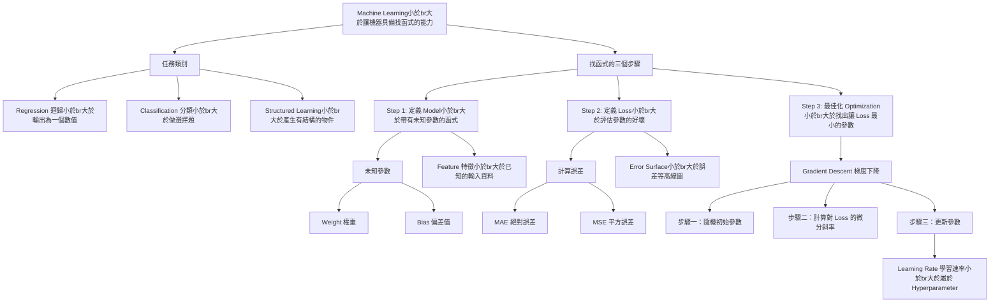

# 【機器學習 2021】第01堂課：機器學習基本概念 (Introduction)

> [!NOTE]
> 講師：李宏毅 (Hung-yi Lee)
> 本筆記由 AI 助手根據課程字幕自動整理生成。

## 1. 什麼是機器學習？
傳統科普文章常將機器學習（Machine Learning）與人工智慧（AI）講得非常玄妙，但用一句話來概括，**機器學習就是「讓機器具備找一個函式（Function）的能力」**。

當機器具備找函式的能力後，就能解決非常多複雜的問題：
* **語音辨識**：輸入語音訊號 $\rightarrow$ 輸出對應文字
* **影像辨識**：輸入圖片 $\rightarrow$ 輸出圖片內容（如貓、狗）
* **下圍棋 (AlphaGo)**：輸入棋盤上黑白子的位置 $\rightarrow$ 輸出下一步應落子的位置

## 2. 機器學習的任務類別
根據我們要找的「函式輸出類型」不同，機器學習可以大致分為以下幾類：

### Regression (迴歸)
當函式的輸出是一個**數值 (Scalar)** 時，這類任務稱為 Regression。
* **例子**：預測明天中午的 PM2.5 數值。輸入為今天的各項氣象指數與 PM2.5，輸出為一個具體的數值預測。

### Classification (分類)
當任務是做**選擇題**，讓機器從人類預先準備好的選項（類別 / classes）中選出一個作為輸出時，稱為 Classification。
* **例子 (二元分類)**：垃圾郵件過濾（Yes/No）。
* **例子 (多元分類)**：AlphaGo 下圍棋（從 $19 \times 19$ 的棋盤位置中選出一個正確的落子點）。

### Structured Learning (結構化學習)
除了 Regression 與 Classification，還有被稱為「黑暗大陸」的領域。機器不只是輸出一個數字或做選擇題，而是要產生**一個有結構的物件**（如畫一張圖、寫一篇文章）。這可以被視為讓機器學會「創造」。

---

## 3. 機器如何找一個函式？ (以預測 YouTube 點閱率為例)
機器學習找函式的過程，可以分為三個標準步驟：

### Step 1: 寫出帶有未知參數的函式 (Model)
首先，我們根據領域知識 (Domain Knowledge) 猜測函式的數學式長相。
例如，我們猜測明天的點閱率 ($y$) 與今天的點閱率 ($x_1$) 有關：
$$ y = b + w \cdot x_1 $$
* $x_1$: 已知的資訊，稱為 **Feature (特徵)**
* $w$: 未知的參數，稱為 **Weight (權重)**
* $b$: 未知的參數，稱為 **Bias (偏差值)**
* 這個帶有未知參數的函式，在機器學習中就稱為 **Model (模型)**。

### Step 2: 定義 Loss Function (損失函數)
Loss ($L$) 也是一個函式，它的輸入是模型裡的參數 ($b$, $w$)，輸出代表**這組參數的好壞**。
* 我們拿歷史訓練資料 (Training Data) 與其真實數值 (Label, $\hat{y}$) 進行比對。
* 計算估測值 $y$ 與真實值 $\hat{y}$ 之間的差距 $e$。
* 差距的計算方式有許多種，例如：
  * **MAE (Mean Absolute Error)**: $e = |y - \hat{y}|$
  * **MSE (Mean Square Error)**: $e = (y - \hat{y})^2$
* 將所有訓練資料的誤差加總平均，即得到整體的 Loss ($L$)。Loss 越小代表參數越好。
* **Error Surface (誤差表面)**：為各種 $w$ 與 $b$ 的組合計算 Loss 後所畫出的等高線圖。

### Step 3: 解最佳化問題 (Optimization)
我們的目標是找出能讓 Loss 最小的那一組最佳參數 ($w^*$, $b^*$)。
課程中主要使用的最佳化方法是 **Gradient Descent (梯度下降法)**：
1. **隨機初始化**：隨機選擇一個初始點 $w_0$。
2. **計算微分 (斜率)**：計算在 $w_0$ 點，參數 $w$ 對 Loss 的微分（切線斜率）。
3. **更新參數**：
   * 若斜率為負（左高右低），增加 $w$ 的值。
   * 若斜率為正（左低右高），減少 $w$ 的值。
   * 移動的步伐大小取決於**斜率大小**與 **Learning Rate ($\eta$, 學習速率)**。
4. **反覆執行**，直到 Loss 降到最低或達到停止條件。

> [!TIP]
> **Hyperparameters (超參數)**
> 像 Learning Rate ($\eta$) 這種需要人類自己設定、而非機器自己找出來的參數，稱為 Hyperparameter。

---

## 4. 知識圖譜 (Knowledge Graph)

---

## 5. 隨堂測驗 (Quiz)

**Q1: 下列何者屬於 Classification (分類) 任務？**
(A) 預測明天台股大盤的收盤指數
(B) 判斷一張 X 光片中是否有腫瘤 (Yes/No)
(C) 讓機器自動畫出一張動漫人物的圖片
(D) 預測這部影片明天的點閱人數

**Q2: 在模型 $y = b + w \cdot x$ 中，$x$ 代表什麼？**
(A) Weight
(B) Bias
(C) Feature
(D) Label

**Q3: 在 Gradient Descent 中，決定我們每一步更新參數步伐大小的變數（例如 $\eta$）稱為什麼？**
(A) Loss Function
(B) Hyperparameter
(C) Error Surface
(D) Domain Knowledge

點擊查看解答

* **Q1 解答**: (B) 判斷是否有腫瘤是二元選擇題，屬於 Classification。(A)(D) 屬於 Regression，(C) 屬於 Structured Learning。
* **Q2 解答**: (C) Feature。它是我們已知的輸入特徵。
* **Q3 解答**: (B) Hyperparameter (超參數)。

