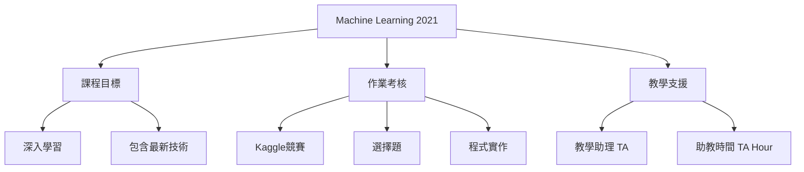

# 第01堂課：機器學習基本概念

本堂課為李宏毅教授 2021 年春季機器學習課程的導論，主要說明課程的定位、運作方式、評分標準以及作業規範。

## 課程定位與規劃

本課程的核心定位為：
* **深度學習 (Deep Learning)** 為教學重點。
* 適合做為入門的第一門機器學習課程。
* 課程風格採「自助餐 (Buffet)」式，內容涵蓋廣泛，包含電腦視覺、自然語言處理、金融應用等最新技術。
* 本課程與林軒田教授的課程有明顯區隔，課程內容具備高度互補性。

## 課程運作與技術輔助

為同時提供中文與英文版本，課程利用了多項人工智慧技術：
* **語音辨識 (Speech Recognition)**：將中文授課內容轉錄為文字。
* **機器翻譯 (Machine Translation)**：將中文文字翻譯為英文。
* **語音合成 (Text-to-Speech Synthesis)**：將英文文字轉化為語音。
* **人工校對**：教學助理 (TA) 會負責修正翻譯結果以確保品質。

### 課程架構知識圖譜

## 作業與評分規範

### 評分機制
* 總計 15 個作業，每個作業 10 分。
* 最終成績僅計算分數最高的 10 個作業。
* 鼓勵同學完成所有 15 個作業，學習深度由學生自行決定。

### 分數分級說明
* **C-**：只需執行範例程式碼。
* **A-**：依照課程提供的指引撰寫程式碼。
* **A+**：挑戰額外難題，需自行思考並閱讀論文。

### Kaggle 競賽規則
* **顯示名稱格式**：必須嚴格遵守 `<學號>_<自訂內容>`，若格式錯誤將無法錄取成績。
* **提交限制**：需在截止日期前選擇兩個結果參與私有榜 (Private Leaderboard) 評測。
* **公平性規範**：
    * 禁止抄襲程式碼或分享結果。
    * 嚴禁人工標註測試集。
    * 禁止使用過往學期的解答。
* **懲罰機制**：首次違規者總成績乘以 0.9，第二次違規者直接判定不及格。

## 常用資源與聯絡方式
* **課程網頁**：包含簡報下載與錄影回放。
* **提問管道**：
    1. 參加助教時間 (TA Hour)。
    2. 於 NTU COOL 平台提問。
    3. 發送郵件至 `ntu-ml-2021spring-ta@googlegroups.com`，郵件主旨須包含 `[hwX]`。

---

## 隨堂測驗

**Q1: 在 Kaggle 提交作業時，正確的顯示名稱格式應該是什麼？**

點擊查看解答

正確格式為 <code>&lt;學號&gt;_&lt;自訂內容&gt;</code>，例如 <code>b93901106_my_submission</code>。

**Q2: 課程總共有 15 個作業，最終成績是如何計算的？**

點擊查看解答

最終成績僅會計算分數最高的 10 個作業。

**Q3: 如果不幸違反了課程規則（如抄襲），第一次的處罰是什麼？**

點擊查看解答

第一次違反規則會導致該學期總成績乘以 0.9。

