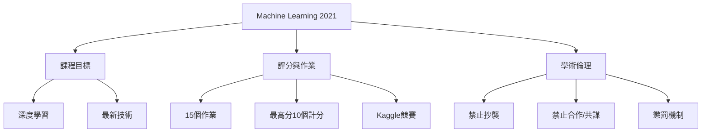

# 第02堂課：深度學習基礎 - 突破線性模型的限制

本堂課為李宏毅教授 2021 年機器學習課程的導論課，主要介紹課程目標、授課方式、作業與評分標準，以及各項嚴格的學術倫理規範。

## 課程核心介紹

*   **課程主旨**：專注於深度學習（Deep Learning）領域，涵蓋機器學習的最新技術。
*   **授課風格**：採用「自助餐式」（Buffet style）教學，學生可根據興趣選擇深入學習的主題。
*   **先修知識**：
    *   數學基礎：微積分、線性代數、機率。
    *   程式能力：需具備 Python 基礎，課程不教授 Python 語法，僅針對機器學習應用與 PyTorch 進行相關指導。
*   **硬體要求**：提供 Google Colab 支援，無需自行安裝複雜硬體環境。

## 課程知識圖譜

## 作業與評分機制

本課程共安排 15 個作業，採用累積制，最終評分計算成績最高的 10 個作業。

*   **評分層級**：
    *   **C-**：僅執行範例程式碼。
    *   **A-**：依照課程指引完成實作。
    *   **A+**：自行挑戰困難任務，閱讀相關論文並克服難題。
*   **競賽與排行榜**：部分作業將在 Kaggle 或 JudgeBoi 平台上進行競賽。
    *   **顯示名稱格式**：`<學號>_<自訂名稱>`（例如：`b93901106_pui_pui_pui`）。若格式錯誤將導致無法辨識成績。
    *   **排行榜規則**：分為公開排行榜（Public Leaderboard）與私人排行榜（Private Leaderboard），私人分數僅在截止日期後揭曉。

## 重要規則與懲罰

*   **禁止抄襲**：變更變數名稱仍視為抄襲，系統會進行自動比對。
*   **保護成果**：禁止外流程式碼或提供測試結果給他人。
*   **懲罰機制**：
    *   **初犯**：該學期總分乘以 $0.9$。
    *   **再犯**：直接判定該課程不及格（Fail the course）。

## 隨堂測驗

點擊查看測驗 1：關於作業的計分方式為何？

答：課程共 15 個作業，每個作業 10 分，但期末成績僅會選取分數最高的 10 個作業進行計算。

點擊查看測驗 2：在 Kaggle 競賽中，顯示名稱（Display Name）的正確格式為何？

答：格式必須為 `<學號>_<自訂名稱>`。若格式錯誤，助教將無法正確紀錄您的成績。

點擊查看測驗 3：如果被發現違反課程作業規則，初犯的懲罰是什麼？

答：初犯者該學期的總分將會乘以 0.9。若是第二次違規，則會導致直接當掉該課程。

