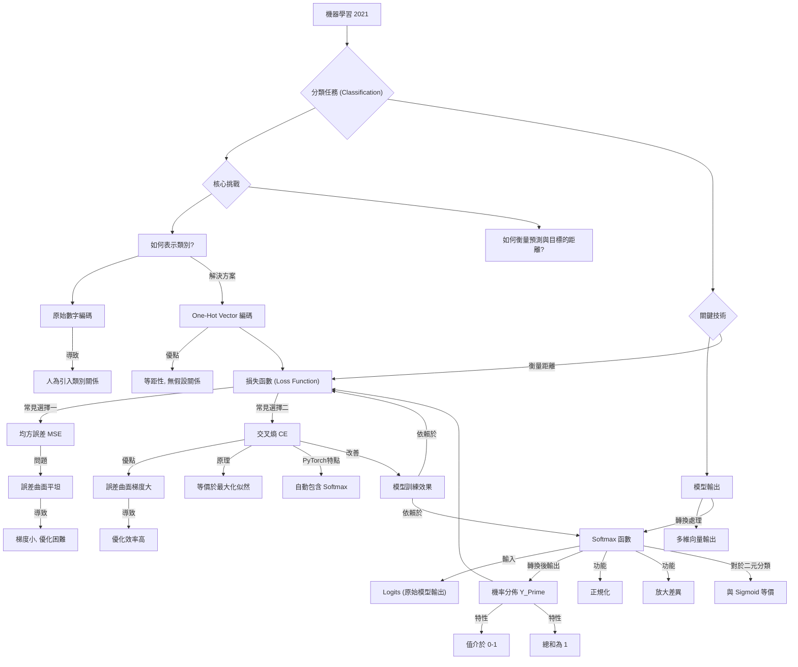

# 【機器學習 2021】第09堂課：[ML 2021 (English version)] Lecture 8: Classification (Short Version)

## 課程概述

本堂課將以精簡版（約20分鐘）深入探討**分類（Classification）**任務。課程內容涵蓋如何從迴歸轉向分類，以及分類任務中關鍵的 One-Hot Vector 編碼、Softmax 函數及其與損失函數（如交叉熵）的關係。若想了解更詳細的兩、三小時版本，可參考往年課程影片。

> **關於符號約定：**
> 在本課程中，$\hat{y}$ ($y$ 加帽子符號) 表示正確答案或目標標籤 (target label)，而 $y$ 則表示模型輸出的預測值。這與其他課程的約定可能不同，請留意。

## 從迴歸（Regression）到分類（Classification）

### 直接將類別編碼為數字的問題

在迴歸任務中，模型的輸入是一個向量，輸出是一個數值，我們希望輸出值與目標標籤盡可能接近。如果嘗試將分類問題直接視為迴歸問題，例如將類別1編碼為數字1，類別2編碼為數字2，類別3編碼為數字3，會產生以下問題：

*   **人為引入了類別間的關係：** 這種編碼方式暗示了「類別1和類別2比類別1和類別3更接近」。
*   **例子：** 若根據身高體重預測小學生的年級（一年級、二年級、三年級），這種編碼可能合理，因為年級之間確實存在順序關係。但如果類別間沒有這種固有的數值或順序關係，例如蘋果、香蕉、橘子，則這種編碼會造成不合理的假設。

### 解決方案：One-Hot Vector 編碼

為了解決直接數字編碼的問題，**One-Hot Vector** 是一種更常見且合理的類別表示方法。

*   **原理：** 每個類別用一個向量表示，向量的維度等於類別總數。在該類別對應的位置為1，其他位置為0。
    *   若有三個類別：
        *   類別1：$[1, 0, 0]$
        *   類別2：$[0, 1, 0]$
        *   類別3：$[0, 0, 1]$
*   **優點：** 這種表示方式使得任意兩個類別之間的「距離」是相同的，避免了人為引入的類別關係假設。

## 類神經網路的輸出設計

當目標標籤 $\hat{y}$ 是一個 One-Hot Vector（例如三維向量），我們的網路也需要輸出相同維度的數值向量。

*   **多輸出設計：** 過去的迴歸網路通常只輸出一個數值。若要輸出三個數值 $y_1, y_2, y_3$，只需將網路的最後一層重複操作三次，每次使用不同的權重（weights）和偏置（biases）與前一層的激活值相乘並相加，即可得到多個輸出值。

## Softmax 函數

在分類任務中，通常會將網路的原始輸出 $y$ (logits) 進一步轉換為 $y'$，以便與 One-Hot $\hat{y}$ 進行比較。Softmax 函數正是執行這項轉換的關鍵。

### Softmax 的作用與必要性

*   **正規化（Normalization）：** 將原始輸出 $y$ 的任意數值，轉換為介於 0 到 1 之間且總和為 1 的 $y'$。這樣 $y'$ 就可以解釋為每個類別的「機率分佈」，與 One-Hot Vector 的形式更具可比性。
*   **放大差異：** Softmax 函數還有一個額外的好處，它會放大原始輸出中較大值與較小值之間的差距，使得模型更容易做出明確的分類決策。

### Softmax 的運作原理

*   **數學公式：** 對於第 $i$ 個輸出 $y_i$，其 Softmax 轉換後的 $y'_i$ 為：
    $$ y'_i = \frac{\exp(y_i)}{\sum_k \exp(y_k)} $$
    其中 $k$ 遍歷所有輸出類別。

*   **步驟圖解：**
    1.  對每個原始輸出 $y_i$ 取指數 $\exp(y_i)$。這會確保所有值都變為正數。
    2.  將所有 $\exp(y_k)$ 的結果相加，得到一個總和。
    3.  將每個 $\exp(y_i)$ 除以這個總和，得到 $y'_i$。

*   **範例：**
    *   原始輸出 $y = [3, 1, -3]$
    *   取指數後：$[\exp(3), \exp(1), \exp(-3)] \approx [20.08, 2.72, 0.05]$
    *   總和：$20.08 + 2.72 + 0.05 = 22.85$
    *   正規化後 $y'$：$[20.08/22.85, 2.72/22.85, 0.05/22.85] \approx [0.88, 0.12, 0.00]$

*   **性質：**
    *   所有 $y'_i$ 都介於 0 到 1 之間。
    *   所有 $y'_i$ 的總和為 1。

### Softmax 與 Sigmoid 的比較（二元分類）

*   Softmax 函數對於兩個類別的分類同樣適用。
*   然而，在**二元分類**任務中，更常聽到使用 **Sigmoid 函數**。
*   這兩種方法實際上是**等價的**。若您自行推導，會發現它們在數學上是相同的。

## 分類任務的損失函數（Loss Function）

將網路輸出 $y'$ 轉換為機率分佈後，我們需要一個損失函數來衡量 $y'$ 與目標 $\hat{y}$ 之間的距離，並引導模型訓練。

### 評估距離：均方誤差（Mean Squared Error, MSE）

*   **公式：** $$ E = \sum_i (y'_i - \hat{y}_i)^2 $$
*   **原理：** 計算 $y'$ 和 $\hat{y}$ 各元素差值的平方和。
*   **適用性：** 雖然 MSE 可以用來計算兩個向量之間的距離，並在 $y'$ 與 $\hat{y}$ 相等時達到最小值，但它在分類任務中的表現通常不如交叉熵。

### 更常見的選擇：交叉熵（Cross-Entropy）

*   **公式：** $$ E = -\sum_i \hat{y}_i \log(y'_i) $$
*   **原理：** 
    *   $\hat{y}_i$ 在 One-Hot Vector 中只有一個位置是 1，其他是 0。因此，這個和式實際上只會取目標類別 $\hat{y}_c = 1$ 所對應的 $\log(y'_c)$。
    *   當 $\hat{y}$ 與 $y'$ 完全相符時，交叉熵的值最小。
*   **與最大似然估計（Maximizing Likelihood）的關係：**
    *   簡而言之，最小化交叉熵**等價於**最大化似然函數（Maximizing Likelihood）。這兩者是同一件事的不同說法。雖然本課程因時間限制未深入探討似然，但它們的數學基礎是相同的。

### 為什麼交叉熵更適合分類任務？

從**優化（Optimization）**的角度來看，交叉熵比均方誤差更適合分類任務，且是 PyTorch 等深度學習框架中分類問題的標準選擇。

*   **PyTorch 的整合：** 在 PyTorch 中，`CrossEntropyLoss` 函數通常會自動包含 Softmax 運算。這意味著如果您在網路的最後一層已經手動加入了 Softmax，然後又使用了 PyTorch 的 `CrossEntropyLoss`，您將會進行**兩次 Softmax** 運算，這是不必要的。在實作中，通常只需在網路輸出原始 logits 後，直接傳入 `CrossEntropyLoss` 即可。

*   **梯度（Gradient）特性比較：**
    *   假設一個三分類問題，正確答案是 $[1, 0, 0]$。我們觀察當 $y_1$ 和 $y_2$ 變化時，損失函數（經過 Softmax 後）的誤差曲面。
    *   **均方誤差（MSE）：** 在損失值較大的區域（例如模型預測完全錯誤，與目標 One-Hot Vector 相距甚遠時），MSE 的誤差曲面會非常**平坦**。這導致梯度非常小，模型在梯度下降時難以朝正確方向移動，很容易「卡住」，訓練失敗。
    *   **交叉熵（Cross-Entropy）：** 在損失值較大的區域，交叉熵的誤差曲面仍然保持**非零的斜率**。這意味著即使模型預測很差，梯度仍然足夠大，足以引導模型沿著梯度下降的方向有效學習，最終到達損失最小的區域。

*   **結論：** 選擇合適的損失函數會極大地影響訓練的難易度。交叉熵函數的梯度特性使其在分類任務的優化上更具優勢，即使在遠離目標的點也能提供有效的學習信號。這就好比「神羅天徵」能讓誤差曲面更平滑，有助於優化。

---

## 知識圖譜 (Knowledge Graph)

---

## 隨堂測驗

### 問題一

在分類任務中，為什麼不直接將類別編碼為數字（例如類別1為1，類別2為2，類別3為3），而建議使用 One-Hot Vector？

點擊查看解答

直接將類別編碼為數字會人為地引入類別之間的「距離」或「順序」關係。例如，將類別1編碼為1、類別2編碼為2，會暗示類別1和2比類別1和3更接近，這在許多非序數類別（nominal classes）中是不合理的。One-Hot Vector 則確保了任意兩個類別之間的距離相等，避免了這種不必要的假設。

### 問題二

Softmax 函數在類神經網路的分類輸出層中扮演什麼角色？其輸出 $y'$ 具有哪些重要特性？

點擊查看解答

Softmax 函數用於將網路輸出的原始數值（logits）轉換為介於 0 到 1 之間且總和為 1 的機率分佈 $y'$。
其重要特性 include：
1.  **正規化：** 所有輸出值 $y'_i$ 都介於 0 和 1 之間。
2.  **機率總和為 1：** 所有輸出值 $y'_i$ 的總和等於 1。
這些特性使得 $y'$ 可以被解釋為每個類別的預測機率，更易於與 One-Hot Vector 目標標籤進行比較。此外，Softmax 還能放大原始輸出中的數值差異，使分類決策更清晰。

### 問題三

從優化（optimization）的角度來看，為什麼交叉熵（Cross-Entropy）通常比均方誤差（Mean Squared Error, MSE）更適合用於分類任務的損失函數？

點擊查看解答

主要原因在於它們在誤差曲面（error surface）上的梯度特性：
*   **均方誤差 (MSE)：** 當模型的預測結果與目標相差甚遠（即損失值很大）時，MSE 的誤差曲面會變得非常平坦。這導致在這些區域的梯度非常小，使得梯度下降演算法難以有效更新模型參數，模型容易「卡住」或訓練緩慢。
*   **交叉熵 (Cross-Entropy)：** 即使模型預測結果與目標相差甚遠（即損失值很大），交叉熵的誤差曲面仍然保持較大的、非零的斜率。這意味著梯度仍然足夠大，可以有效地引導模型參數朝著正確的方向更新，從而加速收斂並提高訓練效率。

總之，交叉熵在損失較大時提供更強的學習信號，使得分類模型的訓練更穩定和高效。

