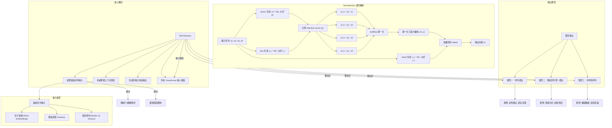

# 【機器學習 2021】第12堂課：Self-Attention 簡介 - 處理變長序列輸入

## 課程介紹與背景

本堂課將介紹繼 CNN 之後另一種常見的網路架構——**Self-Attention**。它旨在解決目前模型輸入多為固定長度向量的限制，轉而處理**變長序列（Variable-Length Sequence）**的輸入。

### 現有模型的限制

*   目前的 Network 輸入多為**單一向量**。
    *   預測 YouTube 觀看人數：輸入視為向量。
    *   影像處理：輸入影像大小固定，可視為向量。
*   輸出：單一數值（迴歸）或單一類別（分類）。
*   挑戰：若輸入是**一排向量**，且**向量數量會改變**，應如何處理？

### 什麼是 Self-Attention？

*   Self-Attention 是一種能處理**變長序列輸入**的網路架構。
*   它能夠讓模型在處理序列中的某個向量時，同時考慮**整個序列的上下文資訊**。

## Self-Attention 解決的問題：變長序列輸入 (Variable-Length Sequence Input)

輸入是一序列的向量，且序列長度不固定。

### 輸入案例

#### 文字處理 (Text Processing)

*   **問題**：句子長度不同，詞彙數量不同。
*   **表示方式**：
    *   將句子中的每個詞彙表示為一個向量。
    *   整個句子則是一組向量集合（Vector Set），大小不一。
*   **詞彙向量化**：
    *   **One-Hot Encoding**：簡單直接，但缺乏語義資訊，假設詞彙間無關聯。
        *   範例：Apple (1,0,0...), Bag (0,1,0...), Cat (0,0,1...)。
    *   **Word Embedding**：賦予每個詞彙帶有語義資訊的向量。
        *   同類詞彙（如動物）在向量空間中會聚集。
        *   Word Embedding 的訓練方法非本課程重點，但可直接載入預訓練模型。
    *   **總結**：一個句子可表示為一排長度不一的詞彙向量。

#### 聲音訊號 (Speech Signal)

*   **表示方式**：將聲音訊號切割成小片段（Window），每個 Window 描述為一個向量，稱為 **Frame**。
    *   **Window 長度**：通常為 25 毫秒 (ms)。
    *   **Frame 向量化**：透過各種方法將 25ms 聲音轉化為一個向量（細節不贅述）。
    *   **Window 移動**：通常每次向右移動 10 毫秒。
    *   **序列長度**：1 秒的聲音約有 100 個 Frame 向量；1 分鐘約有 6000 個 Frame 向量。
*   **總結**：一段聲音訊號可表示為一串向量。

#### 圖形 (Graph)

*   **問題**：社交網路、分子結構等都是圖形，節點數量不固定。
*   **表示方式**：圖中的每個節點（如人、原子）可視為一個向量。
    *   **社交網路**：每個節點代表一個人，向量可包含個人資料（性別、年齡、工作等）。
    *   **分子**：每個節點代表一個原子。
        *   原子向量化：可用 One-Hot Vector 表示（如氫 H: (1,0,0...), 碳 C: (0,1,0...)）。
*   **總結**：一個圖形可表示為一堆向量。

## 輸出類型 (Output Types)

當輸入是一個向量序列時，可能的輸出類型有三種：

### 類型一：輸入長度 = 輸出長度 (Sequence Labeling)

*   模型接收 N 個輸入向量，並輸出 N 個對應的 Label。
*   每個 Label 可以是數值（迴歸）或類別（分類）。
*   此為本堂課主要討論的類型。

#### 應用範例

*   **文字處理**：
    *   **詞性標註 (POS Tagging)**：給定一個句子，為每個詞彙標註其詞性（名詞、動詞、形容詞等）。
        *   例如："I saw a saw." 第一個 "saw" 是動詞，第二個 "saw" 是名詞。模型需為每個 "saw" 輸出不同標籤。
*   **語音處理**：
    *   **語音辨識簡化版**：對於一段聲音訊號中的每個 Frame 向量，判斷它屬於哪一個 Phonetic（音標）。
        *   作業二即為此類任務。
*   **圖形處理**：
    *   **節點特性預測**：在社交網路中，預測每個用戶（節點）的特性，如是否會購買某商品。

### 類型二：整段序列輸出一個 Label (Sequence-to-Single-Label)

*   模型接收一整個序列作為輸入，僅輸出一個 Label。

#### 應用範例

*   **文字處理**：
    *   **情感分析 (Sentiment Analysis)**：給定一段文字，判斷其情感是正面、負面還是中立。
        *   例如：分析網友對產品的評價。
*   **語音處理**：
    *   **語者辨認 (Speaker Recognition)**：聽一段聲音，判斷是誰在說話。
        *   作業四將涉及此類任務。
*   **圖形處理**：
    *   **分子特性預測**：給定一個分子結構（圖形），預測其毒性或親水性。

### 類型三：機器決定輸出長度 (Sequence-to-Sequence)

*   模型接收 N 個輸入向量，但輸出 N' 個 Label，其中 N' 由機器自行決定。

#### 應用範例

*   **機器翻譯**：輸入一種語言的句子，輸出另一種語言的句子，詞彙數量通常不同。
*   **語音辨識**：輸入一段聲音訊號，輸出對應的文字。
*   此類型將在後續課程中深入探討（作業五）。

## 解決 Sequence Labeling 的挑戰

本堂課將專注於解決**類型一：Sequence Labeling** 的問題。

### 傳統 Fully-Connected Network 的限制

*   **直覺方法**：將序列中的每個向量獨立地輸入到一個 Fully-Connected (FC) Network，然後獲得各自的輸出。
*   **嚴重缺陷**：完全忽略上下文資訊。
    *   例如：在詞性標註任務中，對於句子 "I saw a saw."，兩個 "saw" 對 FC Network 來說輸入完全相同，模型無法區分它們應分別標註為動詞和名詞。

### 擴展視窗 (Window) 的方法

*   **改進思路**：將當前向量與其前後幾個相鄰的向量串聯起來，一同輸入到 FC Network。這樣 FC Network 就能考慮到局部上下文資訊。
    *   **範例**：作業二中，判斷一個 Frame 的音標時，會考慮該 Frame 前後各 5 個 Frame（共 11 個 Frame）。
*   **侷限性**：
    *   **固定視窗大小**：對於變長序列，無法通用。若要覆蓋最長序列，則視窗會非常大。
    *   **參數數量龐大**：過大的視窗會導致 FC Network 參數過多，計算量大，且容易造成 overfitting。
*   **結論**：對於需要考慮整個序列才能解決的問題，單純擴大視窗仍有其極限。

### Self-Attention 的引進

*   為了解決「需要考慮整個 Input Sequence 資訊」的挑戰，同時避免固定視窗大小和參數爆炸的問題，我們引入 **Self-Attention** 技術。

## Self-Attention 的運作機制

### 核心概念

*   Self-Attention 接收**一整個序列的資訊**作為輸入，並輸出**相同數量**的向量。
*   每個輸出向量都是**考慮了整個輸入序列**後得到的，蘊含了豐富的上下文資訊。
*   這些輸出向量隨後可以送入 Fully-Connected Network 進行最終的預測。

### Self-Attention 與 Transformer

*   Self-Attention 不是只能使用一次，可以多次疊加，並與 Fully-Connected Network 交替使用。
    *   Self-Attention 負責處理整個序列的資訊。
    *   Fully-Connected Network 專注於處理某個位置的資訊。
*   **"Attention is All You Need"** 論文提出了著名的 **Transformer** 網路架構，其中 Self-Attention 是最核心的模組（被比喻為「變形金剛的火種源」）。
*   儘管類似 Self-Attention 的架構更早就有出現（如 Self-Matching），但 "Attention is All You Need" 這篇論文使其發揚光大。

### 運作流程

Self-Attention 接收一排輸入向量 `a1, a2, a3, a4`，輸出相同數量且已考慮整個序列上下文的向量 `b1, b2, b3, b4`。以下將詳細說明如何產生 `b1`。

#### 步驟一：計算關聯性 (Attention Score - α)

此步驟旨在根據 `a1`，找出序列中與 `a1` 相關程度高的其他向量。關聯程度用數值 `α` 表示。

1.  **Query (q), Key (k), Value (v) 概念**：
    *   **Query (q)**：由輸入向量 `a` 乘以矩陣 `Wq` 得到，代表「查詢」的內容，像搜尋文章的關鍵字。
    *   **Key (k)**：由輸入向量 `a` 乘以矩陣 `Wk` 得到，代表「被查詢」的內容，像文章的索引。
    *   **Value (v)**：由輸入向量 `a` 乘以矩陣 `Wv` 得到，代表「實際的資訊內容」，像文章的內容。

2.  **Dot Product 注意力機制**：
    *   這是最常見的計算 `α` 的方法，也是 Transformer 中使用的方法。
    *   **過程**：
        1.  將輸入向量 `a_i` 乘以 `Wq` 得到 `q_i`。
        2.  將輸入向量 `a_j` 乘以 `Wk` 得到 `k_j`。
        3.  計算 `q_i` 與 `k_j` 的**內積 (Dot Product)**，得到一個純量值 `α_i,j`。
        *   `α_i,j = q_i ⋅ k_j`

3.  **計算 `a1` 與其他向量的關聯性**：
    *   將 `a1` 乘以 `Wq`，得到 **`q1` (Query)**。
    *   將 `a2, a3, a4` 分別乘以 `Wk`，得到 **`k2, k3, k4` (Keys)**。
    *   計算 `q1` 與每個 `k_i` 的內積，得到關聯性分數 (Attention Score)：
        *   `α1,2 = q1 ⋅ k2` （`a1` 與 `a2` 的關聯性）
        *   `α1,3 = q1 ⋅ k3` （`a1` 與 `a3` 的關聯性）
        *   `α1,4 = q1 ⋅ k4` （`a1` 與 `a4` 的關聯性）
    *   **注意**：在實際實作中，`a1` 也會和自己計算關聯性：`α1,1 = q1 ⋅ k1`。

#### 步驟二：SoftMax 歸一化 (Normalization)

*   將所有計算出的 `α` 值（如 `α1,1, α1,2, α1,3, α1,4`）通過 **SoftMax 函數**進行歸一化。
*   SoftMax 的輸出是一排經過歸一化的注意力權重 `α'`（如 `α'1,1, α'1,2, α'1,3, α'1,4`）。
*   **注意**：此處不一定要使用 SoftMax，也可以嘗試其他激活函數（如 ReLU），效果可能更好。

#### 步驟三：加權求和 (Weighted Sum) 獲取上下文資訊

*   此步驟根據歸一化後的注意力權重 `α'`，從序列中抽取與 `a1` 相關的重要資訊，生成輸出向量 `b1`。
*   **過程**：
    1.  將輸入向量 `a1, a2, a3, a4` 分別乘以 `Wv`，得到 **`v1, v2, v3, v4` (Values)**。
    2.  將每個 `v_i` 乘以對應的歸一化注意力權重 `α'1,i`。
    3.  將所有加權後的 `v_i` 求和，得到最終的輸出向量 `b1`。
        *   `b1 = α'1,1 ⋅ v1 + α'1,2 ⋅ v2 + α'1,3 ⋅ v3 + α'1,4 ⋅ v4`
*   **意義**：`b1` 是序列中所有 `Value` 向量的加權平均。哪個 `α'` 值越高，其對應的 `v` 向量對 `b1` 的影響就越大，代表該部分資訊與 `a1` 最相關。

## 隨堂測驗

### 測驗一：Self-Attention 主要解決什麼問題？

  
點擊展開解答

  Self-Attention 主要解決了深度學習模型難以有效處理**變長序列輸入 (Variable-Length Sequence Input)** 的問題。它允許模型在處理序列中的某個元素時，能夠彈性地考慮整個序列的上下文資訊，而不受限於固定大小的視窗或過多的模型參數。

### 測驗二：在 Self-Attention 的運作機制中，Query (q), Key (k), Value (v) 各代表什麼？

  
點擊展開解答

  *   **Query (q)**：代表「查詢」的內容，由當前輸入向量 `a_i` 經過線性轉換 (乘以 `Wq` 矩陣) 而來。它用於向序列中的其他元素發出「查詢」。
  *   **Key (k)**：代表「被查詢」的內容或「索引」，由序列中每個輸入向量 `a_j` 經過線性轉換 (乘以 `Wk` 矩陣) 而來。它與 Query 進行匹配，以判斷關聯性。
  *   **Value (v)**：代表實際的「資訊內容」，由序列中每個輸入向量 `a_j` 經過線性轉換 (乘以 `Wv` 矩陣) 而來。在計算出注意力權重後，這些 Value 會被加權求和，形成最終的輸出。

### 測驗三：為什麼單純擴大 Fully-Connected Network 的輸入視窗 (Window) 無法很好地解決變長序列問題？

  
點擊展開解答

  單純擴大 Fully-Connected Network 的輸入視窗存在以下幾個問題，使其無法很好地解決變長序列問題：
  1.  **固定視窗大小的限制**：對於長度不一的序列，必須設定一個足夠大的固定視窗來覆蓋最長的序列，但這會導致許多短序列在輸入時產生大量的填充（padding），效率低下。
  2.  **參數數量龐大**：過大的輸入視窗會使得 Fully-Connected Network 需要非常多的輸入維度，進而導致模型參數數量巨大，這不僅增加計算負擔，也更容易導致模型過擬合（overfitting）。
  3.  **缺乏彈性**：固定視窗無法根據序列內容動態地關注不同長度的上下文資訊，這與 Self-Attention 能夠動態計算每個元素與其他所有元素關聯性的方式截然不同。

