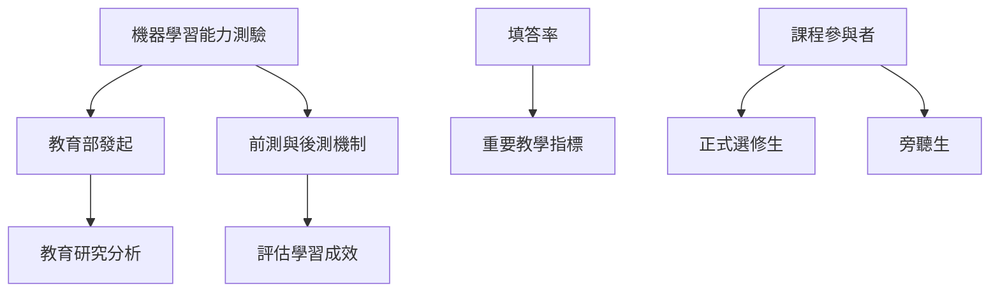

# 第14堂課：自注意力機制 (Self-Attention) - 處理變長序列輸入

本堂課為李宏毅教授 2021 機器學習課程的第 14 堂課，主要內容為針對全台灣修習機器學習課程學生進行的「機器學習能力前測」。此問卷由中華民國教育部發起，旨在進行教育研究分析與成效評估。

## 課程核心目的與說明

本測驗的主要目標是為了評估修課學生在機器學習領域的基礎知識與學習狀況。以下為本次前測的關鍵重點：

*   **研究用途**：本問卷僅供教育部進行教育研究與成效分析之用。
*   **學術公正性**：填寫結果不會影響學生的個人課程成績，請同學放心填寫。
*   **覆蓋範圍**：此問卷適用於全台灣所有開設機器學習相關課程的學生，且採統一試題。
*   **參與對象**：無論是正式選修學生或旁聽生，皆鼓勵填寫以利樣本完整性。
*   **成效追蹤**：除了本次的「前測」外，課程結束後還會有「後測」，用以衡量學習成效。
*   **重要指標**：問卷的「填答率」是教育部評估教學品質的重要數據指標。

## 知識圖譜

---

## 隨堂測驗

### 1. 關於本次機器學習能力前測，下列敘述何者正確？

點擊展開解答

答案：本測驗不會影響學生的課程成績，且所有修習相關課程的學生（含旁聽生）皆應填寫，作為教育研究分析之用。

### 2. 教育部推動此測驗的主要目的是什麼？

點擊展開解答

答案：主要目的是進行教育研究分析，並透過「前測」與「後測」的對照，評估全台機器學習課程的學習成效。

### 3. 為什麼問卷的「填答率」被視為重要的指標？

點擊展開解答

答案：填答率的高低直接影響數據樣本的代表性，是教育部評估教學品質與研究成效的重要指標。

