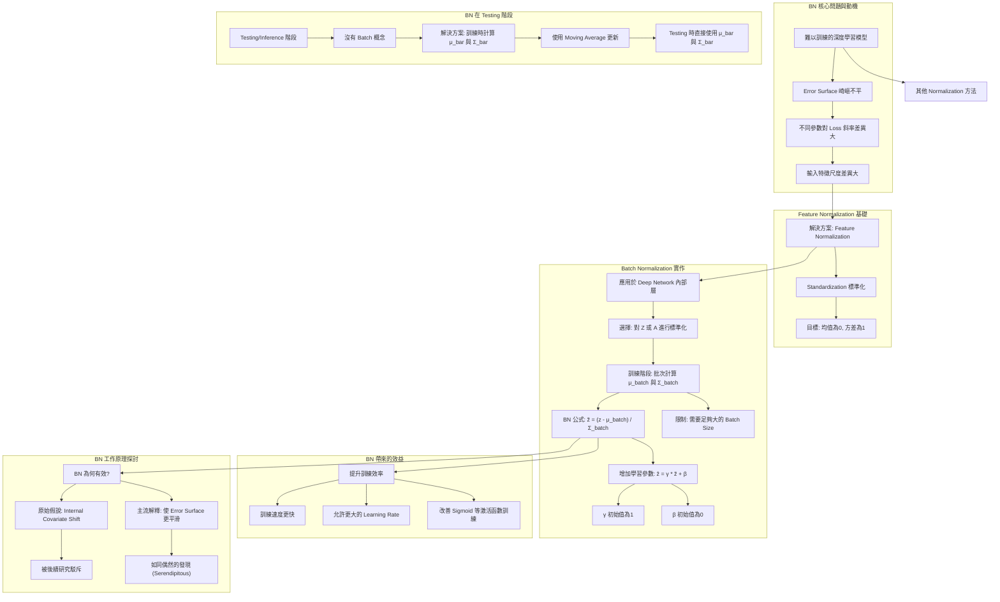

# 【機器學習 2021】第16堂課：Batch Normalization

## 1. Batch Normalization (BN) 簡介與動機

Batch Normalization 是一個用於改善深度學習模型訓練的技術。其核心思想是直接修改模型的損失函數 (error surface) 的「地形」，使其更容易訓練。

### 1.1 困難的 Optimization 問題

在討論 Batch Normalization 之前，我們首先回顧機器學習中的優化問題。即使損失函數是凸函數（碗狀），也可能因為以下情況而難以訓練：

*   **參數對 Loss 的斜率差異巨大**：
    *   例如，W1 方向斜率變化小，W2 方向斜率變化大。
    *   若使用固定學習率 (learning rate)，很難得到好結果。
    *   這導致需要使用 Adam 等自適應學習率的優化器。

### 1.2 從何而來的崎嶇 Error Surface？

這種「參數對 Loss 斜率差異巨大」的狀況，通常源於輸入特徵的數值範圍 (scale) 差異很大。

**範例：簡單線性模型**

*   模型：`y = W1 * x1 + W2 * x2 + b`
*   Loss：`L = sum(e)` where `e = y - y_hat`

**W1 對 Loss 的影響：**
*   當 `x1` 的值普遍很小，`W1` 的微小變化對 `y` 和 `e` 的影響都小，導致 `L` 的變化也很小（`W1` 方向斜率小）。

**W2 對 Loss 的影響：**
*   當 `x2` 的值普遍很大，`W2` 的微小變化對 `y` 和 `e` 的影響都大，導致 `L` 的變化也很大（`W2` 方向斜率大）。

**結論**：當輸入特徵 `x1` 和 `x2` 的數值範圍差異很大時，就會產生不同方向斜率差異巨大的 Error Surface，使得訓練變得困難。

### 1.3 解決方案：Feature Normalization (特徵正規化)

為了製造更好的 Error Surface，我們可以嘗試讓不同維度的特徵擁有相似的數值範圍。這就是「特徵正規化」的概念。

**標準化 (Standardization)** 是一種常見的特徵正規化方法：

*   **計算方式**：對於第 `i` 個特徵維度：
    1.  計算所有訓練資料中，第 `i` 個維度的平均值 `μ_i`。
    2.  計算所有訓練資料中，第 `i` 個維度的標準差 `σ_i`。
    3.  將原始特徵值 `x_i` 轉換為 `x̃_i = (x_i - μ_i) / σ_i`。
*   **效果**：經過標準化後，該維度上的數值將平均值為 0，方差為 1，分佈在 0 上下。
*   **好處**：使 Gradient Descent 收斂更快、訓練更順利。

## 2. 深度學習中的 Batch Normalization

Feature Normalization 不僅適用於輸入特徵 `x`，也應該考慮應用於深度網路的隱藏層輸出。

### 2.1 隱藏層的 Feature Normalization

如果輸入 `x̃` 經過第一層 `W1` 得到 `z1`，但 `z1` 各維度數值分佈仍有差異，那麼訓練第二層 `W2` 的參數也會有困難。因此，我們也應該對隱藏層的輸出 `z` 或激活值 `a` 進行正規化。

*   **實作考量**：
    *   在激活函數 (activation function) **之前** (`z`) 或 **之後** (`a`) 進行正規化，實作差異不大。
    *   若選擇 Sigmoid 函數，對 `z` 進行正規化可能更好，因為 Sigmoid 在 0 附近斜率較大，有助於梯度傳播。

### 2.2 從 Feature Normalization 到 Batch Normalization

傳統的 Feature Normalization 需要計算「所有」訓練資料中特定維度的平均值 `μ` 和標準差 `σ`。然而：

*   **訓練資料量龐大**：實際的資料集往往有數百萬筆，無法一次性載入所有資料到記憶體中計算 `μ` 和 `σ`。
*   **解決方案**：在實作時，我們不考慮整個訓練資料集，而只考慮「一個 Batch」中的範例。

**Batch Normalization (BN) 的工作方式：**

1.  **批次計算**：
    *   在每次訓練迭代時，從訓練資料中取出一個 Batch 的資料 (例如 64 筆)。
    *   針對該 Batch 內的資料，計算隱藏層輸出 `z` 的每個維度的平均值 `μ_batch` 和標準差 `σ_batch`。
    *   對該 Batch 內的 `z` 進行正規化：`z̃ = (z - μ_batch) / σ_batch`。
    *   由於 `μ_batch` 和 `σ_batch` 是根據當前 Batch 計算的，因此 Batch Normalization 將每個 Batch 中的範例關聯起來，它被視為網路的一部分。

2.  **學習參數 γ 和 β**：
    *   在 `z̃` 之後，Batch Normalization 還會引入兩個可學習的參數：`γ` (scale) 和 `β` (shift)。
    *   最終的輸出是 `ẑ = γ * z̃ + β`。
    *   **目的**：有人認為強制平均值為 0 和方差為 1 可能限制了網路的表達能力。`γ` 和 `β` 允許網路調整 `ẑ` 的分佈，使其不必強制平均值為 0 和方差為 1，從而有更大的彈性。
    *   **初始值**：通常將 `γ` 初始化為全 1 向量，`β` 初始化為全 0 向量，這樣在訓練初期仍然保持正規化的好處。

### 2.3 Batch Normalization 在測試 (Inference) 階段的處理

在測試或線上應用時，通常一次只處理一筆資料，沒有「Batch」的概念，因此無法計算 `μ_batch` 和 `σ_batch`。

*   **解決方案：Moving Average (移動平均)**：
    *   在訓練階段，每次計算出 `μ_batch` 和 `σ_batch` 時，都會使用移動平均的方式來更新全局的 `μ_bar` 和 `σ_bar`。
    *   例如：`μ_bar_new = P * μ_bar_old + (1 - P) * μ_batch_current` (P 為超參數，如 0.9 或 0.99)。
    *   在測試階段，直接使用訓練過程中累積得到的全局 `μ_bar` 和 `σ_bar` 來進行正規化：`ẑ = γ * ((z - μ_bar) / σ_bar) + β`。

## 3. Batch Normalization 的實驗結果與效益

### 3.1 實驗數據佐證

下圖截自 Batch Normalization 原始論文，展示了其顯著優勢：
(這裡可以想像有一張圖表顯示不同訓練曲線)

*   **訓練速度**：紅色虛線（使用 BN）比黑色虛線（不使用 BN）更快達到相同的驗證集準確度。
*   **收斂速度**：使用 BN 後，模型能在更短的時間內收斂。
*   **學習率容忍度**：BN 使 Error Surface 更平滑，允許使用更大的學習率 (learning rate)，進一步加速訓練。
*   **對 Sigmoid 的改善**：即使是難以訓練的 Sigmoid 激活函數，加上 BN 也能順利訓練（粉紅色線），而沒有 BN 的 Sigmoid 可能根本無法訓練。

## 4. Batch Normalization 為何有效？

### 4.1 假說一：Internal Covariate Shift (內部協變量偏移)

Batch Normalization 原始論文提出「Internal Covariate Shift (ICS)」的概念來解釋其作用：

*   **ICS 描述**：當訓練深度網路時，前一層的參數更新會導致其輸出分佈發生變化。對於後續層來說，這就好像輸入資料的分佈發生了變化 (covariate shift)，使得後續層的訓練變得困難。
*   **BN 的作用 (原始假說)**：BN 通過正規化每一層的輸入，使得各層輸入的分佈保持相對穩定，從而減輕 ICS 的影響，加速訓練。

### 4.2 反駁與新觀點

一篇名為 "How Does Batch Normalization Help Optimization?" 的論文，通過大量實驗反駁了 ICS 是 BN 主要優點的觀點：

*   **實驗發現**：
    *   有無 BN，隱藏層輸出的分佈變化都不大。
    *   即便分佈變化很大，對訓練的傷害也有限。
    *   根據變化前後的分佈計算出的梯度方向相似。
*   **結論**：ICS 可能不是訓練網路時的主要問題，也可能不是 BN 效果好的關鍵原因。

該論文從實驗和理論上支持了另一個觀點：

*   **主流解釋**：Batch Normalization 的主要作用是**改變 Error Surface，使其變得更平滑、不那麼崎嶇**。
    *   平滑的 Error Surface 使得梯度下降更容易找到好的方向，並容忍更大的學習率。
*   **偶然的發現 (Serendipitous)**：作者認為 BN 的積極影響可能是一種「偶然的發現」，就像盤尼西林一樣，其優越性可能來自於意料之外的機制，而非最初假設的 ICS。儘管如此，它仍然是一個非常有用的方法。

## 5. 其他 Normalization 方法

Batch Normalization 並非唯一的正規化方法，還有許多其他變體，例如：

*   Layer Normalization
*   Instance Normalization
*   Group Normalization

## 知識圖譜

---

## 隨堂測驗

### 1. Batch Normalization (BN) 的主要動機是什麼？

點擊展開解答

BN 的主要動機是為了解決深度學習模型訓練過程中，Error Surface 過於崎嶇導致優化困難的問題。這通常是因不同輸入特徵或隱藏層輸出各維度的數值範圍差異過大所引起。通過正規化這些數值，BN 試圖使 Error Surface 更平滑，從而加速訓練並提高模型的穩定性。

### 2. Batch Normalization 在訓練階段和測試階段計算平均值 ($\mu$) 和標準差 ($\sigma$) 的方式有何不同？

點擊展開解答

*   **訓練階段**：在訓練階段，每次迭代都會從資料集中取一個「Batch」的資料。BN 會針對當前這個 Batch 的資料，計算其隱藏層輸出的各維度平均值 ($\mu_{batch}$) 和標準差 ($\sigma_{batch}$)，然後用於正規化該 Batch 的資料。同時，這些批次統計量也會被用來更新全局的移動平均 ($\mu_{bar}$) 和移動標準差 ($\sigma_{bar}$)。
*   **測試階段**：在測試階段（或線上推斷），通常一次只處理一筆資料，沒有「Batch」的概念。此時，BN 不會計算當前資料的 $\mu$ 和 $\sigma$，而是直接使用訓練階段累積得到的全局移動平均 ($\mu_{bar}$) 和移動標準差 ($\sigma_{bar}$) 來進行正規化。

### 3. 在關於 Batch Normalization 為何有效的討論中，原始論文提出的是什麼假說？而後續的研究又提出了什麼不同的觀點？

點擊展開解答

*   **原始假說**：Batch Normalization 的原始論文提出了「Internal Covariate Shift (ICS)」的假說。他們認為 BN 通過穩定各層輸入的分佈，減輕了前一層參數更新導致後續層輸入分佈變化的問題 (ICS)，從而加速了訓練。
*   **後續研究觀點**：一篇名為 "How Does Batch Normalization Help Optimization?" 的論文，通過實驗反駁了 ICS 是 BN 主要優點的觀點。該論文提出，BN 的主要作用是使模型的 **Error Surface 變得更平滑**，從而使得梯度下降更容易、更高效地進行優化，並允許使用更大的學習率。他們甚至認為 BN 像是一種「偶然的發現」(serendipitous)。

