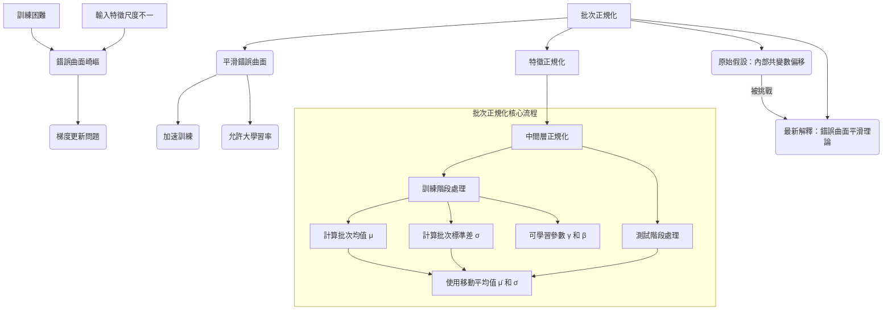

# 【機器學習 2021】第17堂課：批次正規化 (Batch Normalization)

## 1. 引言：訓練困難與批次正規化概述

在機器學習模型的訓練過程中，我們常常會遇到「錯誤曲面 (Error Surface)」崎嶇不平的問題。當錯誤曲面非常崎嶇時，模型會很難訓練，梯度下降法可能會在不平坦的表面上掙扎，導致訓練效率低下或難以收斂到理想的解。

### 1.1 訓練困難的根本原因

即使錯誤曲面是凸面或碗狀，也可能因為以下情況導致訓練困難：
*   **不同參數的梯度尺度差異大**：例如，在 `w1` 方向上，損失函數的斜率變化很小；而在 `w2` 方向上，斜率變化卻很大。如果使用固定的學習率，可能難以取得好結果。這也解釋了為什麼需要自適應學習率 (Adaptive Learning Rate) 優化器 (如 Adam)。

### 1.2 批次正規化 (Batch Normalization) 的核心思想

批次正規化是「直接平整錯誤曲面」的一種方法，目的是讓訓練過程更順暢、更有效率。其核心思想是通過對神經網路的每一層輸入進行標準化處理，使其分佈穩定，進而改善訓練。

## 2. 問題分析：梯度消失/爆炸與錯誤曲面

為什麼 `w1` 和 `w2` 的斜率會差異如此之大？這通常源於輸入特徵的尺度差異。

### 2.1 參數梯度差異大的情境

考慮一個簡單的線性模型：`y = w1 * x1 + w2 * x2 + b`。

*   **當 `x1` 值很小時**：改變 `w1` (即 `Δw1`) 對 `y` 的影響很小，進而對 `e` (誤差) 和 `L` (損失) 的影響也小。這會導致在 `w1` 方向上，錯誤曲面的斜率很小。
*   **當 `x2` 值很大時**：改變 `w2` 對 `y` 的影響會很大，進而對 `e` 和 `L` 的影響也大。這會導致在 `w2` 方向上，錯誤曲面的斜率很陡峭。

### 2.2 輸入特徵尺度對梯度的影響

**結論：** 如果不同維度特徵的數值大小差異很大（某些維度值很大，另一些很小），那麼錯誤曲面會表現出不良行為，即不同方向上的斜率大小差異巨大，使得訓練更加困難。

## 3. 特徵正規化 (Feature Normalization)

為了解決上述問題，我們可以修改特徵向量，讓每個維度的值都落在相似的範圍內，從而創造一個更好的錯誤曲面，使訓練更容易。這類方法統稱為特徵正規化 (Feature Normalization)。

### 3.1 傳統特徵正規化的方法 (標準化)

最常用的特徵正規化方法是**標準化 (Standardization)**。對於一個維度的所有特徵值 $x$，其處理方式如下：

$$
x_{tilde} = \frac{x - \mu}{\sigma}
$$

其中：
*   $\mu$ (mu) 是該維度所有特徵值的平均值。
*   $\sigma$ (sigma) 是該維度所有特徵值的標準差。

### 3.2 正規化後的統計特性

經過標準化處理後，該維度的特徵值將呈現以下特性：
*   **平均值為 0** ($\text{mean} = 0$)
*   **方差為 1** ($\text{variance} = 1$)

這使得所有維度的特徵值都分佈在 0 附近，且尺度相似。

### 3.3 特徵正規化的益處

將特徵正規化應用於輸入數據，可以：
*   使錯誤曲面變得更好。
*   在梯度下降訓練過程中，損失函數的收斂速度更快。
*   使梯度下降過程更平滑。

在深度學習中，特徵正規化 (通常指對輸入層的正規化) 是一種常用且有益的預處理步驟。

## 4. 批次正規化 (Batch Normalization) 深入探討

即使輸入 $x$ 經過正規化，但當它通過網路層變成中間的活化值 $z$ 或 $a$ 時，其分佈可能又不再是正規化的了。這會導致下一層的參數訓練再次面臨困難。因此，我們需要對網路的**中間層**也進行正規化。

### 4.1 為什麼需要對中間層進行正規化？

將輸入 $x$ 經過第一層權重 $w_1$ 得到 $z_1$，再通過活化函數得到 $a_1$。即使 $x$ 是正規化的， $z_1$ 或 $a_1$ 的不同維度之間也可能存在顯著的分佈差異。如果這些中間層的「特徵」沒有正規化，訓練下一層的參數 ($w_2$) 時仍然會遇到梯度困難。

因此，應對中間層的 $z$ (活化函數輸入) 或 $a$ (活化函數輸出) 進行正規化。在實踐中，這兩種做法差異不大。對於 Sigmoid 活化函數，對 $z$ 進行正規化更受推薦，因為它能將值集中在 Sigmoid 函數梯度較大的區域 (0 附近)。

### 4.2 批次正規化的計算過程 (訓練階段)

這裡以對 $z$ 進行正規化為例：

#### 4.2.1 針對 $z$ 或 $a$ 進行正規化

將網路的某一層輸出 $z_1, z_2, \dots, z_N$ (其中 $N$ 是批量大小或訓練數據量) 視為新的特徵向量。
對於這些 $z$ 向量的每個維度，計算其平均值 ($\mu$) 和標準差 ($\sigma$)：

*   $\mu$ 是一個向量，其每個元素是 $z_1, z_2, \dots, z_N$ 在該維度上的平均值。
*   $\sigma$ 是一個向量，其每個元素是 $z_1, z_2, \dots, z_N$ 在該維度上的標準差。

然後，對每個 $z_i$ 進行標準化：

$$
z_{i, \text{tilde}} = \frac{z_i - \mu}{\sigma}
$$

這裡的減法和除法都是**元素級運算 (element-wise operation)**。

#### 4.2.2 批次 (Batch) 的概念引入

由於整個訓練數據集可能包含數百萬個樣本，一次性將所有數據載入網路並計算 $\mu$ 和 $\sigma$ 是不可能的 (受限於 GPU 記憶體)。

**批次正規化**的關鍵在於：**在實現時，我們只針對一個批次 (Batch) 中的數據計算 $\mu$ 和 $\sigma$，然後對該批次中的所有數據進行正規化。**

例如，如果批量大小 (Batch Size) 設定為 64，那麼每次只讀取 64 個數據，並根據這 64 個數據計算 $\mu$ 和 $\sigma$，然後對這 64 個數據進行正規化。

**限制：** 批次正規化要求批次大小足夠大。如果批次大小設置為 1，則無法計算 $\mu$ 和 $\sigma$。一個足夠大的批次可以近似代表整個數據集的分佈。

#### 4.2.3 可學習參數 $\gamma$ 和 $\beta$

在標準化之後，批次正規化引入了兩個可學習的參數：$\gamma$ (gamma) 和 $\beta$ (beta)。

$$
z_{i, \text{hat}} = \gamma \odot z_{i, \text{tilde}} + \beta
$$

其中：
*   $\gamma$ 是一個向量，與 $z_{i, \text{tilde}}$ 進行**元素級乘法** (scaling)。
*   $\beta$ 是一個向量，與乘積結果進行**元素級加法** (shifting)。
*   $\odot$ 表示元素級乘法。

**引入 $\gamma$ 和 $\beta$ 的原因：**
儘管正規化後的 $z_{i, \text{tilde}}$ 平均值為 0，方差為 1，但這種「強制歸零」可能對網路帶來不必要的限制。引入 $\gamma$ 和 $\beta$ 允許網路自行學習調整輸出的分佈，例如，如果網路需要平均值非零的分佈，它會學習適當的 $\beta$ 值。

**初始化：**
*   $\gamma$ 的初始值通常設為 1 (即一個全為 1 的向量)。
*   $\beta$ 的初始值通常設為 0 (即一個全為 0 的向量)。
這樣，在訓練初期，每個維度的分佈仍然相對接近。隨著訓練的進行，網路會學習優化這些參數。

### 4.3 批次正規化在測試/推論階段

批次正規化在測試或推論階段會引發問題。

#### 4.3.1 測試階段的問題

在實際的線上應用中，數據是單獨或零星到來的，無法像訓練時那樣累積成一個批次。如果沒有批次，就無法計算 $\mu$ 和 $\sigma$。

#### 4.3.2 移動平均 (Moving Average) 的應用

為了解決這個問題，在測試階段會使用在訓練期間計算的 $\mu$ 和 $\sigma$ 的**移動平均值 (Moving Average)**。

*   **訓練期間**：每次處理一個批次，都會計算當前的 $\mu_t$ 和 $\sigma_t$。
*   PyTorch 等深度學習框架會自動計算並維護這些統計量的移動平均值：
    $$
    \bar{\mu} \leftarrow p \cdot \bar{\mu} + (1 - p) \cdot \mu_t \\
    \bar{\sigma} \leftarrow p \cdot \bar{\sigma} + (1 - p) \cdot \sigma_t
    $$
    其中，$p$ 是一個超參數 (通常在 PyTorch 中設為 0.1)。

*   **測試期間**：不再根據當前數據計算 $\mu$ 和 $\sigma$，而是直接使用訓練期間得到的最終移動平均值 $\bar{\mu}$ 和 $\bar{\sigma}$ 進行正規化。

## 5. 批次正規化的實驗結果與效益

批次正規化 (Batch Normalization) 原始論文的實驗結果顯示了其顯著的優勢：

### 5.1 訓練速度與收斂性

*   在驗證集上的準確度顯示，使用批次正規化 (紅虛線) 的訓練速度遠快於不使用批次正規化 (黑虛線)。
*   雖然最終收斂時的準確度可能相同，但 BN 能讓模型在更短的時間內達到相同或更高的準確度，有時甚至只需要一半或更少的時間。

### 5.2 允許更大的學習率

*   應用批次正規化後，錯誤曲面會變得更平滑，模型更容易訓練。
*   這使得我們可以**使用更大的學習率**，進一步加速訓練。實驗中，學習率增大 5 倍或 30 倍後，模型仍然能有效訓練。

### 5.3 Sigmoid 活化函數的適用性

*   Sigmoid 函數因其梯度在兩端接近 0 (梯度消失問題) 而通常不推薦使用，導致訓練困難。
*   然而，原始論文指出，即使使用 Sigmoid 函數，**結合批次正規化後也能獲得可接受的結果**。作者甚至提到，在沒有 BN 的情況下使用 Sigmoid 幾乎無法訓練。

## 6. 批次正規化為何有效？理論與爭議

### 6.1 原始論文的解釋：內部共變數偏移 (Internal Covariate Shift)

原始批次正規化論文的作者認為，當網路在訓練時，前一層參數的更新會導致後一層輸入分佈的改變。這種現象被稱為「內部共變數偏移 (Internal Covariate Shift)」。他們認為，這種偏移會迫使後續層不斷適應新的輸入分佈，從而減慢訓練速度。批次正規化通過固定這些層的輸入分佈來解決這個問題。

### 6.2 挑戰：批次正規化如何幫助優化？

然而，一篇名為《How Does Batch Normalization Help Optimization?》的論文對「內部共變數偏移」作為 BN 核心優勢的說法提出了質疑。該論文指出：
*   內部共變數偏移不一定是網路訓練中的主要問題。
*   即使分佈發生很大變化，也不會對訓練過程造成太大傷害。
*   BN 的效果可能不是因為解決了內部共變數偏移。

### 6.3 錯誤曲面平滑化

這篇論文（《How Does Batch Normalization Help Optimization?》）通過實驗和理論證明，批次正規化主要通過**改變和平滑錯誤曲面**來幫助優化，使其不再那麼崎嶇。一個更平滑的錯誤曲面更容易進行梯度下降，即使使用較大的學習率也能穩定訓練。

### 6.4 意外之喜 (Serendipitous Discovery)

該論文作者甚至提出，批次正規化對訓練的積極影響可能是一種「意外之喜 (Serendipitous)」。就像青黴素的發現一樣，BN 可能是在尋求解決其他問題的過程中，意外地發現其能有效平滑錯誤曲面並加速訓練。這意味著即使有其他方法也能平滑錯誤曲面並達到類似甚至更好的效果，但 BN 的簡潔和有效使其成為廣泛採用的技術。

## 7. 其他正規化方法簡介

批次正規化並非唯一的正規化方法。還有許多其他知名的正規化技術，例如：
*   Layer Normalization (層正規化)
*   Instance Normalization (實例正規化)
*   Group Normalization (群組正規化)
*   Weight Normalization (權重正規化)

這些方法各有優缺點，適用於不同的網路架構或應用場景。

---

## 隨堂測驗

### 測驗一

下列關於批次正規化 (Batch Normalization) 的敘述，何者為非？

A. 批次正規化主要目的是平滑模型的錯誤曲面，加速訓練。
B. 批次正規化在訓練階段，會針對當前批次的數據計算平均值和標準差進行正規化。
C. 在測試階段，批次正規化會使用訓練時計算的移動平均值來代替當前批次的統計量。
D. 批次正規化適用於任何批次大小，包括批量大小為 1 的情況。

點擊展開解答

**正確答案：D**

**解析：**
*   A、B、C 均為批次正規化的正確描述。
*   D 選項是錯誤的。批次正規化需要計算批次的平均值和標準差，因此要求批次大小足夠大，通常不適用於批量大小為 1 的情況，因為無法有效計算統計量。

### 測驗二

批次正規化引入了可學習的參數 $\gamma$ (gamma) 和 $\beta$ (beta)，其主要目的是什麼？

A. 為了確保正規化後的平均值和方差始終為 0 和 1。
B. 為了讓網路能夠在需要時，將正規化後的特徵分佈調整回非零平均值或非單位方差。
C. 這些參數用於在測試階段代替移動平均值。
D. 這些參數是預設的超參數，訓練過程中不會改變。

點擊展開解答

**正確答案：B**

**解析：**
*   A 選項是錯誤的。正規化後的 $z_{\text{tilde}}$ 平均值和方差已經是 0 和 1。引入 $\gamma$ 和 $\beta$ 是為了允許網路**偏離**這個 0 均值/1 方差的限制。
*   B 選項是正確的。 $\gamma$ 和 $\beta$ 是可學習的參數，賦予網路調整其層輸出分佈的靈活性，避免「強制歸零」可能帶來的負面影響。
*   C 選項是錯誤的。測試階段使用訓練時的移動平均值。
*   D 選項是錯誤的。$\gamma$ 和 $\beta$ 是網路參數，會隨梯度下降而更新，是可學習的。

### 測驗三

根據課程內容，批次正規化 (Batch Normalization) 被認為最主要的效果是什麼？

A. 徹底解決梯度消失/爆炸問題。
B. 消除所有網路層的內部共變數偏移。
C. 使錯誤曲面變得更平滑，從而加速訓練並允許更大的學習率。
D. 僅僅是一個意外的發現，沒有明確的理論解釋。

點擊展開解答

**正確答案：C**

**解析：**
*   A 選項過於絕對，批次正規化有助於緩解梯度問題，但不能說「徹底解決」。
*   B 選項是原始論文提出的假說，但後續研究（如《How Does Batch Normalization Help Optimization?》）指出，這可能不是 BN 效果的主要原因。
*   C 選項是目前被廣泛接受且有實驗和理論支持的解釋。平滑錯誤曲面是 BN 帶來的核心益處。
*   D 選項前半句「僅僅是一個意外的發現」是該論文對其本質的比喻，但後半句「沒有明確的理論解釋」是錯誤的，該論文本身就提供了錯誤曲面平滑的理論支持。

---

