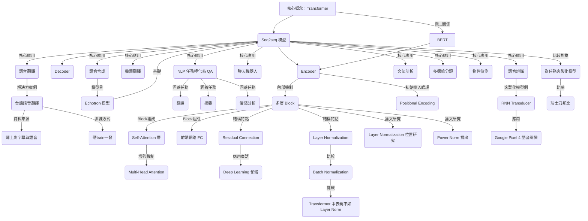

# 【機器學習 2021】第18堂課：【機器學習2021】Transformer (上)

## 課程簡介：Transformer 與 Seq2seq 模型

李宏毅教授在本次課程中，將深入探討 **Transformer** 模型，其與 **BERT** 有著密切關係。Transformer 本質上是一種 **Sequence-to-sequence (Seq2seq)** 模型。

### 什麼是 Sequence-to-sequence (Seq2seq) 模型？
Seq2seq 模型是一種處理序列資料的模型，其特點為：
*   **輸入 (Input)**：一個序列。
*   **輸出 (Output)**：一個序列。
*   **輸出長度由機器決定**：不同於輸入與輸出長度固定的情況（如作業二）或僅輸出單一結果（如作業四），Seq2seq 模型的輸出長度會根據輸入內容由模型自動決定。

## Seq2seq 模型的廣泛應用

Seq2seq 模型在多個領域都有關鍵應用，特別是當輸出序列的長度不確定時。

### 語音辨識 (Speech Recognition)
*   **輸入**：聲音訊號（一串向量）。
*   **輸出**：對應的文字序列。
*   **特性**：輸入聲音長度 `T` 與輸出文字長度 `N` 沒有絕對關係，由機器自行決定。

### 機器翻譯 (Machine Translation)

<picture>
  <source media="(prefers-color-scheme: dark)" srcset="../assets/vid16_seq2seq_dark.png">
  
</picture>
*   **應用**：作業五將會實作機器翻譯。
*   **輸入**：一種語言的句子（文字序列）。
*   **輸出**：另一種語言的句子（文字序列）。
*   **特性**：輸入文字長度 `N` 與輸出文字長度 `N'` 由機器自行決定（例如：「機器學習」->「machine learning」）。

### 語音翻譯 (Speech Translation)
*   **定義**：直接將某語言的聲音訊號翻譯成另一語言的文字。
*   **為何不採用語音辨識 + 機器翻譯？**
    *   世界上許多語言（超過半數的七千多種語言）缺乏文字系統，無法進行語音辨識。
    *   **案例：台語語音翻譯**
        *   **挑戰**：台語文字普及度不高，直接輸出文字難以理解。
        *   **目標**：輸入台語語音，直接輸出中文文字。
        *   **資料來源**：YouTube 鄉土劇（台語語音搭配中文字幕）。
        *   **訓練方式**：「硬 train 一發」：直接將音訊和文字對應輸入模型，不經複雜中介處理。
        *   **實驗結果**：證實可行，但仍有倒裝句等錯誤範例。

### 語音合成 (Speech Synthesis)
*   **定義**：與語音辨識相反，輸入文字，輸出聲音訊號。
*   **案例：台語語音合成**
    *   **資料來源**：「台灣媠聲」資料集。
    *   **實作模型**：目前多為兩階段（文字轉台羅拼音，再轉聲音），但「Echotron」模型本質上也是 Seq2Seq 模型。

### 聊天機器人 (Chatbot)
*   **輸入**：文字（使用者對話）。
*   **輸出**：文字（機器回應）。
*   **訓練**：收集大量對話資料（電視劇、電影台詞），學習問答對應。

### 將 NLP 任務視為問答 (Question Answering, QA)
許多看似與 QA 無關的 NLP 任務，都可以被轉化為 QA 問題，並利用 Seq2seq 模型解決。
*   **概念**：輸入「文章 + 問題」的序列，輸出「答案」的序列。
*   **應用範例**：
    *   **翻譯**：文章 = 英文句子，問題 = 「這個句子的德文翻譯是什麼？」，答案 = 德文。
    *   **摘要**：文章 = 長篇文章，問題 = 「這篇文章的摘要是什麼？」，答案 = 摘要。
    *   **情感分析 (Sentiment Analysis)**：文章 = 評論句子，問題 = 「這個句子是正面還是負面的？」，答案 = 正面/負面。

### 文法剖析 (Grammar Parsing)
*   **任務**：給定文字，產生一個語法剖析樹 (Syntactic Tree)。
*   **Seq2seq 解法**：將樹狀結構「線性化」成序列（例如：使用括號表示結構），再用 Seq2seq 模型學習「句子 -> 結構序列」的映射。
*   **經典論文**：《Grammar as a Foreign Language》(2014) 證明了此方法的可行性，並達到 SOTA。

### 多標籤分類 (Multi-label Classification)
*   **定義**：一個項目可以同時屬於多個類別。
*   **Seq2seq 解法**：輸入文章，輸出一個由機器自行決定長度的類別序列。

### 物件偵測 (Object Detection)
*   **定義**：辨識圖片中的物件並框選出來。
*   **Seq2seq 解法**：雖然看似不相關，但仍有研究指出可利用 Seq2seq 模型來解決。

### 客製化模型 vs. Seq2seq (瑞士刀比喻)
*   Seq2seq 模型功能強大，應用廣泛，但就像「瑞士刀」一樣，雖然能解決許多問題，卻不一定是最「好用」或效果最佳的。
*   針對特定任務客製化模型（例如 Google Pixel 4 語音辨識使用的 RNN transducer）通常能獲得更好的結果。

## Transformer 模型架構：Encoder-Decoder

Seq2seq 模型的經典架構包含兩大部分：
1.  **Encoder**：處理輸入序列。
2.  **Decoder**：根據 Encoder 處理的結果生成輸出序列。

Transformer 是當今最主流的 Seq2seq 模型之一，其架構包含許多複雜的區塊 (Block)。

### Transformer Encoder 深入解析
Encoder 的主要任務是將輸入的一排向量，轉換成另一排同樣長度的向量。Transformer 的 Encoder 核心採用了 **Self-Attention** 機制。

#### Encoder Block 的內部結構
Transformer Encoder 由多個重複的 Block 組成。每個 Block 的基本流程如下：

1.  **Multi-Head Self-Attention Layer**
    *   **輸入**：一排向量（已加上 **Positional Encoding** 以提供位置資訊）。
    *   **處理**：考慮整個序列的資訊，輸出另一排向量。
    *   **Multi-Head**：指使用多個 Self-Attention 機制，從不同角度捕捉資訊。

2.  **Add & Norm (Residual Connection + Layer Normalization)**
    *   **Residual Connection (殘差連結)**：將 Self-Attention 層的輸入直接加到其輸出上 (`Input + Output`)。這有助於梯度傳播。
    *   **Layer Normalization (層歸一化)**：對殘差連結後的結果進行歸一化處理。Layer Normalization 與 Batch Normalization 不同，它是在同一個向量內的不同維度上計算均值和標準差。

3.  **Feed-Forward Network (FC)**
    *   **輸入**：經過 Add & Norm 處理後的向量序列。
    *   **處理**：對序列中的每個向量獨立進行全連接前饋網路處理。

4.  **Add & Norm (Residual Connection + Layer Normalization)**
    *   再次對 Feed-Forward Network 的輸入與輸出進行殘差連結與層歸一化。

#### 總結 Encoder Block 流程

*   **輸入層**：輸入向量 + Positional Encoding
*   **第一個子層**：Multi-Head Self-Attention
*   **Add & Norm (1)**：Self-Attention 輸入 + 輸出，然後 Layer Normalization
*   **第二個子層**：Feed-Forward Network
*   **Add & Norm (2)**：Feed-Forward Network 輸入 + 輸出，然後 Layer Normalization
*   **輸出**：該 Block 的處理結果，將作為下一個 Block 的輸入。

這個複雜的 Encoder 結構，正是 **BERT** 模型的核心。

### Transformer 設計選擇的探討
儘管 Transformer 表現卓越，其原始設計並非絕對最佳，仍有許多研究探討優化空間：
*   **Layer Normalization 的位置**：論文《On Layer Normalization in the Transformer Architecture》探討了 Layer Normalization 放置位置對性能的影響，發現調整順序可帶來更好的結果。
*   **Normalization 類型的選擇**：論文《Power Norm: Rethinking Batch Normalization In Transformers》分析了 Batch Normalization 在 Transformer 中不如 Layer Normalization 的原因，並提出一種新的「Power Normalization」。

## 知識圖譜

## 隨堂測驗

1.  **問題一：** 根據課程內容，Transformer 本質上是一種什麼樣的模型？
    A. Multi-class Classification Model
    B. Regression Model
    C. Sequence-to-sequence Model
    D. Generative Adversarial Network

    

    
點擊查看答案

    **正確答案：C. Sequence-to-sequence Model**
    

2.  **問題二：** 在 Transformer 的 Encoder block 內部，Self-Attention 層和 Feed-Forward Network 層之後，都會緊接著哪兩個關鍵結構以增強模型性能？
    A. Dropout 和 ReLU
    B. Batch Normalization 和 Softmax
    C. Residual Connection 和 Layer Normalization
    D. Convolutional Layer 和 Pooling Layer

    

    
點擊查看答案

    **正確答案：C. Residual Connection 和 Layer Normalization**
    

3.  **問題三：** 課程中提到，對於某些語言，語音翻譯 (Speech Translation) 任務比「語音辨識 + 機器翻譯」的串聯方式更具優勢，其主要原因是什麼？
    A. 語音翻譯模型的訓練速度更快。
    B. 許多語言根本沒有文字系統，無法進行語音辨識。
    C. 語音翻譯通常能達到更高的翻譯準確度。
    D. 語音翻譯所需的計算資源較少。

    

    
點擊查看答案

    **正確答案：B. 許多語言根本沒有文字系統，無法進行語音辨識。**
    
