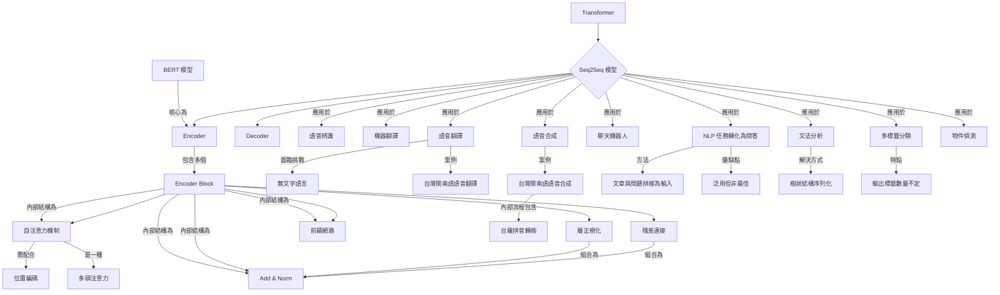

# 【機器學習 2021】第19堂課：[ML 2021 (English version)] Lecture 12: Transformer (1/2)

## 什麼是 Transformer？

本堂課將深入探討 **Transformer** 模型，這將是作業五（Homework 5）的核心。Transformer 模型與 [BERT](https://zh.wikipedia.org/wiki/BERT) 密切相關，但請注意，此 Transformer 非彼 Optimus Prime！

從根本上來說，Transformer 是一種 **Sequence to Sequence (Seq2Seq)** 模型。

## 核心概念：Sequence to Sequence (Seq2Seq) 模型

Seq2Seq 模型處理的任務是：**輸入一個序列，並輸出另一個序列**。其最主要的特點是：**輸出的長度是由模型本身決定的，而非預先固定。**

*   **輸入與輸出等長：** 類似於作業二（Homework 2）的情境，例如語音訊號轉換為另一種形式的語音訊號。
*   **輸出是一個單一項目：** 類似於作業四（Homework 4），例如輸入一段序列，輸出一個類別標籤。
*   **輸出長度不確定：** 作業五（Homework 5）的情境，也是 Seq2Seq 的核心應用。模型根據輸入序列的內容，自行決定輸出序列的長度。

## Seq2Seq 模型的多元應用

Seq2Seq 模型在許多領域都有廣泛應用，特別是當輸入和輸出都是序列，且輸出長度不確定時。

### 1. 語音辨識 (Speech Recognition)

*   **輸入：** 聲音訊號（一串向量序列）。
*   **輸出：** 對應的文字（一串詞彙序列）。
*   **特點：** 聲音訊號的長度與文字的長度沒有絕對的比例關係，模型需要自行判斷應輸出多少個詞彙。

### 2. 機器翻譯 (Machine Translation)

*   **輸入：** 某種語言的句子（文字序列）。
*   **輸出：** 另一種語言的翻譯句子（文字序列）。
*   **特點：** 輸入與輸出語言的句子長度通常不同，例如「Machine Learning」中文有四個字，英文只有兩個字。

### 3. 語音翻譯 (Speech Translation)

*   **輸入：** 語音訊號。
*   **輸出：** 另一種語言的翻譯文字。
*   **為何單獨處理？**
    *   **挑戰：** 世界上有超過一半的語言沒有書寫文字（或文字普及度低）。在這些情況下，我們無法將任務拆解為「語音辨識」再「機器翻譯」，因為缺乏中間的文字表示。
    *   **案例：台灣閩南語語音翻譯**
        *   **情境：** 輸入閩南語語音，直接輸出中文文字。
        *   **可行性：** 透過收集帶有中文字幕的台灣電視劇音頻，可以建立大量的語音-文字對應資料集。
        *   **研究室成果：** 實驗室曾使用 1500 小時的閩南語電視劇音頻進行訓練，成功實現語音翻譯。
        *   **範例分析：**
            *   **成功案例：** 輸入「你的身體快撐不住了 (閩南語)」，輸出「你的身體快撐不住了 (中文)」。
            *   **挑戰案例 (語序反轉問題)：** 輸入「我請廠長幫忙 (閩南語)」，模型輸出「我幫廠長問了什麼 (中文)」。閩南語和中文的語序有時需要反轉，這對模型學習來說是一大難點。
        *   **結論：** 閩南語語音直接轉譯為中文文字是可行的。

### 4. 語音合成 (Speech Synthesis)

*   **輸入：** 文字。
*   **輸出：** 語音訊號（語音辨識的反向任務）。
*   **案例：台灣閩南語語音合成**
    *   **目標：** 輸入中文文字，輸出閩南語語音。
    *   **當前實作方式：** 通常分為兩階段模型 (非完全端到端)：
        1.  中文文字 → 台羅拼音 (KK音標式的閩南語拼音)。
        2.  台羅拼音 → 聲音訊號 (使用類似 Transformer 的 Seq2Seq 模型，例如 Tacotron)。
    *   **範例：** 輸入「歡迎蒞臨臺灣大學語音處理實驗室」，輸出相對應的閩南語語音。

### 5. 聊天機器人 (Chatbot)

*   **輸入：** 文本（使用者輸入的句子）。
*   **輸出：** 文本（模型的回答）。
*   **訓練方法：** 收集大量的對話資料，例如電視劇、電影對白等，將問句視為輸入，答句視為輸出進行訓練。

### 6. 將 NLP 任務轉化為問答 (Question Answering, QA) 問題

許多表面上看似與 QA 無關的自然語言處理 (NLP) 任務，實際上都可以被建模為 QA 問題，並使用 Seq2Seq 模型解決。

*   **基本思路：** 將原始文本與問題串接起來作為 Seq2Seq 的輸入，模型的輸出則是問題的答案。
*   **應用實例：**
    *   **翻譯：** 文章為英文句子，問題是「這句英文的德文翻譯是什麼？」，模型輸出德文答案。
    *   **摘要：** 文章為長篇文章，問題是「這篇文章的摘要是什麼？」，模型輸出文章摘要。
    *   **情感分析：** 文章為評論，問題是「這篇文章是正面還是負面？」，模型輸出「正面」或「負面」。
*   **通用性與限制：** 雖然 Seq2Seq 模型可以「萬用」地解決這些問題，就像瑞士刀一樣，但針對特定任務客製化的模型（例如 RNN Transducer 用於 Pixel 4 語音辨識）往往能獲得更好的性能。

### 7. 文法分析 (Grammar Analysis)

*   **輸入：** 一段文字。
*   **輸出：** 語法分析樹 (Syntactic Tree)。
*   **挑戰：** 輸出是樹狀結構，而非序列。
*   **Seq2Seq 解決方案：** 將樹狀結構「序列化」。
    *   **方法：** 將語法分析樹轉換為帶有括號的文本序列，類似於將文法視為一種「外語」。
    *   **案例：** 論文 "Grammar as a Foreign Language" (2014) 首次提出此概念，並在當時達到 SOTA 表現，證明此「瘋狂」想法的可行性。

### 8. 多標籤分類 (Multi-label Classification)

*   **與多類別分類的區別：** 多類別分類是從多個類別中選擇一個；多標籤分類是單一物件可以屬於多個類別。
*   **挑戰：** 每篇文章可能對應不同數量的類別，難以簡單設定「輸出得分最高的前 N 個」。
*   **Seq2Seq 解決方案：**
    *   **輸入：** 文章。
    *   **輸出：** 模型自行決定應輸出哪些類別（序列），解決了輸出數量不確定的問題。

### 9. 物件偵測 (Object Detection)

*   **任務：** 給定一張圖片，模型框出圖片中的物件並識別其類別。
*   **Seq2Seq 解決方案：** 雖然看起來與 Seq2Seq 相去甚遠，但也可以「暴力」地將其轉化為 Seq2Seq 問題（具體細節本課程不展開）。

## Seq2Seq 模型架構：Encoder-Decoder

Seq2Seq 模型通常分為兩大部分：

*   **Encoder (編碼器)：** 負責處理輸入序列，將其轉換為一種內部表示（通常是一個向量序列或上下文向量）。
*   **Decoder (解碼器)：** 根據 Encoder 的輸出，逐步生成輸出序列。Decoder 會自行決定輸出序列的長度。

最初的 Seq2Seq 模型概念在 2014 年左右提出，而現代 Seq2Seq 模型，特別是本課程要討論的 **Transformer**，正是基於 Encoder-Decoder 架構，並在其內部使用了更複雜的子模塊。

## Transformer Encoder 詳解

Transformer 的 Encoder 負責將輸入的向量序列（例如詞嵌入加上位置編碼）轉換為另一個等長的向量序列。

### Transformer Encoder Block 結構

Transformer Encoder 由多個相同的「Block」堆疊而成。每個 Block 都接收一個向量序列作為輸入，並輸出另一個向量序列。

一個 Transformer Encoder Block 的內部結構如下：

1.  **輸入：** 向量序列 (每個向量代表一個詞的資訊)。
    *   **重要：** 為了讓模型理解詞序，輸入會額外加入 **位置編碼 (Positional Encoding)**。
2.  **多頭自注意力機制 (Multi-head Self-Attention)**
    *   這是 Transformer 的核心，允許模型在處理每個詞時，同時考慮輸入序列中所有其他詞的資訊。
3.  **殘差連接 (Residual Connection)**
    *   將自注意力機制的輸入直接加到其輸出上 (`Input + Output`)。這有助於緩解梯度消失問題，並讓深層網路更容易訓練。
4.  **層正規化 (Layer Normalization)**
    *   對殘差連接後的結果進行正規化。
    *   **與 Batch Normalization 的區別：**
        *   **Batch Norm：** 對於批次中的不同樣本，在**相同特徵維度**上計算均值和標準差進行正規化。
        *   **Layer Norm：** 對於**單一樣本**，在其所有**不同特徵維度**上計算均值和標準差進行正規化。
    *   **公式：** `x_normalized = (x - mean(x)) / std_dev(x)` (注意：原逐字稿提到「不需要 prime」，是指這裡的 `x` 就是原始輸入，而非經過某些變換後的 `x'`)
5.  **前饋網路 (Feed-Forward Network, FFN)**
    *   一個全連接網路，獨立地作用於序列中的每個位置。
6.  **殘差連接 (Residual Connection)**
    *   將前饋網路的輸入直接加到其輸出上。
7.  **層正規化 (Layer Normalization)**
    *   對前饋網路殘差連接後的結果進行正規化。

上述的「殘差連接 + 層正規化」組合，在 Transformer 的圖示中通常簡稱為 **"Add & Norm"**。

一個完整的 Transformer Encoder 由 `N` 個這樣的 Block 堆疊而成。

### BERT 與 Transformer Encoder

值得注意的是，著名的 **BERT (Bidirectional Encoder Representations from Transformers)** 模型，其實就是 **Transformer 的 Encoder 部分**。

## Transformer Encoder 設計的優化與討論

原始 Transformer 的架構設計，雖然非常成功，但並不一定是唯一的或最佳的。研究者們一直在探索優化空間：

*   **層正規化 (Layer Normalization) 的位置：**
    *   原始 Transformer 採用的是 **Post-LN (後置層正規化)**，即「殘差連接 → 層正規化」。
    *   有研究提出 **Pre-LN (前置層正規化)**，即「層正規化 → 自注意力/前饋網路 → 殘差連接」，這種方式在某些情況下可能表現更好，訓練也更穩定。
    *   參考論文："On Layer Normalization in the Transformer Architecture"

*   **為何選擇層正規化而非批次正規化 (Batch Normalization)？**
    *   雖然兩者都是正規化技術，但層正規化更適用於 Transformer 這種處理序列長度多變、或批次大小較小的模型。
    *   參考論文："Power Norm: Rethinking Batch Normalization in Transformers" 探討了此問題，並提出新的正規化方法。

## Mermaid 知識圖譜

## 隨堂測驗

### 測驗一

Seq2Seq 模型與傳統機器學習任務（例如作業二和作業四）在處理輸入輸出長度方面有何根本區別？請舉例說明 Seq2Seq 模型在何種情況下會展現此獨特能力。

  
點擊展開解答

  Seq2Seq 模型最根本的區別在於其能夠**讓模型自行決定輸出序列的長度**。
  
  *   **傳統任務對比：** 在作業二（輸入序列，輸出等長序列）和作業四（輸入序列，輸出單一項目）中，輸出的長度要麼與輸入綁定，要麼是固定的單一值。
  *   **獨特能力體現：** 當輸入和輸出都是序列，且輸出序列的長度無法從輸入序列長度直接推斷或預先確定時，Seq2Seq 的優勢就顯現出來。
  *   **例子：**
      1.  **語音辨識：** 輸入一段長度為 T 的聲音訊號，輸出一段長度為 N 的文字。N 無法直接由 T 推算，模型需根據語音內容自行決定輸出多少字。
      2.  **機器翻譯：** 輸入一句中文，輸出一句英文。中英文句子長度通常不同，模型需自行判斷翻譯後的英文句子長度。
      3.  **多標籤分類：** 輸入一篇文章，輸出其所屬的多個類別標籤。不同文章可能屬於不同數量的類別，模型需自行決定輸出多少個標籤。

### 測驗二

為什麼在處理「語音翻譯」（例如將閩南語語音直接翻譯成中文文字）時，結合「語音辨識」與「機器翻譯」兩個模型的方法，在面對世界上許多語言時會遇到困難？Seq2Seq 模型是如何克服這個困難的？

  
點擊展開解答

  *   **困難所在：**
      1.  **無文字語言：** 世界上有超過一半的語言沒有書寫文字系統，或者其文字系統普及度很低。
      2.  **中間表示缺失：** 如果要結合「語音辨識」與「機器翻譯」，就必須先將語音轉換為文字（語音辨識），再將文字翻譯為另一種語言。對於沒有書寫文字的語言，第一步的語音辨識就會失敗，因為沒有對應的文字作為中間表示。
  *   **Seq2Seq 如何克服：**
      Seq2Seq 模型能夠直接將一個序列（語音訊號）轉換為另一個序列（目標語言的文字），而**無需中間的文字表示**。它學習的是語音與翻譯目標語言文字之間直接的映射關係。
      *   **例子：** 閩南語語音翻譯直接從閩南語聲音訊號學習映射到中文文字，即使閩南語本身沒有普遍接受的書寫文字，也能透過收集大量帶有中文字幕的閩南語影音資料來訓練模型。

### 測驗三

請詳細描述 Transformer Encoder 中一個 Block 的主要組成部分及其功能，特別解釋「殘差連接 (Residual Connection)」和「層正規化 (Layer Normalization)」在其中的作用，並簡述 Layer Normalization 與 Batch Normalization 的主要區別。

  
點擊展開解答

  Transformer Encoder 的一個 Block 主要包含以下部分：

  1.  **多頭自注意力機制 (Multi-head Self-Attention)：**
      *   **功能：** 這是 Transformer 的核心，允許模型在處理序列中每個位置的詞時，能夠同時關注到輸入序列中的所有其他詞，並從不同「注意力頭」學習到不同的表示。它幫助模型捕捉長距離依賴關係。

  2.  **殘差連接 (Residual Connection)：**
      *   **功能：** 在自注意力機制和前饋網路的輸出之後，會將該模塊的輸入直接加到其輸出上（即 `Input + Output`）。
      *   **作用：** 這有助於緩解深層網路訓練時的梯度消失問題，使梯度能夠更容易地流過網絡層次，從而讓訓練更深的模型成為可能。

  3.  **層正規化 (Layer Normalization)：**
      *   **功能：** 在殘差連接之後，對結果進行正規化處理，將每個樣本的特徵維度數據調整到相似的範圍。
      *   **作用：** 穩定訓練過程，加速模型收斂，並減少對初始化權重的敏感性。
      *   **與 Batch Normalization 的區別：**
          *   **Batch Normalization：** 在一個 Batch 內，對**不同樣本**在**相同特徵維度**上計算均值和標準差進行正規化。適用於 Batch Size 較大且每個 Batch 內的數據分佈相似的場景。
          *   **Layer Normalization：** 對**單一樣本**，在**所有特徵維度**上計算均值和標準差進行正規化。與 Batch Size 無關，因此特別適合處理序列長度多變（每個時間步的「特徵」可以看作是不同維度）的任務，如 NLP 和 Transformer，也適用於 Batch Size 較小的情況。

  4.  **前饋網路 (Feed-Forward Network, FFN)：**
      *   **功能：** 是一個由兩個線性轉換和一個激活函數組成的全連接網路。它獨立地作用於序列中每個位置的向量，為模型增加非線性轉換能力。

  **一個 Block 的整體流程簡述：**
  輸入向量序列 -> 多頭自注意力機制 -> (殘差連接 + 層正規化) -> 前饋網路 -> (殘差連接 + 層正規化) -> 輸出向量序列。

