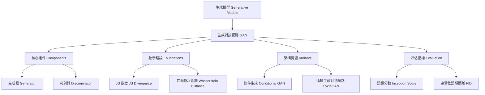

# 第21堂課：生成對抗網路 (Generative Adversarial Network, GAN)

在本堂課程中，李宏毅教授深入探討了**生成模型 (Generative Models)** 的核心代表——**生成對抗網路 (Generative Adversarial Network, GAN)**。課程從為什麼需要生成分佈出發，詳細講解了 GAN 的基本架構、演算法步驟、數學理論推導（包括 JS 散度與 Wasserstein 距離），並延伸到條件生成 (Conditional Generation)、無配對資料的風格轉換 (CycleGAN) 以及生成模型的評估指標 (FID, IS)。

---

## 知識圖譜 (Knowledge Graph)



---

## 1. 生成模型與分佈生成的核心概念

### 1.1 為什麼我們需要產生一個「分佈」？ (Why Distribution?)
在傳統的機器學習任務（如分類、回歸）中，我們通常希望模型給出一個確定的輸出。然而，在許多實際場景（特別是需要**創意 (Creativity)** 或存在**多重正確答案**的任務）中，相同的輸入可能對應多種不同的合理輸出。

*   **小精靈遊戲畫面預測 (Video Prediction)**：
    *   輸入：前幾個畫面（小精靈走到十字路口）。
    *   如果使用傳統的回歸模型（如最小化 MSE Loss），模型為了妥協「往左走」與「往右走」兩種可能的未來，會輸出這兩個合理畫面的**平均值**。這會導致輸出一個模糊不清、小精靈分裂成左右兩個半透明影子的錯誤畫面。
    *   如果使用生成分佈的模型，模型就能學會以機率的方式隨機輸出「往左走（清晰畫面）」或「往右走（清晰畫面）」。

```
傳統回歸 (MSE)  --> 輸入 (路口) --> 輸出: 左右模糊合體 (失敗)
分佈生成模型    --> 輸入 (路口) --> 隨機輸出: 清晰向左 OR 清晰向右 (成功)
```

*   **其他需要創意的任務**：
    *   **畫圖 (Drawing)**：給予條件「紅眼睛的角色」，模型應該能產生各種不同髮色、表情的紅眼動漫人物。
    *   **聊天機器人 (Chatbot)**：給予「你知道輝夜是誰嗎？」，回答可以是「她是秀知院學生會...」或者「她開創了忍者時代...」，皆為合理的答案。

### 1.2 生成器 (Generator) 的運作機制
生成器是一個神經網路（函數），其特點在於：
1.  輸入除了條件 $x$ 之外，還包含一個從簡單分佈（如高斯分佈、均勻分佈）中隨機採樣出來的低維向量 $z$。
2.  向量 $z$ 代表了生成過程中的**隨機性（靈感、隨機變數）**。
3.  輸出 $y$ 則是高維度的複雜分佈（如一張動漫人物的頭像、一段語音）。

$$y = G(x, z)$$

若不給予條件 $x$，單純將 $z$ 送入生成器產生影像，則稱為**無條件生成 (Unconditional Generation)**。

---

## 2. 生成對抗網路 (Generative Adversarial Network, GAN)

### 2.1 GAN 的基本思想：寫作敵人，唸做朋友
GAN 的核心概念建立在兩個神經網路的對抗與共同演化上：

*   **生成器 (Generator, G)**：負責將輸入的隨機向量 $z$ 轉換為虛擬數據（如動漫頭像）。其目標是產生極為逼真的數據，以騙過判別器。
*   **判別器 (Discriminator, D)**：負責接收一個數據（可能是真實數據或生成器產生的虛擬數據），並輸出一個純量（Scalar）。輸出值越大代表越像真實數據，值越小代表越像虛擬數據。

> **比喻**：生成器就像印假鈔的犯罪分子，判別器就像緝捕假鈔的警察。隨著警察的辨識技術越來越高超，印假鈔的技術也隨之被逼得越來越精湛。

---

### 2.2 GAN 的訓練演算法 (Algorithm)

在每個訓練迭代 (Training Iteration) 中，分為以下兩個主要步驟交互進行：

```
                    ┌─────────────────────────┐
                    ▼                         │
   Step 1: 固定 G, 訓練 D             Step 2: 固定 D, 訓練 G
   (讓 D 學習區分真假)                 (更新 G 的參數以騙過 D)
```

#### Step 1: 固定生成器 $G$，更新判別器 $D$
1.  從資料庫中隨機採樣一組真實數據 $\{x^1, x^2, \dots, x^m\}$。
2.  從簡單分佈中隨機採樣一組低維向量 $\{z^1, z^2, \dots, z^m\}$，並通過 $G$ 產生一組虛擬數據 $\{\tilde{x}^1, \tilde{x}^2, \dots, \tilde{x}^m\}$，其中 $\tilde{x}^i = G(z^i)$。
3.  訓練判別器 $D$，其目標為：
    *   對真實數據 $x^i$ 輸出高分（接近 $1$）。
    *   對生成數據 $\tilde{x}^i$ 輸出低分（接近 $0$）。
    *   **本質**：這相當於訓練一個二元分類器（Binary Classifier），以最小化交叉熵 (Cross Entropy)。

#### Step 2: 固定判別器 $D$，更新生成器 $G$
1.  從簡單分佈中隨機採樣一組低維向量 $\{z^1, z^2, \dots, z^m\}$。
2.  將這些向量輸入到 $G$ 中產生 $\{\tilde{x}^1, \dots, \tilde{x}^m\}$，再將生成的影像輸入到固定住參數的 $D$ 中，得到分數 $D(G(z^i))$。
3.  調整生成器 $G$ 的參數，目標是**最大化 $D(G(z^i))$**（即騙過判別器，讓判別器給予高分）。
4.  在實際操作中，我們將 $G$ 與 $D$ 串聯成一個巨大的網路，只對 $G$ 的部分進行梯度下降更新。

---

## 3. GAN 背後的數學理論 (Theory behind GAN)

### 3.1 優化目標 (Our Objective)
我們將真實資料的分佈記作 $P_{\text{data}}$，由生成器 $G$ 所產生的數據分佈記作 $P_G$。生成器的終極目標是讓 $P_G$ 與 $P_{\text{data}}$ 越接近越好。

我們可以用**散度 (Divergence)** $\text{Div}(P_G, P_{\text{data}})$ 來衡量兩個分佈之間的差異。優化目標為：

$$G^* = \arg\min_G \text{Div}(P_G, P_{\text{data}})$$

然而，我們並不知道 $P_G$ 與 $P_{\text{data}}$ 的具體解析式（Formulation），只擁有從這兩個分佈採樣出來的樣本。**GAN 的精妙之處，就在於利用判別器 $D$ 來隱式地計算這個散度。**

---

### 3.2 判別器與 JS 散度 (JS Divergence) 的關聯性
在 Ian Goodfellow 於 2014 年發表的原始論文中，判別器 $D$ 的目標函數定義為：

$$V(G, D) = \mathbb{E}_{x \sim P_{\text{data}}}[\log D(x)] + \mathbb{E}_{y \sim P_G}[\log(1 - D(y))]$$

當給定一個生成器 $G$ 時，最優的判別器 $D^*$ 可以藉由對上述目標函數求偏導並令其為零來求得。經推導，最優判別器為：

$$D^*(x) = \frac{P_{\text{data}}(x)}{P_{\text{data}}(x) + P_G(x)}$$

將 $D^*(x)$ 代回目標函數 $V(G, D)$，我們可以得到極大值：

$$\max_D V(G, D) = -2\log 2 + 2 \cdot \text{JSD}(P_{\text{data}} \parallel P_G)$$

其中，$\text{JSD}$ 代表 **Jensen-Shannon Divergence（JS 散度）**。
這證明了：**最大化判別器的目標函數，本質上就是在計算真實分佈 $P_{\text{data}}$ 與生成分佈 $P_G$ 之間的 JS 散度。**

因此，GAN 的整體 minimax 賽局（Game）可以寫成：

$$G^* = \arg\min_G \max_D V(G, D)$$

---

### 3.3 統一框架：f-divergence
後續的研究（如 $f$-GAN）表明，只要設計不同的判別器目標函數，我們就可以衡量幾乎任何類型的散度（如 KL 散度、Reverse KL 散度、Pearson $\chi^2$ 散度等）。

---

## 4. 訓練 GAN 的痛點與 WGAN 的救贖

### 4.1 JS 散度在訓練 GAN 時的致命缺陷
在實際訓練中，基本的 GAN（基於 JS 散度）極其難以收斂。這被社群自嘲為 **"No Pain, No GAN"**。

#### 為什麼 JS 散度不行？
1.  **數據的低維流形本質**：真實數據 $P_{\text{data}}$ 與生成數據 $P_G$ 在高維空間（如 $64 \times 64 \times 3$ 的影像空間）中，通常都是極低維度的**流形 (Manifold)**。
2.  **不重合性**：兩個低維流形在高維空間中重合的機率幾近於零。即使有重合，由於我們是用有限的**樣本 (Sampling)** 來訓練，判別器也能輕易地畫出一條完美的決策邊界將兩者分開。
3.  **梯度消失**：只要 $P_G$ 與 $P_{\text{data}}$ 幾乎不重合，無論兩者距離多近或多遠，其 JS 散度計算出來的數值**永遠恆等於常數 $\log 2$**。

$$\text{JSD}(P_{\text{data}} \parallel P_G) = \log 2 \quad (\text{if no overlap})$$

這意味著：當兩者完全沒有重合時，生成器不論往哪個方向移動，散度都不會變小。生成器將無法獲得任何梯度資訊（梯度為 0），訓練隨之卡死。

```
[ P_G (遠) ] ───(JS 散度 = log 2, 梯度=0)───> [ P_data ]
[ P_G (近) ] ───(JS 散度 = log 2, 梯度=0)───> [ P_data ]
```

---

### 4.2 瓦瑟斯坦距離 (Wasserstein Distance / Earth Mover's Distance)
為了解決 JS 散度的梯度消失問題，研究者引入了 **Wasserstein 距離**（又稱陸地移動者距離，Earth Mover's Distance）。

#### 直觀理解
假設將分佈 $P$ 視為一堆「沙土」，分佈 $Q$ 視為「壕溝」。將沙土 $P$ 塑造成壕溝 $Q$ 所需移動沙土的**最小平均距離**，即為 Wasserstein 距離。

*   **優勢**：即使兩個分佈完全不重合，隨著它們彼此靠近，Wasserstein 距離也會**連續且平滑地變小**。這能為生成器提供非常穩健且方向明確的引導梯度。

$$\text{Wasserstein}(P_G, P_{\text{data}}) = d$$

---

### 4.3 WGAN (Wasserstein GAN) 的數學公式與 Lipschitz 限制
WGAN 提出利用判別器來估算 Wasserstein 距離：

$$\max_{D \in \text{1-Lipschitz}} \left\{ \mathbb{E}_{x \sim P_{\text{data}}}[D(x)] - \mathbb{E}_{y \sim P_G}[D(y)] \right\}$$

#### 1-Lipschitz 限制 (Lipschitz Constraint)
為了讓上述公式成立，判別器 $D(x)$ 必須滿足 **1-Lipschitz** 條件（即函數必須足夠平滑，其斜率/梯度的模長在任何地方都不能超過 $1$）。

*   **為什麼需要限制？**：如果不加限制，為了讓目標函數最大化，判別器會無限制地讓真樣本 $D(x) \to +\infty$，假樣本 $D(y) \to -\infty$，導致訓練崩潰。限制了斜率後，真假樣本之間的高度差就會被距離所限制，從而能準確地代表 Wasserstein 距離。

```
無 Lipschitz 限制：  D(真) ───↗ +∞  , D(假) ───↘ -∞ (無法收斂)
有 Lipschitz 限制：  D 函數平滑斜率 < 1 (完美代表 Wasserstein 距離)
```

#### 如何實現 1-Lipschitz 限制？
1.  **WGAN (Weight Clipping)**：強制將判別器的權重參數 $w$ 限制在 $[-c, c]$ 之間。缺點是限制過於粗暴，容易讓網路失去學習複雜特徵的能力。
2.  **WGAN-GP (Gradient Penalty)**：在目標函數中加入一個懲罰項，約束「在真假樣本過渡區域隨機採樣的點 $\hat{x}$，其梯度模長應儘可能接近 $1$」。
3.  **Spectral Normalization**：藉由矩陣算子範數歸一化權重，使網路在任何地方的梯度模長都小於 $1$（目前最主流且穩定的做法）。

---

## 5. 條件生成 (Conditional Generation)

### 5.1 為什麼傳統 GAN 無法進行條件生成？
在諸如 **Text-to-Image（文本生成影像）** 的任務中，我們輸入條件 $x$（如 "Red eyes"）以及隨機向量 $z$，希望生成器產生符合條件的影像。

若我們直接使用傳統的判別器 $D(y)$，判別器只會檢查影像 $y$ 本身是否真實。此時，生成器 $G$ 很快就會發現：它只需要產生一張非常逼真但**完全無視條件 $x$** 的影像（例如畫一張極為精緻的黃頭髮角色，而非紅眼睛），就能輕易騙過判別器。

---

### 5.2 Conditional GAN (CGAN) 的架構
為了解決這個問題，判別器必須同時將**條件 $x$** 與**影像 $y$** 作為輸入。

```
輸入條件 x ───┐
              ├─> [ 生成器 G ] ───> 產生影像 y
隨機向量 z ───┘

輸入條件 x ───┐
              ├─> [ 判別器 D ] ───> 輸出分數 (0 ~ 1)
影像 y     ───┘
```

判別器 $D(x, y)$ 的評分標準更新為：
1.  $y$ 必須是一張真實的影像。
2.  $x$ 與 $y$ 必須高度**配對/吻合 (Matched)**。

#### 訓練樣本的配對設計：
*   （真文字，真影像） $\to$ 標註為 **1**（如：紅眼睛，紅眼動漫圖）
*   （真文字，生成影像） $\to$ 標註為 **0**（如：紅眼睛，生成的動漫圖）
*   **關鍵關鍵**：（**真文字，不配對的真影像**） $\to$ 標註為 **0**（如：紅眼睛，藍眼動漫圖）。這能強迫判別器去學習文字與影像之間的關聯性。

---

### 5.3 CGAN 的應用範例
*   **pix2pix (Image Translation)**：將線條圖轉為實體照、黑白照片轉彩色、白晝街景轉夜景。
*   **Sound-to-Image**：輸入「狗吠聲」的音訊特徵，生成狗的影像；輸入「瀑布聲」，生成瀑布影像。
*   **Talking Head Generation**：輸入一張蒙娜麗莎的靜態畫作，搭配一段說話的影片作為條件，生成蒙娜麗莎動起來說話的合成影片。

---

## 6. 無配對資料的非監督學習 (Learning from Unpaired Data)

在許多應用中（如：將真實照片轉為動漫風格、將男生照片轉為女生），我們很難收集到一對一配對好的資料（Unpaired Data）。這時就需要使用**非監督條件生成 (Unsupervised Conditional Generation)**。

### 6.1 循環生成對抗網路 (CycleGAN) 的原理
如果只使用單向的 GAN，將網域 $X$ 映射到網域 $Y$，生成器 $G_{X \to Y}$ 可能會完全忽略輸入的照片，只產生一張隨機的逼真動漫臉。

為了確保轉換後的影像仍保留原本照片的結構與資訊，CycleGAN 引入了**循環一致性 (Cycle Consistency)** 的約束：

```
                    ┌───────────────── 循環一致性 ─────────────────┐
                    ▼                                              │
照片 x ───> [ 生成器 G_X→Y ] ───> 虛擬動漫圖 y' ───> [ 生成器 G_Y→X ] ───> 重建照片 x''
```

1.  **第一步**：將照片 $x$ 透過 $G_{X \to Y}$ 轉換成動漫圖 $y'$，並由判別器 $D_Y$ 判斷 $y'$ 是否符合動漫網域 $Y$。
2.  **第二步**：將生成的動漫圖 $y'$ 透過另一個相反方向的生成器 $G_{Y \to X}$ 轉換回照片 $x''$。
3.  **約束目標**：輸入的 $x$ 與重建後的 $x''$ 必須**越接近越好**（最小化 $L_1$ 或 $L_2$ Reconstruction Loss）。

因為有重建的要求，生成器 $G_{X \to Y}$ 在將照片轉換為動漫風時，就被迫必須保留原本照片中人物的五官位置、姿勢與背景資訊。

---

## 7. 生成模型的評估方法 (Evaluation of Generation)

評估生成器的好壞非常困難，因為我們不能單純比對生成影像與真實影像的像素差異。

### 7.1 影像品質評估 (Quality) 與 Inception Score (IS)
我們如何自動化評估產生的影像是否清晰、品質是否高？

*   **方法**：使用一個訓練好的影像分類器（如 Off-the-shelf 的 Inception Network）。
*   **判斷基準**：將生成的影像 $y$ 輸入分類器，得到類別機率分佈 $P(c|y)$。
    *   如果影像非常清晰，分類器應該會給出非常**集中、明確**的預測（例如：極高機率是「貓」，其他類別機率接近 0）。此分佈的**熵 (Entropy) 越小越好**。
    *   如果影像模糊混亂，分類器會給出非常平均（Uniform）的預測。

---

### 7.2 多樣性評估與 Mode Collapse / Mode Dropping
僅評估單張影像的品質是不夠的，我們還必須防範生成器出現以下病態特徵：

*   **模式崩潰 (Mode Collapse)**：生成器不論輸入什麼隨機向量 $z$，永遠只產生一兩張極為真實的特定圖像（例如：永遠只畫同一個完美的金髮女孩）。
*   **模式丟失 (Mode Dropping)**：生成器的多樣性不夠，漏掉了真實數據中的某些大類（例如：只會畫女生，永遠不畫男生）。

#### 如何用分類器評估多樣性？
我們採樣大量生成的影像 $\{y^1, y^2, \dots, y^N\}$，將其輸入分類器後，計算平均預測類別分佈：

$$P(c) = \frac{1}{N} \sum_{n=1}^N P(c|y^n)$$

*   如果生成器具有豐富的多樣性，$P(c)$ 應該要越接近**均勻分佈 (Uniform Distribution)** 越好（這意味著模型產生的物體涵蓋了各種不同的類別，其熵越大越好）。

> **Inception Score (IS)** 結合了以上兩點：優良的 IS 要求單張影像的預測分佈 $P(c|y)$ 越集中越好，而全體影像的平均分佈 $P(c)$ 越平均越好。

---

### 7.3 弗雷歇設想距離 (Fréchet Inception Distance, FID)
儘管 IS 很有用，但它有一個致命缺點：它只看分類器的輸出結果。如果模型「記住」了資料庫中特定幾張圖並反覆輸出，IS 依然會給出高分。

為此，目前影像生成領域最通用的評估指標是 **FID (Fréchet Inception Distance)**。

```
真實影像 ───> [ CNN 特徵提取 ] ───> 擬合高斯分佈 N(μ_real, Σ_real) ───┐
                                                                       ├───> 計算 Fréchet 距離
生成影像 ───> [ CNN 特徵提取 ] ───> 擬合高斯分佈 N(μ_gen, Σ_gen)   ───┘
```

1.  將大量的真實影像與生成的虛擬影像分別輸入 CNN（如 Inception 網路），取出 Softmax 之前的**深層特徵向量 (Feature Vector)**。
2.  假設這些特徵向量符合多維高斯分佈，計算出真實影像特徵的 $(\mu_{\text{real}}, \Sigma_{\text{real}})$ 與生成影像特徵的 $(\mu_{\text{gen}}, \Sigma_{\text{gen}})$。
3.  計算這兩個高斯分佈之間的 **Fréchet 距離**。
    *   **FID 越小越好**。FID 越小，代表生成影像的特徵分佈與真實影像越接近，無論在品質還是多樣性上表現都越優異。

---

## 隨堂測驗

### 測驗 1：觀念理解
為什麼在訓練 GAN 時，使用傳統的 JS 散度 (JS Divergence) 容易遇到梯度消失問題，而改用 Wasserstein 距離則可以解決？

<details>
<summary>點擊展開解答</summary>

**解答：**
1. **JS 散度的問題**：真實數據分佈 $P_{\text{data}}$ 與生成分佈 $P_G$ 在高維空間中多為互不重合的低維流形。一旦兩者完全不重合，無論距離遠近，其 JS 散度皆恆等於常數 $\log 2$。這導致生成器 $G$ 的梯度變為 0，無法更新。
2. **Wasserstein 距離的優勢**：Wasserstein 距離衡量的是將一個分佈搬移到另一個分佈所需的最小平均距離。即使兩者完全不重合，隨著它們距離拉近，Wasserstein 距離的數值也會平滑且連續地變小，從而能為生成器提供穩定的引導梯度。
</details>

---

### 測驗 2：架構設計
在 Text-to-Image（文字生成影像）的條件生成（Conditional GAN）任務中，為什麼判別器 $D$ 的輸入必須包含條件 $x$？如果只輸入生成的影像 $y$，會發生什麼問題？

<details>
<summary>點擊展開解答</summary>

**解答：**
1. **問題所在**：如果判別器 $D$ 只接收影像 $y$，它就只能判斷影像本身的真實度。
2. **後果**：生成器 $G$ 會發現，它只要挑選某個最容易畫得逼真的物件（例如畫一張極精緻的蘋果），而不理會輸入的文字條件（例如「一隻奔跑的狗」），就能輕易獲得判別器的高分。這會導致生成器完全忽視輸入條件 $x$。
3. **解決方案**：判別器必須同時輸入 $x$ 與 $y$，並在訓練時加入「（正確條件，不配對的真實影像）為 0」的負樣本，強迫判別器與生成器同時學習條件與影像之間的配對關聯性。
</details>

---

### 測驗 3：評估指標
在評估生成影像的品質與多樣性時，FID（Fréchet Inception Distance）與 IS（Inception Score）相比，有什麼主要的優勢？

<details>
<summary>點擊展開解答</summary>

**解答：**
1. **IS 的缺點**：IS 僅依賴預測類別分佈的熵。如果生成模型出現了嚴重過擬合（Memory GAN），只是死記硬背或翻轉了資料庫中的幾張高畫質真實圖片，IS 仍會給予極高的分數。
2. **FID 的優勢**：FID 是將真實影像與生成影像同時送入 CNN，提取 Softmax 之前的深層特徵向量，並計算這兩個特徵分佈（假設為高斯分佈）之間的距離。FID 能夠直接比對生成數據與真實數據在特徵層面上的統計相似度，能更敏銳地偵測出 Mode Collapse、影像失真或單純拷貝真實影像等異常問題，是目前公認更客觀、更貼近人類視覺感知的指標。
</details>