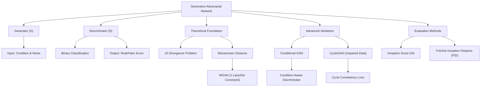

# 第22堂課：Unknown Title (Video 22)

在機器學習中，我們過去接觸的大多是「輸入 $x$，輸出一個點或類別 $y$」的判別式模型（Discriminative Model）。然而，在許多現實任務中，同樣的輸入可能對應多種截然不同但皆屬合理的輸出（需要「創造力」的任務）。為了解決這類問題，我們需要**生成式模型（Generative Model）**。

本堂課將深入探討**生成對抗網路（Generative Adversarial Network, GAN）**的理論基礎、演算法架構、優化技巧（如 WGAN）、條件生成（Conditional GAN）以及在無配對資料（Unpaired Data）下的循環生成（CycleGAN）等核心技術。

---

## 知識圖譜 (Knowledge Graph)



---

## 一、 為什麼需要生成式模型？（Network as Generator）

傳統的神經網路給定輸入 $x$，輸出往往是單一的確定值 $y$。但在需要「創造力（Creativity）」的場景中，同一個輸入可以有不同的合理輸出：

1. **影片預測（Video Prediction）**：在小精靈（Pacman）遊戲中，當小精靈走到十字路口時，它既可以往左轉，也可以往右轉。
   * 如果使用傳統的迴歸損失（如 L1 或 L2 Loss）來訓練，網路為了降低平均誤差，會輸出左轉與右轉的「平均值」，導致預測出一個**分裂成兩半且模糊**的畫面。
   * **生成器**能透過引入隨機雜訊，在不同的分支路線上生成清晰、完整的單一可能畫面。
2. **文字生成圖像（Text-to-Image）**：輸入「紅眼睛的角色」，合理的輸出可以是酷拉皮卡，也可以是四宮輝夜，而非兩者的疊加模糊圖。
3. **聊天機器人（Chatbot）**：同一個問題可以有多種不同的應答方式，而非每次都給出千篇一律的「標準答案」。

### 生成器的運作機制

生成器本質上是一個網路，其輸入除了任務條件 $x$（若為無條件生成則無 $x$）之外，還必須輸入一個從簡單分佈（Simple Distribution，如高斯分佈 $\mathcal{N}(0, I)$）中隨機採樣出來的低維雜訊向量 $z$。生成器會將此簡單分佈對映（Map）到一個極其複雜的高維目標分佈 $P_G$。

$$y = G(x, z)$$

透過隨機採樣不同的 $z$，網路便能輸出多樣化且高品質的合理結果。

---

## 二、 生成對抗網路（GAN）的基本概念

李宏毅教授指出，GAN 的核心思想可以用「寫作敵人，唸作朋友」來形容。它由兩個神經網路組成：**生成器（Generator, $G$）**與**判別器（Discriminator, $D$）**。

### 1. 角色定義
* **生成器 $G$**：輸入隨機向量 $z$，輸出生成的虛假物件 $y = G(z)$。其目標是產生極其逼真的物件，以「騙過」判別器。
* **判別器 $D$**：輸入一個物件 $y$（可以是真實資料，也可以是生成資料），輸出一個實數純量（Score）。
  * 分數越高，代表 $D$ 認為該物件為真實資料（Real）的機率越高。
  * 分數越低，代表 $D$ 認為該物件為生成資料（Fake）的機率越高。

### 2. 對抗演算法流程（Algorithm）

在每一個訓練的 Iteration 中，我們交替更新 $D$ 與 $G$：

#### Step 1: 固定生成器 $G$，更新判別器 $D$
1. 從真實資料庫中隨機採樣一批真實資料 $\left\{y^1, y^2, \dots, y^m\right\}$（標籤設為 $1$）。
2. 從簡單分佈中採樣一批雜訊向量 $\left\{z^1, z^2, \dots, z^m\right\}$，通過 $G$ 生成虛假資料 $\left\{\tilde{y}^1, \tilde{y}^2, \dots, \tilde{y}^m\right\}$（標籤設為 $0$）。
3. 訓練 $D$ 去極大化分類或迴歸準確度，即**讓真實資料得分盡量高，生成資料得分盡量低**。

#### Step 2: 固定判別器 $D$，更新生成器 $G$
1. 重新採樣雜訊向量 $\left\{z^1, z^2, \dots, z^m\right\}$，輸入 $G$ 得到生成資料。
2. 將生成資料輸入固定的判別器 $D$，計算得分。
3. **更新 $G$ 的參數，目標是極大化 $D(G(z))$ 的得分**（即讓 $D$ 誤判生成資料為真）。這是一個串接的大網路，我們只透過反向傳播更新 $G$ 的參數。

---

## 三、 GAN 的數學原理（Theory behind GAN）

### 1. 優化目標

我們的終極目標是尋找一個生成器 $G$，使得其所定義的分佈 $P_G$ 與真實資料分佈 $P_{data}$ 之間的**散度（Divergence）**最小：

$$G^* = \arg\min_G \text{Div}(P_G, P_{data})$$

然而，我們無法得知 $P_{data}$ 與 $P_G$ 的解析表達式，我們只能透過**採樣（Sampling）**獲得樣本。此時，判別器 $D$ 扮演了計算 Divergence 的關鍵橋樑。

### 2. 目標函數與 JS 散度

定義判別器的客觀函數 $V(G, D)$ 如下：

$$V(G, D) = \mathbb{E}_{y \sim P_{data}}[\log D(y)] + \mathbb{E}_{y \sim P_G}[\log (1 - D(y))]$$

當我們固定 $G$ 並極大化 $V(G, D)$ 時，最佳的判別器 $D^*$ 可以藉由對 $D(y)$ 求偏導並令其為零來求得：

$$\frac{\partial}{\partial D(y)} \left( P_{data}(y) \log D(y) + P_G(y) \log (1 - D(y)) \right) = 0$$

解得最優判別器：

$$D^*(y) = \frac{P_{data}(y)}{P_{data}(y) + P_G(y)}$$

將 $D^*$ 代回 $V(G, D)$，經過公式推導，可以證明其最大值與 **Jensen-Shannon Divergence (JSD)** 存在線性關係：

$$\max_D V(G, D) = -\log(4) + 2 \cdot \text{JSD}(P_{data} \parallel P_G)$$

因此，GAN 的整體 Minimax 賽局可以表示為：

$$G^* = \arg\min_G \max_D V(G, D)$$

這說明了**訓練判別器（求 $\max_D V(G, D)$）本質上就是在測量真實分佈與生成分佈之間的 JS 散度**；而更新生成器，則是為了最小化這個散度。

---

## 四、 訓練瓶頸與 WGAN (Tips for GAN)

### 1. JS 散度的致命缺陷：梯度消失

在實際訓練中，基本的 GAN 極度不穩定（"No pain, no GAN"）。其核心原因在於：**在高維空間中，真實分佈 $P_{data}$ 與生成分佈 $P_G$ 的重疊部分幾乎為零。**
* **資料本質**：影像資料在高維空間中通常只分佈在極低維度的流形（Manifold）上。
* **採樣誤差**：我們只能採樣有限的點。對於判別器而言，總能找到一個完美的超平面將真實點與生成點完全分開（二元分類器準確率輕易達到 $100\%$）。

當兩個分佈完全沒有重疊時，無論它們距離多近或多遠，其 JS 散度恆為常數 $\log 2$。這導致：
* 判別器輕鬆訓練到完美狀態，此時給生成器的梯度為 $0$（梯度消失）。
* 如下圖所示，不論生成器是在 $P_{G_0}$ 還是 $P_{G_1}$，其損失函數均無差別，模型無法朝正確的方向優化。

```
P_G0 (JS = log2)  ---------->  P_G1 (JS = log2)  ---->  P_data (JS = 0)
(無法獲得向右優化的梯度)
```

### 2. 瓦瑟斯坦距離 (Wasserstein Distance)

為了解決 JS 散度的缺陷，**WGAN** 引入了瓦瑟斯坦距離（又稱推土機距離，Earth Mover's Distance）。
其定義為：將分佈 $P$ 的「土堆」搬運並塑造成分佈 $Q$ 的形狀時，所需的**最小平均搬運距離**。

* **優勢**：即使兩個分佈完全沒有重疊，Wasserstein 距離 $W(P, Q)$ 仍能平滑地反映兩者之間的空間距離（例如，距離越近，$W$ 越小）。這為生成器提供了持續且平滑的引導梯度。

### 3. WGAN 的數學實現與 1-Lipschitz 約束

依據 Kantorovich-Rubinstein 對偶定理，Wasserstein 距離可寫為：

$$W(P_{data}, P_G) \approx \max_{D \in \text{1-Lipschitz}} \left\{ \mathbb{E}_{y \sim P_{data}}[D(y)] - \mathbb{E}_{y \sim P_G}[D(y)] \right\}$$

在此處，判別器 $D$（通常稱為 Critic）不再輸出機率，而是輸出無邊界的實數。但限制是 $D$ 必須滿足 **1-Lipschitz 連續性約束**（即函數必須平滑，函數斜率的絕對值不能大於 1）。
* **為什麼需要約束？** 如果不限制 $D$ 的平滑度，為了最大化兩者得分差，$D$ 會將真實資料的輸出趨近於 $+\infty$，虛假資料的輸出趨近於 $-\infty$，導致訓練發散。

#### 如何實現 1-Lipschitz 約束？
1. **Weight Clipping**（原始 WGAN）：強制將 $D$ 的參數限制在 $[-c, c]$ 區間內。這種做法較為粗暴，會限制網路的表達能力。
2. **Gradient Penalty (WGAN-GP)**：在客觀函數中加入懲罰項，約束真實樣本與生成樣本過渡區域之梯度的模長接近於 $1$。
3. **Spectral Normalization**（譜歸一化）：將每一層網路的權重矩陣除以其最大奇異值（Spectral Norm），確保整個網路的 Lipschitz 常數小於等於 $1$。

---

## 五、 條件生成 (Conditional GAN)

在傳統 GAN 中，生成器輸入隨機雜訊 $z$，隨機產生影像（例如隨機產生一張人臉）。但我們往往希望能夠控制生成的內容（例如：輸入文字「紅頭髮、綠眼睛」，生成對應的二次元人物）。

### 1. 錯誤的架構
如果我們只將條件 $x$ 輸入生成器 $G(x, z)$ 得到影像 $y$，而判別器 $D$ 只輸入 $y$ 來判斷真假，那麼生成器會發現：只要產生一張高品質、逼真的任意影像（例如黑髮紅眼），就能輕易騙過 $D$。此時，生成器會**完全忽略輸入條件 $x$**。

### 2. 正確的架構
判別器 $D$ 的輸入必須同時包含**條件 $x$** 與**影像 $y$**。判別器不僅要判斷 $y$ 是否真實，還要判斷 **$x$ 與 $y$ 是否匹配**。

* **正樣本**：真實影像，且與條件匹配：$(x, y_{real}) \rightarrow \text{Score } 1$
* **負樣本 1**：真實影像，但與條件不匹配（如條件是紅髮，影像卻是黃髮）：$(x, y_{mismatch}) \rightarrow \text{Score } 0$
* **負樣本 2**：生成的影像：$(x, G(x, z)) \rightarrow \text{Score } 0$

```
Condition x \____ [ Generator G ] ---> Image y 
Noise z     /                               |
                                            v
Condition x ----------------------------> [ Discriminator D ] ---> Score (0 or 1)
```

### 3. 典型應用
* **pix2pix (Image-to-Image Translation)**：將設計草圖轉為實體圖、街景標籤圖轉為真實街景。
* **Sound-to-Image**：輸入聲音訊號（如瀑布聲、狗吠聲），生成對應的視覺影像。
* **Talking Head Generation**：給定一張靜態照片與一段語音，生成照片人物說話的動態影片。

---

## 六、 無配對資料下的風格轉換 (CycleGAN)

在許多應用中，我們很難收集到配對的資料（Paired Data）。例如，我們有大量的真人照片（Domain $X$）和大量的二次元人物照片（Domain $Y$），但並沒有「某個真人對應的二次元化照片」。

如果直接用一般的 GAN 將 $x \in X$ 輸入生成器 $G_{X \rightarrow Y}$，判別器 $D_Y$ 只負責判斷輸出是否屬於 Domain $Y$。生成器同樣會選擇忽略輸入 $x$，無論輸入誰，都只輸出同一張最能騙過判別器的二次元美少女圖（Mode Collapse）。

### 1. 循環一致性（Cycle Consistency）

**CycleGAN** 提出了解決方案。它要求我們同時訓練兩個生成器：
* $G_{X \rightarrow Y}$：將 Domain $X$ 轉換為 Domain $Y$。
* $G_{Y \rightarrow X}$：將 Domain $Y$ 轉換回 Domain $X$。

當一個輸入 $x$ 轉換為 $y = G_{X \rightarrow Y}(x)$ 後，必須能夠透過第二個生成器還原回原來的自己：

$$\hat{x} = G_{Y \rightarrow X}(G_{X \rightarrow Y}(x)) \approx x$$

重建後的 $\hat{x}$ 與原始輸入 $x$ 之間的 L1 損失稱為 **Cycle Consistency Loss**。
這個約束強制要求 $G_{X \rightarrow Y}$ 在轉換風格時，**必須保留輸入 $x$ 的關鍵特徵資訊**（如臉部特徵、五官位置），否則還原器 $G_{Y \rightarrow X}$ 將無法重構出原始影像。

```
Domain X (x) ---> [ G_X->Y ] ---> Latent Y ---> [ G_Y->X ] ---> Reconstructed X (x̂)
     |                                                                   ^
     └─────────────────────── (Minimize L1 Loss) ────────────────────────┘
```

### 2. 雙向循環系統
完整的 CycleGAN 包含雙向的循環（$X \rightarrow Y \rightarrow X$ 和 $Y \rightarrow X \rightarrow Y$），並引入兩個判別器 $D_X$ 與 $D_Y$。

* **應用範例**：
  * **Selfie2Anime**：將個人自拍照轉為動漫風格。
  * **Text Style Transfer**：將負面句子（如「胃疼，沒睡醒，各種不舒服」）自動轉換為相同意思但語氣正面的句子（如「今天天氣真好」）。

---

## 七、 生成模型的評估方法 (Evaluation of Generation)

評估生成模型是一項極具挑戰性的任務。單純依賴人類主觀評估成本高昂、且容易有偏差。

### 1. 影像品質（Quality of Image）

* **評估方法**：將生成的影像 $y$ 輸入一個在大型資料庫（如 ImageNet）上預訓練好的影像分類器（如 Inception Net）。
* **核心思想**：若生成的影像品質極高、特徵清晰，分類器預測的類別機率分佈 $P(c|y)$ 應該會非常**集中**（即熵極低，分類器能非常篤定地指出影像中的主體是什麼）。

### 2. 多樣性（Diversity）與 Mode Collapse

如果模型發生 **Mode Collapse**，它會反覆生成一模一樣的精美影像。此時雖然單張影像的品質極高，但多樣性為零。
* **評估方法**：隨機抽取大量生成的影像，計算它們在分類器預測分佈上的**平均值**：
  
  $$P(c) = \frac{1}{N} \sum_{n=1}^{N} P(c|y^n)$$

* **核心思想**：如果生成的多樣性很高，那麼這些影像應該涵蓋各種不同的類別。平均下來，綜合分佈 $P(c)$ 應該接近**均勻分佈（Uniform Distribution）**。

### 3. 綜合評估指標

#### A. Inception Score (IS)
結合了影像品質（希望 $P(c|y)$ 與平均分佈 $P(c)$ 的 KL 散度越大越好）：
* **IS 越高越好**：代表單張影像特徵明確（品質高），且多張影像類別分佈均勻（多樣性高）。

#### B. Fréchet Inception Distance (FID)
* **計算步驟**：
  1. 將真實影像與生成影像分別輸入 CNN（如 Inception Net）。
  2. 提取 Softmax 前一網路層的**特徵向量**。
  3. 將這兩組高維特徵向量分別擬合為多元高斯分佈 $\mathcal{N}(\mu_{real}, \Sigma_{real})$ 與 $\mathcal{N}(\mu_{gen}, \Sigma_{gen})$。
  4. 計算這兩個高斯分佈之間的 Fréchet 距離。
* **核心思想**：**FID 越小越好**。FID 直接衡量了生成分佈與真實分佈在高維語意空間中的相似度，是目前評估 GAN 最主流、最可靠的指標。

---

## 八、 隨堂測驗

### 測驗 1
**問題**：在傳統的 GAN 訓練中，若判別器 $D$ 被訓練得太完美，為什麼生成器 $G$ 會面臨梯度消失（Gradient Vanishing）的問題？如何有效解決？

<details>
<summary>點擊展開答案與解析</summary>

**答案**：
1. **原因**：因為在高維空間中，真實資料分佈 $P_{data}$ 與生成分佈 $P_G$ 的重疊部分幾乎為零（低維流形假設）。此時，不論兩者距離多遠，其 JS 散度均為常數 $\log 2$。若 $D$ 被訓練得太完美，其損失曲線在 $P_G$ 處會變得極度平坦，導致梯度為 0，生成器無法更新。
2. **解決方法**：引入 **Wasserstein Distance（瓦瑟斯坦距離）**並訓練 **WGAN**。即使分佈不重疊，Wasserstein 距離也能平滑地反映空間中的物理距離。同時需要對 $D$ 施加 **1-Lipschitz 約束**（如譜歸一化 Spectral Normalization 或梯度懲罰 Gradient Penalty）以確保訓練穩定。
</details>

---

### 測驗 2
**問題**：在進行「文字生成圖像（Conditional GAN）」任務時，若我們將判別器 $D$ 的輸入設計為「只接收生成器輸出的影像 $y$」，會產生什麼後果？標準的 Conditional GAN 應該如何設計判別器的輸入？

<details>
<summary>點擊展開答案與解析</summary>

**答案**：
1. **後果**：生成器會完全忽視輸入條件 $x$，只專注於生成一張高品質、能騙過判別器的任意影像（例如不管輸入什麼條件，永遠只產生黑髮美少女）。
2. **標準設計**：判別器 $D$ 的輸入必須同時包含**條件 $x$** 與**影像 $y$**。判別器不僅要判斷 $y$ 是否真實，還要檢查 $x$ 與 $y$ 是否相互匹配。在訓練時，除了提供真實配對 $(x, y_{real})$ 作為正樣本外，還必須提供**錯誤配對的真實影像 $(x, y_{mismatch})$** 作為負樣本，強制 $D$ 去學習條件一致性。
</details>

---

### 測驗 3
**問題**：在無配對資料（Unpaired Data）的風格轉換任務中，CycleGAN 是如何避免生成器出現 Mode Collapse（即生成器不理會輸入 $x$，永遠只生成某張特定風格的精美圖片）的？

<details>
<summary>點擊展開答案與解析</summary>

**答案**：
CycleGAN 引入了 **Cycle Consistency Loss（循環一致性損失）**。
它要求模型在將 Domain $X$ 的圖片 $x$ 經由 $G_{X \rightarrow Y}$ 轉為風格 $y$ 後，必須能再經由另一個生成器 $G_{Y \rightarrow X}$ 還原回 $\hat{x}$，且限制 $\hat{x} \approx x$。
如果生成器 $G_{X \rightarrow Y}$ 發生 Mode Collapse（不論輸入什麼 $x$ 都輸出相同的 $y$），那麼重建器 $G_{Y \rightarrow X}$ 將失去足夠的資訊去重建出各式各樣相異的原始輸入 $x$，這會導致巨大的 Cycle Consistency Loss。因此，這個約束強迫生成器必須在保留輸入 $x$ 語意結構的前提下進行風格轉換。
</details>