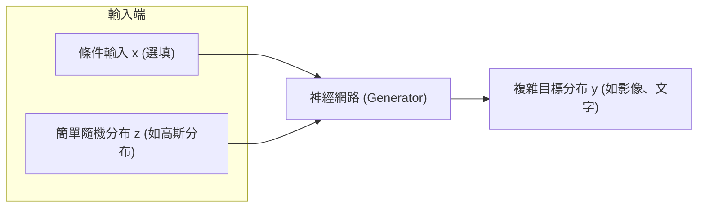
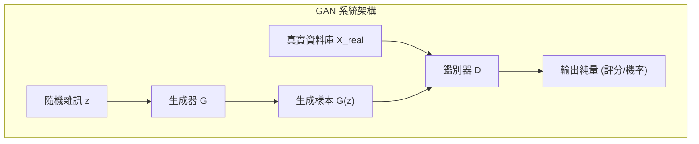
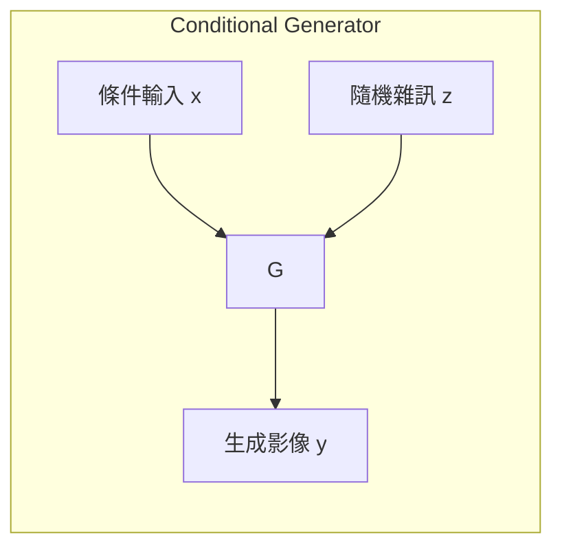
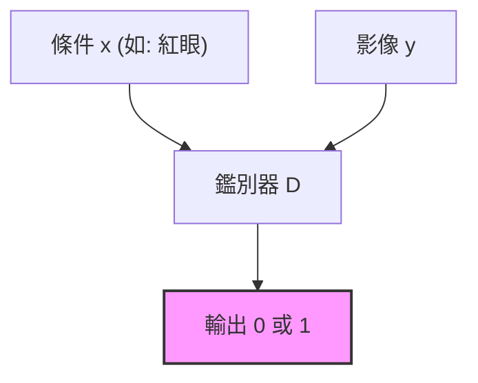
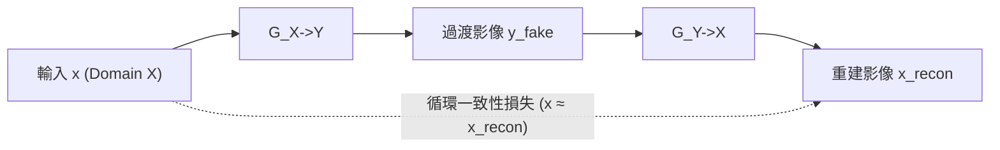

# 第23堂課：Generative Adversarial Network (GAN) 生成對抗網路

在機器學習中，傳統的任務多數是輸入一個 $x$，輸出一個標記（Label） $y$。然而，當我們希望模型具有「創造力」或處理「一對多」的複雜任務（即同一個輸入可能對應多種合法的輸出）時，傳統的單一輸出模型便不再適用，此時我們需要引入**生成模型（Generative Models）**。本堂課將深入探討**生成對抗網路（Generative Adversarial Network, GAN）**的原理、數學推導、訓練技巧（如 WGAN）以及各種變體應用（如 Conditional GAN, Cycle GAN）。

---

## 1. 為什麼需要生成器與分布（Why Distribution?）

### 1.1 網路作為生成器（Network as Generator）
生成器的本質是一個神經網路，其輸入除了條件 $x$（若為無條件生成，則無 $x$）之外，還包含一個從簡單分布（如高斯分布、均勻分布）中隨機採樣出來的低維向量 $z$。神經網路藉由這個隨機性，將簡單的分布轉化為高維度且極度複雜的目標分布 $y$（如動漫人物頭像、真實人臉、段落文字）。



### 1.2 為什麼不能用傳統的迴歸（Regression）？
以**影片預測（Video Prediction）**為例，假設給定小精靈遊戲（Pacman）前幾影格的畫面，預測下一刻的畫面：
* 當小精靈走到十字路口時，既可以**向左轉**，也可以**向右轉**（這是一個雙峰/多峰分布）。
* 若使用傳統的均方誤差（MSE）或平均絕對誤差（MAE）進行監督式學習，模型為了最小化損失，會傾向於輸出**向左與向右的「平均值」**，導致預測出來的下一影格出現「既向左又向右的半透明疊影」或「模糊的殘影」。
* **結論**：對於需要「創造力」或存在多種可能答案的任務（如繪圖、對話機器人），我們必須讓模型學會輸出一個**分布（Distribution）**，而非單一的絕對數值。

---

## 2. 生成對抗網路（GAN）的基本概念

GAN 的核心思想在於**生成器（Generator, G）**與**鑑別器（Discriminator, D）**之間的對抗與共同演化（寫作敵人，唸作朋友）。



### 2.1 角色職責
1. **生成器 $G$**：
   * 是一個函數，輸入向量 $z$，輸出生成樣本 $y = G(z)$。
   * 目標是產生能「騙過鑑別器 $D$」的高品質樣本。
2. **鑑別器 $D$**：
   * 是一個二元分類器或評分函數，輸入一個樣本（真實或生成的），輸出一個純量值（通常介於 $0$ 到 $1$ 之間）。
   * 目標是精確區分「真實樣本（給予高分）」與「生成樣本（給予低分）」。

### 2.2 演算法流程（Training Loop）
在每一次的訓練迭代中：

#### Step 1: 固定 $G$，更新 $D$
* 從真實數據庫中採樣一組真實影像，標記為 $1$。
* 從簡單分布中採樣向量 $z$，通過 $G$ 產生一組生成影像，標記為 $0$。
* 訓練 $D$ 以極大化二元分類的正確率（即最大化真實影像的評分，最小化生成影像的評分）。

#### Step 2: 固定 $D$，更新 $G$
* 讓 $G$ 產生虛擬影像，並將其輸入給固定的 $D$。
* 調整 $G$ 的參數，目標是讓 $D$ 的輸出值越接近 $1$ 越好（極大化 $D(G(z))$）。
* 此時將 $G$ 與 $D$ 串接視為一個巨大的網路，利用反向傳播算法（Backpropagation）僅更新 $G$ 的參數。

---

## 3. GAN 的數學理論（Theory behind GAN）

### 3.1 最佳化目標
我們的終極目標是尋找一個生成器 $G^*$，使得它所產生的機率分布 $P_G$ 與真實資料分布 $P_{data}$ 之間的**散度（Divergence）**最小：

$$G^* = \arg\min_G \text{Div}(P_G, P_{data})$$

然而，由於我們無法寫出 $P_G$ 與 $P_{data}$ 的解析式（Analytical Form），我們只能從中進行**採樣（Sampling）**。GAN 的天才之處在於，**透過訓練鑑別器 $D$，我們可以直接估算這個散度**。

### 3.2 鑑別器的目標函數與 JS 散度
定義目標函數 $V(G, D)$ 如下：

$$V(G, D) = \mathbb{E}_{y \sim P_{data}}[\log D(y)] + \mathbb{E}_{y \sim P_G}[\log(1 - D(y))]$$

對於任意給定的 $G$，我們要找一個最優的 $D^*$ 來極大化 $V(G, D)$：

$$D^* = \arg\max_D V(G, D)$$

#### 數學推導
欲求最大值，我們對內部的積分表達式進行求導。對於任一位置 $y$：

$$f(D) = P_{data}(y) \log D(y) + P_G(y) \log(1 - D(y))$$

對 $D(y)$ 微分並令其為 $0$：

$$\frac{\partial f(D)}{\partial D(y)} = \frac{P_{data}(y)}{D(y)} - \frac{P_G(y)}{1 - D(y)} = 0$$

解得最優鑑別器為：

$$D^*(y) = \frac{P_{data}(y)}{P_{data}(y) + P_G(y)}$$

將 $D^*(y)$ 代回原目標函數 $V(G, D)$ 中：

$$\max_D V(G, D) = \int_y \left[ P_{data}(y) \log\left(\frac{P_{data}(y)}{P_{data}(y)+P_G(y)}\right) + P_G(y) \log\left(\frac{P_G(y)}{P_{data}(y)+P_G(y)}\right) \right] dy$$

對其進行常數項整理，可得：

$$\max_D V(G, D) = -2\log 2 + 2 \cdot \text{JSD}(P_{data} \parallel P_G)$$

其中，$\text{JSD}$ 代表 **Jensen-Shannon Divergence（JS 散度）**。

#### 統一的 Minimax 遊戲
因此，GAN 的訓練可以完美寫為：

$$G^* = \arg\min_G \max_D V(G, D)$$

藉由極大化 $V(G, D)$ 來逼近 JS 散度，再藉由極小化該散度來更新生成器。

---

## 4. JS 散度的缺陷與 WGAN 的引入

雖然理論上完美，但在實際訓練中，經典 GAN 極難收斂，這源於 JS 散度的本質缺陷。

### 4.1 為什麼 JS 散度不適用？
1. **高維空間中的重合機率極低**：
   影像數據在極高維的空間中，其實只是低維度的流形（Manifolds）。因此，$P_G$ 與 $P_{data}$ 的重疊部分在測度論意義上幾乎為零（重合機率為 $0$）。
2. **採樣造成的非連續性**：
   在實際訓練中，我們是用有限數量的樣本來估算分布。即使分布本質上有重疊，採樣出來的點也很難精準重合。

當兩分布完全不重疊時，不論距離多近或多遠，其 JS 散度恆為常數 $\log 2$：

$$\text{JSD}(P_{data} \parallel P_G) = \log 2 \quad (\text{if } P_{data} \cap P_G = \varnothing)$$

這會導致在訓練初期，鑑別器可以輕而易舉地達到 100% 的分類準確率（梯度為 $0$），使得生成器無法獲得任何有效的更新信號。

```
JS Divergence 示意：
P_G0  ------------------  P_data   (JSD = log 2)
P_G1       -------------  P_data   (JSD = log 2) [雖然變近了，但梯度仍然為 0！]
P_G100                    P_data   (JSD = 0)
```

### 4.2 瓦瑟斯坦距離（Wasserstein Distance / Earth Mover's Distance）
為了解決上述問題，**WGAN** 引入了瓦瑟斯坦距離（Wasserstein Distance）。它將兩個分布想像成兩堆土，移動一堆土使其與另一堆土重合所需要的**最小平均搬運距離**即為其距離。

* **優點**：即使兩個分布完全沒有重叠，Wasserstein 距離依然能夠提供一個**連續、線性且平滑**的測量值（如 $d_0, d_1 \to 0$），為生成器提供持續的導向梯度。

```
Wasserstein Distance 示意：
W(P_G0, P_data) = d_0
W(P_G1, P_data) = d_1  (d_1 < d_0) [距離變近，模型能感受到梯度並持續改進！]
```

### 4.3 WGAN 的數學實現與 1-Lipschitz 限制
根據對偶理論（Kantorovich-Rubinstein Duality），Wasserstein 距離可以寫成：

$$\max_{D \in \text{1-Lipschitz}} \left\{ \mathbb{E}_{y \sim P_{data}}[D(y)] - \mathbb{E}_{y \sim P_G}[D(y)] \right\}$$

此時，鑑別器 $D$ 的輸出不再限制在 $0$ 到 $1$ 之間（不再使用 Sigmoid），而是輸出一個實數。然而，為了防止 $D$ 無限制地拉大真假樣本的分數差距（導致函數值發散到 $\pm \infty$），我們必須加上 **1-Lipschitz 限制**，即限制鑑別器函數的變動梯度不能太劇烈。

#### 如何滿足 1-Lipschitz 限制？
1. **Weight Clipping（原始 WGAN）**：
   強制將 $D$ 的權重參數限制在 $[-c, c]$ 之間。缺點是會限制網路的表達能力，使其行為過於簡單。
2. **Gradient Penalty（WGAN-GP）**：
   在損失函數中加入梯度懲罰項，強制要求「在真假數據過渡區域內，相對於輸入的梯度模長（Norm）接近於 $1$」。
3. **Spectral Normalization（譜歸一化）**：
   對每一層的權重矩陣除以其最大奇異值（Spectral Norm），確保整個網路的 Lipschitz 常數小於等於 $1$。

---

## 5. 條件式生成（Conditional GAN, CGAN）

在諸多應用中，我們不只要生成隨機的精美影像，更希望能**控制**生成的內容。例如，輸入文字「紅眼睛、黑頭髮」，生成對應的動漫人物。



### 5.1 鑑別器設計的關鍵
在 Conditional GAN 中，如果鑑別器 $D$ 僅輸入影像 $y$，則生成器會發現只要產生「非常真實的影像」就能騙過 $D$，從而**完全忽略輸入條件 $x$**。

因此，Conditional GAN 的鑑別器必須同時將 **條件 $x$** 與 **影像 $y$** 作為輸入：

* **真實對（Real Pair）**：(真實條件 $x$, 對應真實影像 $y$) $\to$ 評分 $1$
* **錯誤對（Wrong Pair）**：(真實條件 $x$, 毫不相干的真實影像 $y'$) $\to$ 評分 $0$
* **生成對（Fake Pair）**：(真實條件 $x$, 生成影像 $G(x, z)$) $\to$ 評分 $0$

這樣便能強制生成器不僅要產生高品質影像，還必須精準符合輸入條件。



### 5.2 代表性應用：Pix2Pix（影像翻譯）
* 輸入設計草圖，輸出實物相片；輸入地圖，輸出衛星圖。
* 在實際訓練中，通常會結合 **GAN 損失** 與 **監督式損失（L1/L2 Loss）**。監督式損失確保大體結構不失真，GAN 損失則負責補足細節、消除模糊感。

---

## 6. 無配對資料下的學習（Learning from Unpaired Data）

在現實中，要取得大量成對的訓練資料（如：同一個人卸妝前後、同一張風景照的白天與黑夜）非常困難。我們希望能在只有「一組真實照片（Domain X）」與「一組動漫人臉（Domain Y）」，且兩者**毫無一一對應關係（Unpaired）**的情況下，學會兩者之間的風格轉換。

### 6.1 Cycle GAN 的引入
如果僅用一個 Generator $G_{X \to Y}$ 與一個 Discriminator $D_Y$，模型會發生**模式崩潰（Mode Collapse）**：不論輸入 Domain X 的哪張人臉，模型都固定輸出同一張能完美騙過 $D_Y$ 的動漫頭像，這完全失去了「轉換」的意義。

為了強迫生成器保留輸入影像的特徵，Cycle GAN 引入了**循環一致性（Cycle Consistency）**：



* **循環損失（Cycle Loss）**：要求 $x \approx G_{Y \to X}(G_{X \to Y}(x))$。
* 同理，我們也會對 Domain Y 進行反向循環：$y \approx G_{X \to Y}(G_{Y \to X}(y))$。
* 這兩條約束鏈共同作用，迫使過渡影像必須保留原圖中用以「重建回來」的關鍵特徵（如五官位置、眼鏡、表情等）。

---

## 7. 生成模型的評估方法（Evaluation）

評估生成器產生的影像好壞不能單憑人類主觀感受（昂貴且不穩定），必須有客觀、可量化的指標。

### 7.1 影像品質（Quality）
* **原理**：將生成的影像 $y$ 輸入一個在 ImageNet 上訓練好的強大分類器（如 Inception Net）。
* **評判標準**：如果影像品質很高、主體明確，分類器輸出該影像屬於某一類別的條件機率分布 $P(c|y)$ 應該是**高度集中（低熵，Entropy 趨近於 0）**的。

### 7.2 多樣性（Diversity）
* **問題**：模型可能會遇到模式崩潰（Mode Collapse），即反覆生成同一張極高品質的影像。
* **評估方法**：隨機採樣大批生成樣本，計算其分類概率的平均值 $P(c) = \frac{1}{N}\sum_n P(c|y^n)$。如果平均分布 $P(c)$ 接近**均勻分布（Uniform Distribution，高熵）**，代表生成的類別非常多元。

### 7.3 Inception Score (IS) 與 Fréchet Inception Distance (FID)
* **Inception Score (IS)**：結合了上述兩點指標。$\text{IS} = \exp(\mathbb{E}[\text{KL}(P(c|y) \parallel P(c))])$。**IS 越大越好**。
* **Fréchet Inception Distance (FID)**：
  IS 僅看分類器的輸出，無法與「真實人類世界」進行對照。FID 的做法是將真實影像與生成影像分別送入 CNN（如 Inception Net），取出 **Softmax 前一層的特徵向量**。
  假設這兩組特徵向量分別服從多元高斯分布，計算這兩個高斯分布之間的 Fréchet 距離：
  
  $$\text{FID} = \parallel \mu_r - \mu_g \parallel^2 + \text{Tr}(\Sigma_r + \Sigma_g - 2(\Sigma_r\Sigma_g)^{1/2})$$
  
  * **FID 越小越好**（代表生成分布與真實分布在特徵空間上高度吻合）。

---

## 8. 隨堂測驗

### 測驗 1：觀念理解
**問題**：在訓練傳統的監督式 L2 迴歸模型進行多模態（Multi-modal）任務（如預測 Pacman 在十字路口的下一步）時，為什麼會產生模糊或疊影的輸出？

<details>
<summary>點擊展開解答</summary>
<strong>解答</strong>：<br>
因為 L2 Loss (均方誤差) 的數學特性是尋找所有可能輸出的「期望值」或「平均值」。當面對擁有多個峰值（例如左轉和右轉）的真實分布時，平均值落在了兩個可行路徑的中間，導致模型輸出一個既不左也不右的「模糊疊影」。生成模型（如 GAN）則能學習到整個分布，從中進行採樣，輸出具體且清晰的單一可行路徑。
</details>

---

### 測驗 2：數學與推導
**問題**：請解釋 WGAN 中為什麼需要加入 1-Lipschitz 限制？如果不加會發生什麼事？

<details>
<summary>點擊展開解答</summary>
<strong>解答</strong>：<br>
WGAN 的目標函數是極大化真假樣本在鑑別器 $D$ 的分數差。如果不對 $D$ 進行 1-Lipschitz（平滑度）限制，為了解決優化問題，鑑別器 $D$ 會將真實樣本的分數無止境地往 $+\infty$ 推，並將生成樣本的分數無止境地往 $-\infty$ 推。這會導致 $D$ 的梯度爆炸，訓練無法收斂。1-Lipschitz 限制確保了鑑別器函數足夠平滑，使得 Wasserstein 距離的估計具有數學上的有效性。
</details>

---

### 測驗 3：應用與變體
**問題**：在進行「無配對影像轉換（Unpaired Image-to-Image Translation）」時，Cycle GAN 是如何防止模型產生「模式崩潰（Mode Collapse）並忽略輸入影像」的？

<details>
<summary>點擊展開解答</summary>
<strong>解答</strong>：<br>
Cycle GAN 引入了「循環一致性（Cycle Consistency）」。它要求一個影像經過一次風格轉換（$G_{X \to Y}$）再轉回來（$G_{Y \to X}$）後，必須與原圖 $x$ 盡可能一致。這種「強迫其能夠復原」的約束，逼迫過渡期的生成影像 $y$ 必須高度保留原圖 $x$ 的語意特徵（如臉部位置、方向、核心五官結構），從而防止生成器隨意輸出一個與輸入無關的固定動漫影像。
</details>