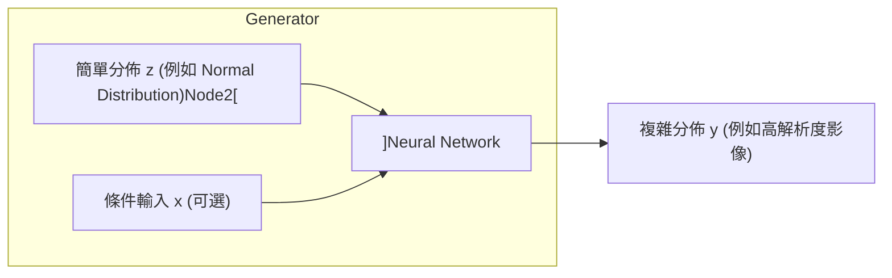
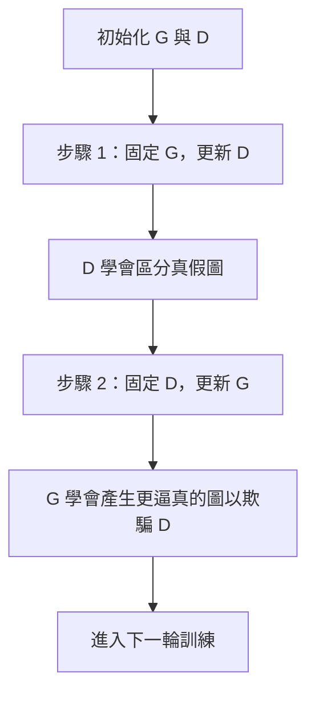

# 第24堂課：Generative Adversarial Network (GAN)

在這堂課中，李宏毅教授深入探討了**生成模型 (Generative Models)** 的核心技術——**生成對抗網路 (Generative Adversarial Network, GAN)**。我們將從「為什麼需要生成分佈」出發，逐步推導 GAN 的基本概念、數學原理、訓練技巧（包含對抗 JS 散度缺陷的 WGAN 演算法），並延伸至條件生成 (Conditional Generation) 以及無成對資料的學習 (Unpaired Learning)。

---

## 1. 為什麼要以「分佈」作為輸出？ (Why Distribution?)

傳統的深度學習任務，我們通常期望模型給出一個「單一且確定」的輸出。然而，在許多需要「創意 (Creativity)」或「多樣性可能性」的任務中，相同的輸入可能對應多個完全合理但不同的輸出。

### 1.1 傳統損失函數的缺陷：以 Video Prediction 為例
假設我們要讓模型預測下一個電玩畫面（例如小精靈 Pacman）：
- 當小精靈走到十字路口時，它可以選擇**向左轉**或**向右轉**。
- 如果我們使用傳統的均方誤差 (Mean Squared Error, MSE) 來訓練模型：
  $$\text{Loss} = \sum ||y_{pred} - y_{target}||^2$$
  為了最小化這個 Loss，模型最安全的策略是輸出**「向左轉」與「向右轉」兩張圖的平均值**（即兩條路徑疊加的模糊半透明殘影）。這顯然不是我們想要的真實畫面。

### 1.2 引入分佈 (Distribution) 的解決方案
為了讓機器能做出具有「創造性」的決策，我們將網路設計成一個**生成器 (Generator)**：
- **輸入**：除了原本的條件輸入 $x$ 之外，額外加入一個從簡單分佈（如高斯分佈、均勻分佈）中隨機採樣出來的低維度噪聲向量 (Noise vector) $z$。
- **輸出**：高維度且複雜的分佈 $y$。



透過每次隨機採樣不同的 $z$，同一個輸入 $x$ 就能對應到多個不同且清晰的輸出，從而學會真正的多樣性。

---

## 2. GAN 的基本概念 (Basic Idea of GAN)

生成對抗網路 (GAN) 由 **Ian Goodfellow** 於 2014 年提出，其核心思想是將兩個神經網路置於對抗的關係中：**生成器 (Generator, G)** 與 **判別器 (Discriminator, D)**。

### 2.1 角色分工與對抗關係
1. **生成器 $G$**：
   - 接收隨機向量 $z \sim P_z$，並嘗試將其映射為虛擬數據 $y = G(z)$。
   - 目標是產生栩栩如生、足以「騙過」判別器的假數據。
2. **判別器 $D$**：
   - 接收一張輸入影像（可能是來自資料庫的真圖 $y \sim P_{data}$，或是由 $G$ 產生的假圖 $y \sim P_G$）。
   - 輸出一個標量分數（通常在 $0 \sim 1$ 之間）。分數越高代表輸入越像真實影像，越低代表越像生成的假影像。

李宏毅教授生動地用**「生物演化（天敵關係）」**與**「寫作敵人，唸作朋友（經典動漫對手）」**來比喻這兩者的關係。兩者互相激發潛能，彼此都在對方的進步下被動提升：



### 2.2 訓練演算法 (Training Algorithm)
在每一次的訓練迭代 (Iteration) 中，分為兩個主要步驟：

#### Step 1: 固定生成器 $G$，更新判別器 $D$
我們從資料庫中採樣一組真實影像，並使用當前的 $G$ 生成一組假影像。我們希望 $D$ 對真影像輸出高分（接近 1），對假影像輸出低分（接近 0）。此時，這本質上是一個**二分類 (Binary Classification)** 任務。

#### Step 2: 固定判別器 $D$，更新生成器 $G$
我們將 $G$ 和 $D$ 串接成一個龐大的網路。我們隨機採樣 $z$，通過 $G$ 產生假圖，再將假圖直接送入固定的 $D$ 中。我們調整 $G$ 的參數，使得最終 $D$ 輸出的分數越大越好（即往 1 靠近）。在這個步驟中，梯度會穿過 $D$ 傳回給 $G$，導引 $G$ 調整其參數。

---

## 3. GAN 的數學理論 (Theory behind GAN)

我們如何從數學上嚴謹地定義 GAN 的優化目標？

### 3.1 終極目標：最小化分佈間的散度
我們希望尋找一個生成器 $G^*$，使其產生的數據分佈 $P_G$ 與真實世界的數據分佈 $P_{data}$ 越接近越好。我們將此定義為最小化某種散度 (Divergence, 如 KL-Divergence 或 JS-Divergence)：

$$G^* = \arg \min_{G} \text{Div}(P_G, P_{data})$$

然而，在現實中我們根本不知道 $P_{data}$ 和 $P_G$ 的解析表達式（PDF），我們只擁有**從中採樣 (Sampling)** 出來的資料。這正是判別器 $D$ 大顯身手的地方。

### 3.2 判別器與 JS 散度的等價關係
根據 Ian Goodfellow 的論文，我們將判別器 $D$ 的優化目標函數定義為：

$$V(G, D) = \mathbb{E}_{y \sim P_{data}}[\log D(y)] + \mathbb{E}_{y \sim P_G}[\log (1 - D(y))]$$

當我們固定生成器 $G$ 時，最佳的判別器 $D^*$ 滿足：

$$D^*(y) = \frac{P_{data}(y)}{P_{data}(y) + P_G(y)}$$

將 $D^*$ 代回 $V(G, D)$，我們可以推導出最大值 $\max_D V(G, D)$ 與 **Jensen-Shannon (JS) Divergence** 的關係：

$$\max_{D} V(G, D) = -2 \log 2 + 2 \cdot \text{JSD}(P_{data} \parallel P_G)$$

因此，原先「最小化散度」的目標，可以完美轉換為以下的極小化極大值 (Minimax) 問題：

$$G^* = \arg \min_{G} \max_{D} V(G, D)$$

---

## 4. JS 散度的致命缺陷與 WGAN 的救贖 (Tips for GAN)

在實作中，經典 GAN 非常難以訓練。李宏毅教授指出，這主要是因為 **JS 散度在衡量不重疊分佈時失效了**。

### 4.1 為什麼 JS 散度不適用？
1. **高維空間中的低維流形 (Low-dimensional Manifolds)**：影像數據在高維空間中通常分布在極其窄小的低維通道上。這意味著 $P_G$ 和 $P_{data}$ 的重疊概率幾乎為 0。
2. **採樣稀疏性 (Sampling)**：即使兩者有微小的重疊，我們也只是在做有限次數的採樣，機器學到的依然是兩個互不相交的點集。

當 $P_G$ 與 $P_{data}$ 完全不重疊時：
$$\text{JSD}(P_G \parallel P_{data}) = \log 2 \quad (\text{常數})$$

不論 $P_G$ 與 $P_{data}$ 靠得多近、或者隔得多遠，只要不相交，JS 散度永遠都是常數 $\log 2$。這會導致**梯度消失 (Gradient Vanishing)**——判別器輕易地以 100% 的準確率將兩者區分開，此時生成器得不到任何梯度信號來改進自身。

```
[分佈 P_0] -------- (距離近) -------- [分佈 P_data]   => JS = log 2
[分佈 P_100] ---------------------- [分佈 P_data]   => JS = log 2 (無法反映距離)
```

### 4.2 陸地移動者距離：Wasserstein Distance
為了解決這個問題，**WGAN (Wasserstein GAN)** 引入了 **Wasserstein Distance**（又稱 Earth Mover's Distance，陸地移動者距離）。
- **物理直覺**：將一個分佈 $P$ 看作是一堆土，另一個分佈 $Q$ 看作是目的地。Wasserstein 距離代表**將這堆土推到目的地所需的最小平均搬運工作量**（土量 $\times$ 距離）。
- **優勢**：即使兩個分佈完全不重疊，只要它們彼此靠近，Wasserstein 距離就會變小；相距甚遠，距離就會變大。這為 $G$ 提供了極其平滑且具方向性的引導梯度。

### 4.3 WGAN 的數學約束 (1-Lipschitz)
WGAN 的優化目標被定義為：

$$\min_{G} \max_{D \in \text{1-Lipschitz}} \left\{ \mathbb{E}_{y \sim P_{data}}[D(y)] - \mathbb{E}_{y \sim P_G}[D(y)] \right\}$$

這裡的 $D$ 必須滿足 **1-Lipschitz** 的平滑性約束（即限制其梯度的範數）。若不施加此約束，$D$ 為了讓真圖分數無限高、假圖分數無限低，會把邊界兩側的函數值推向 $+\infty$ 和 $-\infty$，導致訓練崩潰。

#### 如何滿足 Lipschitz 約束？
1. **Weight Clipping（權重裁剪）**：經典 WGAN 強制將 $D$ 的參數限制在 $[-c, c]$ 之間。缺點是會限制網路的表達能力。
2. **Gradient Penalty (WGAN-GP)**：在目標函數中加入懲罰項，約束 $D$ 在真假樣本過渡區域的梯度範數接近 1：
   $$\mathcal{L}_{GP} = \lambda \mathbb{E}_{\hat{y}} \left[ (||\nabla_{\hat{y}} D(\hat{y})||_2 - 1)^2 \right]$$
3. **Spectral Normalization（譜歸一化）**：直接約束神經網路每一層的矩陣譜範數，使整體網路天然滿足 Lipschitz 條件，是目前最穩定的方法之一。

---

## 5. 條件生成 (Conditional Generation)

在許多應用中，我們不希望機器只是「無條件」地隨機產生一張二次元人臉（Unconditional Generation），而是期望它能根據特定指示（如文字描述、線條圖）生成對應影像。

### 5.1 為什麼傳統 GAN 架構會失敗？
如果我們僅僅將條件 $x$ 作為輸入傳給 $G$，但判別器 $D(y)$ 依然只接收影像 $y$：
- $G$ 會發現，它只要學會產生一張極度精美、能騙過 $D$ 的人臉即可，**完全可以無視輸入條件 $x$**。因為對 $D$ 而言，只要影像夠真實，它就會給高分。

### 5.2 條件判別器 (Conditional Discriminator) 的設計
為了讓 $G$ 聽懂人話，判別器 $D$ 的輸入必須改為 **配對的 $(x, y)$**。

```
True text-image pair:     (紅眼睛, 紅眼美少女)  -->  Discriminator  -->  1 (High Score)
Mismatched pair:          (紅眼睛, 黃髮男主角)  -->  Discriminator  -->  0 (Low Score)
Fake image pair:          (紅眼睛, 假的美少女)  -->  Discriminator  -->  0 (Low Score)
```

透過這種訓練設計，生成器必須同時滿足「影像逼真」與「與輸入條件 $x$ 高度契合」兩個條件，才能拿到高分。

### 5.3 影像翻譯 (Image-to-Image Translation) 與 pix2pix
在影像翻譯任務（如線條圖轉照片、白晝轉黑夜）中，除了 Conditional GAN 的對抗性損失外，通常會額外引入**監督式損失 (Supervised Loss)**，例如 $L_1$ 或 $L_2$ 距離：

$$\mathcal{L}_{GAN}(G, D) + \lambda \mathbb{E}_{x, y} [||y - G(x, z)||_1]$$

這可以保證生成的物件在位置、結構上與輸入高度一致，避免 GAN 的隨機性導致物件位置發生偏移。

---

## 6. 無成對資料的學習：Unsupervised Conditional Generation

在現實世界中，我們常常無法收集到「成對的訓練資料」（例如：真實人臉與對應的動漫臉、真實照片與對應的梵谷風格畫作）。此時，我們需要進行**無監督條件生成 (Unsupervised Conditional Generation)**。

### 6.1 核心挑戰
如果我們只訓練一個單向生成器 $G_{X \to Y}$：
- $G_{X \to Y}$ 會將 Domain $X$ 的人臉轉為 Domain $Y$ 的二次元臉。
- 判別器 $D_Y$ 只負責檢驗輸出是否符合 Domain $Y$。
- 結果就是：生成器會選擇無視輸入影像的特徵（如性別、眼鏡、臉型），一律輸出某一種類型、最容易騙過 $D_Y$ 的動漫臉。

### 6.2 循環生成對抗網路 (Cycle GAN)
為了讓生成的假圖 $y$ 與輸入的原圖 $x$ 保持本質上的關聯，**Cycle GAN** 引入了**循環一致性損失 (Cycle Consistency Loss)**。

```mermaid
graph LR
    subgraph Node1["Forward Cycle"]
    x["Domain X: 原圖 x"] --> G_XY["Generator G_X-大於Y"]
    G_XY --> y_fake["Domain Y: 假圖 y'"]
    y_fake --> G_YX["Generator G_Y-大於X"]
    G_YX --> x_recon["重建圖 x*"]
    end
    x_recon -- Node2["計算 L1 距離 (Cycle Consistency Loss)"] --- x
```

同時，也有一個反向的循環（從 Domain $Y \to$ Domain $X \to$ Domain $Y$）。Cycle GAN 包含了兩套生成器與判別器：
- $G_{X \to Y}$ 與 $D_Y$
- $G_{Y \to X}$ 與 $D_X$

這種互為因果的雙向約束，逼得機器必須在轉換過程中**保留能夠重建原圖的核心特徵資訊**，從而完美實現了風格轉換，同時保留了原本圖像的主體物件與結構。

---

## 7. 生成模型的評估方法 (Evaluation of Generation)

評估一個生成模型的好壞非常具有挑戰性。我們通常關注兩個維度：**影像品質 (Quality)** 與 **多樣性 (Diversity)**。

### 7.1 影像品質評估：分類器輸出集中度
要評估假圖 $y$ 是否真實，我們可以將其輸入給一個訓練好的圖像分類器（如 Inception Net）。
- 若假圖是一張清晰的貓，分類器的輸出概率分佈 $P(c|y)$ 會非常集中（高度確信是貓）。
- 若假圖只是一團模糊的雜訊，分類器會感到困惑，輸出分佈會非常均勻。
- 因此，**$P(c|y)$ 的熵 (Entropy) 越小（即分佈越集中），代表影像品質越高。**

### 7.2 多樣性評估與 Mode Collapse / Mode Dropping
生成模型常遇到兩個頑疾：
1. **Mode Collapse（模式崩潰）**：生成器發現某幾種圖片（如某個特定的二次元美女）最容易騙過 $D$，於是此後不論輸入什麼隨機噪聲，都只生成同一張圖。
2. **Mode Dropping（模式丟失）**：生成的分佈只覆蓋了真實分佈的一部分（例如只會生女生，不會生男生）。

為了解決這個問題，我們計算生成一整批影像後的平均預測分佈：

$$P(c) = \frac{1}{N} \sum_{n=1}^N P(c|y^n)$$

如果生成器具有足夠的多樣性，$P(c)$ 的分佈應該**越均勻越好**（代表生出了各式各樣的物體）。

### 7.3 Inception Score (IS) 與 Fréchet Inception Distance (FID)
- **Inception Score (IS)**：結合了上述兩點，計算 $P(c|y)$ 與 $P(c)$ 之間的 KL 散度。**IS 越大越好**。
- **Fréchet Inception Distance (FID)**：
  IS 有一個缺點：如果模型只記住了訓練集，IS 依然會很高。FID 則是將真實影像與生成影像分別送入 CNN，提取最後一層池化層的特徵向量，並假設特徵符合多維高斯分佈。
  
  我們計算這兩個高斯分佈之間的 **Fréchet 距離**。**FID 越小，代表生成分佈與真實分佈越接近。**

---

## 8. 知識圖譜 (Knowledge Graph)

```mermaid
graph TD
    Node1["生成模型"] --> Node2["無條件生成"]
    Node1["生成模型"] --> Node3["條件生成"]
    Node1["生成模型"] --> Node4["無成對資料 Style Transfer"]

    Node2["無條件生成"] --> Node5["GAN 核心架構"]
    Node5["GAN 核心架構"] --> Node6["生成器 G"]
    Node5["GAN 核心架構"] --> Node7["判別器 D"]
    Node7["判別器 D"] --> Node8["等價於極大化 JS 散度"]

    Node9["JS 散度"] -->|缺陷: 不重疊分佈梯度消失| Node10["Wasserstein 距離"]
    Node10["Wasserstein 距離"] --> Node11["WGAN"]
    Node11["WGAN"] -->|需要 Lipschitz 約束| Node12["WGAN-GP / Spectral Norm"]

    Node3["條件生成"] --> Node13["Conditional GAN"]
    Node13["Conditional GAN"] -->|解決 G 忽略條件的問題| Node14["配對輸入 D("]x, y")"
    Node13["Conditional GAN"] --> Node15["影像翻譯 pix2pix"]

    Node4["無成對資料 Style Transfer"] --> Node16["Cycle GAN"]
    Node16["Cycle GAN"] -->|避免資訊流失與任意映射| Node17["循環一致性損失"]

    Node1["生成模型"] --> Node18["評估指標"]
    Node18["評估指標"] --> Node19["品質評估 P("]c|y")"
    Node18["評估指標"] --> Node20["多樣性評估 P("]c")"
    Node18["評估指標"] --> Node21["FID (越小越好)"]
```

---

## 9. 隨堂測驗

### 測驗 1：關於 JS 散度在 GAN 中的問題
在訓練經典的 GAN 時，當生成分佈 $P_G$ 與真實數據分佈 $P_{data}$ 幾乎完全不重疊時，JS 散度會發生什麼現象？這對生成器的訓練有何負面影響？

<details>
<summary>點擊展開解答</summary>
**解答：**
當兩個分佈完全不重疊時，不論它們相距多遠，JS 散度都會保持為一個常數值 $\log 2$。這會導致判別器以 100% 的準確率將真假影像區分開，此時對抗損失無法為生成器提供任何有效的梯度（梯度消失），使生成器無法透過梯度下降更新參數。
</details>

---

### 測驗 2：Conditional GAN 的判別器設計
在文字生成影像的任務中，如果判別器 $D$ 的輸入僅僅是生成器產生的影像 $y$，而沒有將文字條件 $x$ 作為輸入，會產生什麼後果？

<details>
<summary>點擊展開解答</summary>
**解答：**
生成器 $G$ 會完全忽略輸入文字 $x$。因為 $D$ 只檢查影像 $y$ 是否真實，生成器只要學會生成一兩張細緻但與文字無關的「萬能安全影像」就能騙過判別器拿到高分。因此，必須將文字條件 $x$ 與影像 $y$ 組成配對 $(x, y)$ 一起輸入給判別器，強制其學習文字與影像的關聯性。
</details>

---

### 測驗 3：Cycle GAN 循環一致性的目的
在進行「真人照片轉動漫人臉」的無監督風格轉換時，為什麼我們需要「循環一致性損失 (Cycle Consistency Loss)」？

<details>
<summary>點擊展開解答</summary>
**解答：**
因為我們沒有成對的訓練數據，如果只訓練單向轉換 $G_{X \to Y}$，機器只需要學會產生一張隨機的、符合動漫風格的美女圖就能騙過判別器，這會使輸入的原圖特徵（例如眼鏡、眼神、髮型）在轉換中完全流失。Cycle GAN 要求轉換後的動漫圖能被另一個生成器 $G_{Y \to X}$ 重建回原本的真人照片，這種雙向約束能強制模型保留原圖的本質語義特徵。
</details>