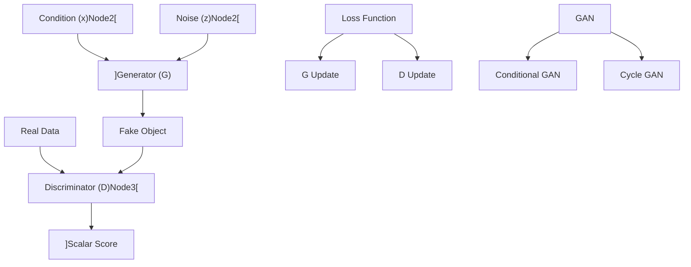

# 第25堂課：GAN 的魔幻應用 - 非監督學習

本堂課介紹了生成式模型（Generative Models）的核心概念，重點探討生成對抗網路（Generative Adversarial Network, GAN）的架構、訓練機制以及條件生成與非配對資料學習。

## 1. 生成式模型的動機 (Why Generation?)

在許多機器學習任務中，模型需要具備「創造力」或處理一對多映射的能力。例如：
- **影片預測**：給定前幾幀畫面，預測下一幀可能發生的情況。
- **繪圖與聊天機器人**：給定相同的輸入（例如：「畫一個紅眼睛的角色」或「你是誰？」），模型應能根據隨機變數 $z$ 生成多樣化的輸出。

### 生成模型的基本架構
生成模型的核心思想是將簡單分佈（如高斯分佈）映射至複雜的數據分佈：
- **輸入**：簡單分佈中的採樣 $z$。
- **過程**：通過神經網路 $G$ (Generator)。
- **輸出**：複雜分佈中的樣本 $y = G(z)$。

## 2. 生成對抗網路 (GAN)

GAN 由兩大模組組成，它們處於競爭關係：
1. **生成器 (Generator, $G$)**：負責生成假資料，目標是騙過判別器。
2. **判別器 (Discriminator, $D$)**：負責區分真實資料與 $G$ 產生的假資料，輸出一個純量（Scalar），值越大代表越像真實資料。

### 訓練演算法
GAN 的訓練分為兩個步驟，並在迭代中交替進行：
- **Step 1: 固定 $G$，更新 $D$**：讓 $D$ 學習將真實物件評高分，生成的物件評低分（類似二元分類器）。
- **Step 2: 固定 $D$，更新 $G$**：讓 $G$ 學習如何產生能騙過 $D$ 的影像，即提升生成的物件在 $D$ 中的得分。

## 3. GAN 的理論基礎與挑戰

GAN 的目標是最小化生成分佈 $P_G$ 與真實數據分佈 $P_{data}$ 之間的差異 (Divergence)：
$$G^* = \arg \min_G \text{Div}(P_G, P_{data})$$

### 為什麼 JS Divergence 不適合？
在數據分佈不重疊的情況下，JS Divergence 會恆定為 $\log 2$，導致判別器無法提供梯度資訊給生成器（Loss 變得毫無意義）。

### Wasserstein Distance (WGAN)
為了解決此問題，WGAN 引入了 Wasserstein Distance（又稱 Earth Mover's distance），計算將一個分佈搬運成另一個分佈所需的最小成本。
- **1-Lipschitz Constraint**：為了使訓練收斂，必須限制 $D$ 的平滑度。
- **實現方式**：
  - **原始 WGAN**：限制權重範圍（Weight Clipping）。
  - **WGAN-GP**：使用梯度懲罰（Gradient Penalty）。
  - **Spectral Normalization**：限制梯度範數。

## 4. 進階生成架構

- **Conditional GAN**：不僅輸入 $z$，還輸入條件 $x$（如文字描述、標籤），實現精準控制的生成。
- **Cycle GAN**：用於處理「非配對資料」(Unpaired Data) 的轉換。透過「循環一致性」（Cycle Consistency，即 $x \to G(x) \to F(G(x)) \approx x$）來確保生成內容與原始輸入的關聯性。

## 5. 評估指標
- **Inception Score (IS)**：評估生成影像的品質與多樣性。
- **Fréchet Inception Distance (FID)**：計算真實分佈與生成分佈在高維特徵空間中的高斯距離，數值越小越好。

---

## 隨堂測驗

1. **問：在 GAN 的訓練過程中，如果生成分佈 $P_G$ 與真實分佈 $P_{data}$ 完全沒有重疊，使用傳統的 JS Divergence 會遇到什麼問題？**
   

   
點擊查看解答

   JS Divergence 會恆定為 $\log 2$，導致判別器無法提供有效的梯度資訊給生成器，導致 Loss 數值失去參考價值，無法進一步訓練。
   

2. **問：Cycle GAN 中「循環一致性 (Cycle Consistency)」的主要目的是什麼？**
   

   
點擊查看解答

   在缺乏成對數據 (Unpaired Data) 的情況下，確保從 A 域轉換到 B 域再轉回 A 域的結果能與原始輸入盡可能接近，避免生成器忽略原始輸入資訊 (Ignore input)。
   

3. **問：FID (Fréchet Inception Distance) 數值的大小代表什麼含義？**
   

   
點擊查看解答

   數值越小代表生成品質越好、分佈越接近真實數據，數值越大則代表差異越大。
   
