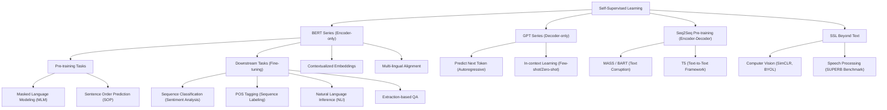

# 第26堂課：Self-Supervised Learning (Video 26)

本堂課程由李宏毅教授深入探討**自監督學習 (Self-Supervised Learning, SSL)** 的核心概念，特別聚焦於自然語言處理（NLP）中的兩大標竿巨作：**BERT 系列（Encoder 架構）**與 **GPT 系列（Decoder 架構）**。

自監督學習近年來在語音（Speech）與電腦視覺（CV）領域亦取得突破性進展，開啟了預訓練大模型（Foundation Models）的新紀元。本篇筆記將詳實梳理自監督學習的理論基礎、演算法細節、下游任務適應（Downstream Fine-tuning）以及模型背後的運作機制。

---

## 1. 知識圖譜 (Knowledge Graph)

---

## 2. 自監督學習的核心概念 (Core Concept of SSL)

### 2.1 什麼是自監督學習？
在傳統的**監督學習 (Supervised Learning)** 中，我們需要成對的輸入與標籤 $(x, \hat{y})$，其中標籤 $\hat{y}$ 通常需要昂貴的人工標記。

而**自監督學習 (Self-Supervised Learning)** 則是從無標記數據（Unlabeled Data）本身挖掘監督訊號。其核心思想如深度學習巨頭 Yann LeCun 所述：
> *"The system learns to predict part of its input from other parts of its input."*  
> （系統透過輸入的某一部分，去預測輸入的另一部分。）

自監督學習將無標記數據 $x$ 分割為兩部分：
1. 輸入部分 $x'$
2. 剩餘部分 $x''$（作為目標，即自建的 Label）

模型透過預測 $x''$ 來學習數據的底層特徵與表徵（Representations）。

$$x \xrightarrow{\text{Split}} \{x', x''\} \quad \Longrightarrow \quad \text{Model}(x') \to y \quad \text{vs.} \quad x'' \ (\text{Label})$$

### 2.2 模型參數量的巨型化趨勢
隨著自監督學習的興起，模型規模呈現指數型增長：
* **ELMo (2018)**: 94M 參數
* **BERT (2018)**: 340M 參數
* **GPT-2 (2019)**: 1.5B (1542M) 參數
* **Megatron (2019)**: 8B 參數
* **T5 (2019)**: 11B 參數
* **Turing NLG**: 17B 參數
* **GPT-3 (2020)**: 175B 參數（參數規模已是 Turing NLG 的 10 倍以上）
* **Switch Transformer (2021)**: 1.6T (萬億) 參數

這類超大型預訓練模型（Large Pre-trained Models）展現出驚人的「湧現能力」（Emergent Abilities）。

---

## 3. BERT 系列：雙向編碼器表徵 (BERT Series)

BERT 全稱為 **Bidirectional Encoder Representations from Transformers**，其架構本質上就是一個 **Transformer Encoder**。BERT 的預訓練過程包含兩個核心任務：

### 3.1 預訓練任務一：遮罩輸入 (Masking Input / MLM)
在輸入句子中，隨機選取約 $15\%$ 的 Token 進行遮罩。遮罩的具體策略為：
* $80\%$ 的機率替換為特殊 Token `[MASK]`。
* $10\%$ 的機率隨機替換為另一個 Token。
* $10\%$ 的機率保持不變。

#### MLM 預測機制：
BERT 輸出被遮罩位置的特徵向量，通過一個隨機初始化的線性層（Linear Layer）與 Softmax，預測被遮罩的真實 Token。優化目標是**最小化預測機率與真實 Ground Truth 的交叉熵（Cross-Entropy）**：

$$\mathcal{L}_{\text{MLM}} = - \sum_{i \in \text{masked}} \log P(w_i | X_{\backslash i})$$

以輸入「台灣[MASK]學」為例，模型需要預測出被遮罩字為「大」。

### 3.2 預訓練任務二：下一句預測 (Next Sentence Prediction - NSP)
輸入兩個句子，在開頭加入特殊 Token `[CLS]`，兩句之間用 `[SEP]` 分隔。
* `[CLS] 句子A [SEP] 句子B`
* BERT 輸出 `[CLS]` 的向量，通過線性分類器預測「句子B是否為句子A的下一句」（Binary Classification: Yes/No）。

> **技術演進備註**：後續研究（如 RoBERTa）指出 **NSP 任務對下游任務幫助有限**，甚至會帶來負面影響。因此，在 ALBERT 中，NSP 被替換為**句子順序預測 (Sentence Order Prediction, SOP)**。SOP 的正樣本為連續兩句，負樣本為將這兩句的順序顛倒，這迫使模型學習更細緻的段落相干性。

---

## 4. 如何使用 BERT：下游任務微調 (Downstream Fine-tuning)

預訓練完成的 BERT 相當於一個強大的「特徵提取器」，我們只需在其上方疊加一個簡單的線性層（Linear Layer），並在特定的下游任務（Downstream Tasks）上進行**微調 (Fine-tuning)**。

BERT 能夠輕鬆適應 GLUE（General Language Understanding Evaluation）基準測試中的各類任務，主要分為以下四種 Case：

### Case 1: 序列分類 (Sequence Classification)
* **輸入**：單一序列（如：評論）。
* **輸出**：類別標籤（如：正面/負面情緒分析）。
* **方法**：
  在開頭放置 `[CLS]` Token，將其經過 BERT 得到的輸出向量 $h_{\text{[CLS]}}$ 輸入至線性分類器 $W_y$ 中，得到類別預測。微調時，**BERT 的參數與線性層的參數同時進行梯度更新**（此方法顯著優於從頭隨機初始化訓練，收斂速度與最終 Loss 皆更佳）。

$$\hat{y} = \text{Softmax}(W_y h_{\text{[CLS]}} + b_y)$$

### Case 2: 序列標註 (Sequence Labeling / POS Tagging)
* **輸入**：一個句子。
* **輸出**：每個 Token 對應的標籤（如：詞性標記 POS Tagging，"I saw a saw" $\to$ "Pronoun, Verb, Determiner, Noun"）。
* **方法**：
  BERT 輸出每個 Token 對應的向量 $h_i$，分別送入同一個線性分類器，預測其詞性類別。

$$\hat{y}_i = \text{Softmax}(W_{\text{pos}} h_i + b_{\text{pos}})$$

### Case 3: 自然語言推理 (Natural Language Inference, NLI)
* **輸入**：兩個序列（Premise 前提 與 Hypothesis 假設）。
* **輸出**：三分類（Contradiction 矛盾、Entailment 蘊含、Neutral 中立）。
* **方法**：
  格式化為 `[CLS] Premise [SEP] Hypothesis` 輸入 BERT，利用 `[CLS]` 的輸出向量進行三分類預測。

### Case 4: 抽取式問答 (Extraction-based Question Answering, QA)
* **輸入**：問題 $Q = \{q_1, \dots, q_M\}$ 與 文章 Document $D = \{d_1, \dots, d_N\}$。
* **輸出**：文章中的起始位置 $s$ 與結束位置 $e$（答案即為 $A = \{d_s, \dots, d_e\}$）。
* **機制**：
  1. 將輸入拼接為 `[CLS] Q [SEP] D` 送入 BERT，得到文章中每個 Token 的輸出向量 $d_i \in \mathbb{R}^d$。
  2. 隨機初始化兩個等維度向量：**Start Vector $s \in \mathbb{R}^d$** 與 **End Vector $e \in \mathbb{R}^d$**。
  3. 計算 $s$ 與各個文章 Token 向量 $d_i$ 的內積（Inner Product），並經過 Softmax 得到起始機率分布：

$$P_{\text{start}}(i) = \frac{\exp(s \cdot d_i)}{\sum_{j=1}^N \exp(s \cdot d_j)}$$

  4. 同理，計算 $e$ 與 $d_i$ 的內積以得到結束機率分布：

$$P_{\text{end}}(i) = \frac{\exp(e \cdot d_i)}{\sum_{j=1}^N \exp(e \cdot d_j)}$$

  5. 取機率最大者作為預測的邊界 $s$ 與 $e$。微調時更新 BERT 參數及向量 $s, e$。

---

## 5. 為什麼 BERT 如此強大？(Why does BERT work?)

### 5.1 脈絡化單字嵌入 (Contextualized Word Embeddings)
在傳統的 Word2Vec 或 GloVe 中，不論上下文為何，同一個單字（如「蘋果」）對應的向量都是固定的（Static Word Embedding）。

而 BERT 產出的則是**脈絡化單字嵌入 (Contextualized Word Embeddings)**。同一個字在不同的上下文環境中，會產生完全不同的向量表示：
* 「吃**蘋果**」中的「蘋果」向量會接近「草莓」、「水果」。
* 「**蘋果**手機」中的「蘋果」向量則會接近「電腦」、「手機」。

這完美體現了語言學家 John Rupert Firth 的著名觀點：
> *"You shall know a word by the company it keeps."*  
> （欲知一字，且看其伴。）

### 5.2 跨領域遷移能力 (Cross-domain Transfer Ability)
李宏毅教授團隊的研究成果顯示，將預訓練於英文語料的 BERT 模型，直接應用於 **DNA 序列分類、蛋白質分類、甚至音樂分類**（將 DNA 的 A, T, C, G 鹼基或音樂特徵映射為英文字），其表現顯著優於從頭訓練（Random Initialization）或單純的特徵重建。

這表明 **BERT 學習到了普適的序列結構與長距離依賴關係**，其內部的 Attention 分布具備極強的結構泛化能力。

---

## 6. 多語言 BERT 與跨語言對齊 (Multi-lingual BERT)

Google 曾推出在 104 種語言上同時訓練的 **Multi-lingual BERT (mBERT)**。令人驚奇的是，mBERT 展現出了極強的 **Zero-shot 跨語言遷移能力**：
> **實驗**：使用「英文 QA 數據集」來微調 mBERT，模型**從未看過任何中文 QA 範例**。接著直接在「中文 QA 數據集」上進行測試，模型竟然能正確回答中文問題！

### 6.1 跨語言對齊的秘密：語言空間的平移向量 (Translation Vector)
mBERT 是如何將英文與中文對齊到同一個語意空間的？

研究發現，mBERT 並非完全消除語言界線。在向量空間中，中英文向量之所以能互通，是因為：
$$\mathbf{v}_{\text{Chinese}} \approx \mathbf{v}_{\text{English}} + \vec{u}_{\text{shift}}$$

其中 $\vec{u}_{\text{shift}}$ 是一個代表「語言特徵偏置」的固定平移向量。
* 如果我們計算出中文與英文 Embedding 的平均值差：
$$\vec{u}_{\text{shift}} = \mathbf{\mu}_{\text{Chinese}} - \mathbf{\mu}_{\text{English}}$$
* 將中文特徵向量扣除這個 $\vec{u}_{\text{shift}}$，就可以在**完全無監督**的情況下，直接進行 Token 等級的跨語言翻譯。

---

## 7. Seq2Seq 預訓練模型與 GPT 系列

### 7.1 Seq2Seq 模型預訓練 (MASS / BART / T5)
若要預訓練一個完整的 **Encoder-Decoder (Seq2Seq)** 架構，通常會使用「破壞文本再重建」的策略。
* **BART** 的破壞策略非常多元，包含：Token 遮罩、Token 刪除、文本填充（Text Infilling，將一段區間代換為單一 `[MASK]`）、句子隨機排列（Sentence Permutation）與文檔旋轉（Document Rotation）。
* **T5 (Text-to-Text Transfer Transformer)** 將所有 NLP 任務都統整為「Text-to-Text」的形式。

### 7.2 GPT 系列：自迴歸生成 (Predict Next Token)
不同於 BERT 的雙向編碼，**GPT (Generative Pre-trained Transformer)** 是一個 **Decoder-only** 架構。其核心任務是**預測下一個 Token（Autoregressive 語言模型）**：

$$P(X) = \prod_{t=1}^T P(w_t | w_1, w_2, \dots, w_{t-1})$$

在預訓練時，因為 Decoder 具有 Masked Self-Attention 機制，模型在預測第 $t$ 個字時，無法看到 $t$ 之後的資訊。

#### GPT-3 的 In-context Learning (上下文學習)
GPT-3 擁有高達 175B 的參數。它最震撼的特點是：在進行下游任務時，**不需要進行任何參數梯度的更新（No Gradient Descent）**。
用戶只需在輸入（Prompt）中給出：
1. 任務描述 (Task Description)
2. 幾個範例 (Few-shot Examples)
3. 待求解的問題 (Prompt)

模型便能藉由強大的注意力機制，直接生成正確答案。這種創新的學習範式被稱為 **In-context Learning**。

---

## 8. 隨堂測驗 (Quizzes)

### 測驗 1：BERT 的遮罩輸入 (MLM) 策略
在 BERT 的 MLM 預訓練中，為什麼被選中的 $15\%$ Token 不全部替換為 `[MASK]`，而是保留 $10\%$ 的隨機替換與 $10\%$ 的保持不變？

點擊展開解答

因為在下游任務的微調（Fine-tuning）和實際推理時，輸入文本中<b>絕對不會出現 <code>[MASK]</code> 這種特殊 Token</b>。如果預訓練時只學習預測 <code>[MASK]</code>，會導致預訓練與微調階段的輸入分布不一致（Discrepancy）。保留隨機替換與保持不變，能迫使 BERT 在沒有 <code>[MASK]</code> 的情況下，依然保持對上下文語意特徵的魯棒提取能力。

---

### 測驗 2：抽取式問答 (Case 4) 的數學推導
在問答任務中，若一篇文章長度為 $N$，BERT 分別學到了 Start Vector $s$ 與 End Vector $e$。試問模型預測出之答案區間 $[s_{\text{pred}}, e_{\text{pred}}]$，其联合概率最大化公式應如何表示（假設起點與終點選擇相互獨立）？

點擊展開解答

我們需要尋找一對起點 $i$ 與終點 $j$（且滿足合理約束 $i \le j$），使得它們的聯合機率最大：
$$(s_{\text{pred}}, e_{\text{pred}}) = \arg\max_{1 \le i \le j \le N} P_{\text{start}}(i) \times P_{\text{end}}(j)$$
而在實作中，通常會轉為對數空間進行計算，以避免數值下溢：
$$(s_{\text{pred}}, e_{\text{pred}}) = \arg\max_{1 \le i \le j \le N} \left( s \cdot d_i + e \cdot d_j \right)$$

---

### 測驗 3：GPT 與 BERT 的本質架構差異
請說明為什麼 BERT 適合用於自然語言理解（NLU）任務（如問答、分類），而 GPT 更擅長用於自然語言生成（NLG）任務？

點擊展開解答

<ul>
  <li><b>BERT (Encoder-only)</b>：採用<b>雙向自注意力機制（Bidirectional Self-Attention）</b>。在提取任一位置的特徵時，皆能同時觀測到左側與右側的上下文（全域資訊）。這使其能非常精準地理解並抽取文本語意，極度適合 NLU 任務。</li>
  <li><b>GPT (Decoder-only)</b>：採用<b>單向/遮罩自注意力機制（Causal/Masked Self-Attention）</b>。模型在生成第 $t$ 個字時，只能依賴前 $t-1$ 個字。這種自迴歸（Autoregressive）結構與人類逐字寫作、說話的生成邏輯完全一致，因此天生擅長 NLG 任務。</li>
</ul>

