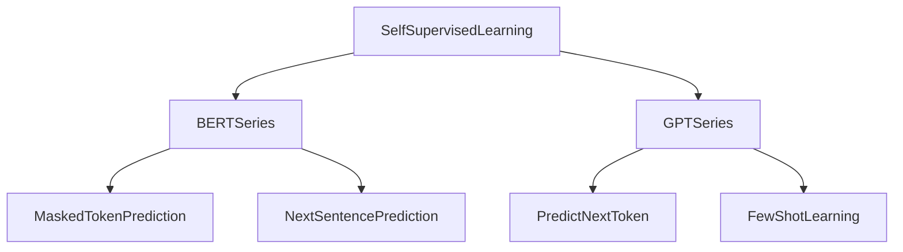

# 第28堂課：Self-supervised Learning (aka Foundation Model) (Part 3 of 3)

在機器學習中，自我監督學習 (Self-supervised Learning) 是一種無需人工標註數據，而是利用數據本身的部分資訊作為監督訊號來訓練模型的方法。Yann LeCun 指出，「非監督學習 (Unsupervised Learning)」一詞容易造成混淆，因此建議改用「自我監督學習」。

## 核心概念
自我監督學習的核心理念是：**讓系統學習從輸入的一部份去預測另一部份**。輸入的剩餘部分充當了預測器的監督訊號。

## BERT 系列 (BERT Series)

BERT (Bidirectional Encoder Representations from Transformers) 通過大規模預訓練來學習強大的上下文表示。

### 1. 預訓練 (Pre-training)
*   **Masked Token Prediction**: 隨機遮蔽 (Mask) 輸入序列中的某些 token（將其替換為 `[MASK]` 或隨機字元），並要求模型預測出原始的 token。訓練目標是最小化交叉熵 (Cross Entropy)。
*   **Next Sentence Prediction (NSP)**: 原本用於 BERT，預測兩句話是否接續。在後續研究如 RoBERTa 中發現效果有限，ALBER 則改用 SOP (Sentence Order Prediction)。

### 2. 下游任務 (Downstream Tasks)
在預訓練後，利用少量有標註數據進行 **Fine-tuning**，適配特定的任務：
*   **Case 1 (序列分類)**: 如情緒分析，在 `[CLS]` token 上連接一個線性層。
*   **Case 2 (序列標記)**: 如詞性標註 (POS tagging)，對每個輸入 token 對應的輸出進行分類。
*   **Case 3 (自然語言推論 NLI)**: 輸入兩句話，預測其關係（矛盾、包含、中立）。
*   **Case 4 (閱讀理解 QA)**: 輸入文件與問題，輸出兩個整數 $(s, e)$ 代表答案在文件中的起點與終點位置。

### 3. 為何 BERT 有效？
*   **上下文嵌入 (Contextualized Word Embedding)**: BERT 考慮了上下文，同樣的字（如「蘋果」）在不同語境下有不同的 embedding。
*   **跨領域應用**: 不僅限於文字，BERT 也被應用於處理蛋白質序列、DNA 序列和音樂分類，表現優於隨機初始化。

## GPT 系列 (GPT Series)

GPT 系列專注於生成任務，透過「預測下一個 Token」進行訓練。

*   **生成能力**: GPT 具有強大的文字生成能力，這源於其在超大規模數據上的預訓練。
*   **In-context Learning**: 無需梯度下降 (Gradient Descent)，透過提供「任務描述」與「少許範例」(Few-shot/Zero-shot)，模型即可在當前上下文中學會如何完成特定任務。

## 其他模型與應用
*   **Seq2seq 預訓練**: 如 BART/MASS，透過遮蔽部分文字並重組 (Text Infilling) 來訓練編碼器與解碼器。
*   **多語言 BERT (Multi-lingual BERT)**: 在多種語言上進行訓練，具備零樣本 (Zero-shot) 閱讀理解能力，不同語言在向量空間中存在跨語言對齊 (Cross-lingual Alignment)。
*   **語音處理**: 透過 SUPERB (Speech Universal PERformance Benchmark) 評估模型在語音辨識、情緒識別等 10+ 項任務上的能力。

---

## 隨堂測驗

### Q1: 為什麼 Yann LeCun 建議將 "Unsupervised Learning" 稱為 "Self-supervised Learning"？

點擊查看解答

因為 "Unsupervised" 一詞是一個有負擔且容易混淆的術語。在自我監督學習中，系統其實是從輸入數據的一部份去預測另一部份，該部分數據本身就是一種監督訊號，並非完全沒有監督。

### Q2: BERT 模型中的 [CLS] token 主要用途是什麼？

點擊查看解答

[CLS] token 主要用於序列層級的分類任務（例如情緒分析）。它是整個序列的摘要表示，將其通過線性層即可進行分類預測。

### Q3: 什麼是 GPT 的 "In-context Learning" (或 Few-shot Learning)？

點擊查看解答

這是一種不需要對模型參數進行梯度下降的學習方式。模型僅透過接收包含「任務描述」與「少量範例」的 prompt，即可理解並執行該任務。

## 來自課程原聲的重點摘要

## 來自課程原聲的重點摘要

*   **GPT 的訓練方式與比喻**
    *   教授將 GPT 比喻為「接龍專家」。GPT 的核心任務是「根據前文預測下一個 Token」。
    *   教授以「Taiwan da...」為例，GPT 會先將其轉為 Embedding，根據開始句子的 Token (Begin of sentence)，持續預測下一個 Token（如「Taiwan」、「da」、「Xue」），透過海量數據的訓練，讓模型能生成完整的句子。
*   **推導邏輯與細節**
    *   **Self-supervised Learning 的應用**：與 BERT 類似，GPT 也是利用 Self-supervised Learning 進行訓練。
    *   **與 BERT 的架構差異**：GPT 的架構與 Transformer Decoder 相似，但移除了 Cross-attention 機制。原因是 GPT 在預測下一個 Token 時，必須避免讓模型「偷看」到後續的詞彙。
    *   **Self-supervised Learning 的定義**：教授強調，GPT 的訓練不需要人工標註（Labels），模型透過不斷預測下一個 Token 來進行自我訓練，這與傳統需要大量標註數據的監督式學習不同。
*   **常見誤區與觀念強化**
    *   **GPT 與 BERT 的關係**：有些學生可能會誤以為 GPT 必須加上額外的 Classifier 才能使用，但教授強調，GPT 論文本身並不依賴額外的分類器。在實際操作中，如果你需要特定任務，可以對原始模型進行簡單的微調（Fine-tune）。
    *   **「零樣本」與「少樣本」學習**：教授特別提到了 Few-shot Learning 和 Zero-shot Learning。例如，給模型看一個翻譯範例，模型就能推論出如何進行翻譯，這體現了 GPT 強大的泛化能力。
    *   **Self-supervised Learning 不限於文字**：教授明確指出，Self-supervised Learning 的概念不僅適用於文字 (NLP)，同樣可以擴展到語音 (Audio) 和圖像 (CV) 領域。
