# 第28堂課：Self-Supervised Learning (自監督學習)

本堂課程由李宏毅教授深入探討自監督學習（Self-Supervised Learning, SSL）的原理與發展。自監督學習在近年來已成為自然語言處理（NLP）乃至語音與影像領域的絕對核心技術。課程將以著名的「芝麻街家族」（ELMo, BERT, ERNIE 等）模型為起點，深入剖析 **BERT 家族**（雙向編碼器）與 **GPT 家族**（自迴歸生成器）的技術架構、運作機制、微調方法，並探討「為什麼自監督學習能帶來如此巨大的變革」。

---

## 知識圖譜 (Knowledge Graph)

```mermaid
graph TD
    Node1["Self-Supervised Learning"] --> Node2["Pre-training"]
    Node2["Pre-training"] --> Node3["BERT Series"]
    Node2["Pre-training"] --> Node4["GPT Series"]
    Node2["Pre-training"] --> Node5["Seq2Seq Models"]
    
    Node3["BERT Series"] --> Node6["Masked Language Modeling"]
    Node3["BERT Series"] --> Node7["Next Sentence Prediction"]
    Node3["BERT Series"] --> Node8["Sentence Order Prediction"]
    Node3["BERT Series"] --> Node9["Downstream Fine-tuning"]
    
    Node9["Downstream Fine-tuning"] --> Node10["Sequence Classification"]
    Node9["Downstream Fine-tuning"] --> Node11["Sequence Labeling"]
    Node9["Downstream Fine-tuning"] --> Node12["Natural Language Inference"]
    Node9["Downstream Fine-tuning"] --> Node13["Extraction-based QA"]
    
    Node3["BERT Series"] --> Node14["Multi-lingual BERT"]
    Node14["Multi-lingual BERT"] --> Node15["Cross-lingual Alignment"]
    
    Node4["GPT Series"] --> Node16["Predict Next Token"]
    Node4["GPT Series"] --> Node17["In-context Learning"]
    Node17["In-context Learning"] --> Node18["Few-shot Learning"]
    Node17["In-context Learning"] --> Node19["Zero-shot Learning"]
    
    Node5["Seq2Seq Models"] --> Node20["MASS"]
    Node5["Seq2Seq Models"] --> Node21["BART"]
    Node5["Seq2Seq Models"] --> Node22["T5"]
    
    Node1["Self-Supervised Learning"] --> Node23["Beyond Text"]
    Node23["Beyond Text"] --> Node24["Computer Vision SSL"]
    Node23["Beyond Text"] --> Node25["Speech SSL"]
    Node24["Computer Vision SSL"] --> Node26["SimCLR"]
    Node24["Computer Vision SSL"] --> Node27["BYOL"]
    Node25["Speech SSL"] --> Node28["SUPERB Benchmark"]
```



---

## 1. 什麼是自監督學習 (Self-Supervised Learning)？

傳統的監督學習（Supervised Learning）高度依賴人工標記的成對數據 $(x, y)$。然而，獲取高質量的標記數據成本極其高昂。

自監督學習則是**無監督學習（Unsupervised Learning）**的一種特殊形式。正如深度學習巨頭 Yann LeCun 所指出：

> "I now call it 'self-supervised learning', because 'unsupervised' is both a loaded and confusing term. In self-supervised learning, the system learns to predict part of its input from other parts of its input."

自監督學習的核心思想是：**利用沒有標記（Unlabeled）的數據 $x$，人為地將其拆分成兩部分——輸入 $x'$ 與 pseudo-label $x''$，以此作為監督信號來訓練模型**。

```
【監督學習】     Input (x) ───► [ Model ] ───► Output (y)  ◄─── 比較 ───► Label (ŷ)
【自監督學習】   Input (x) ─┬─► Part 1 (x') ───► [ Model ] ───► Output (y)
                           │                                      ▲
                           └─► Part 2 (x'') ◄─────────────────────┘ (作為自產生的 Label)
```

透過這種方式，我們可以使用網路上近乎無限的文本、語音與影像數據來進行大規模的**預訓練（Pre-training）**，讓模型學習到通用的特徵表示（Representation），隨後只需極少量的標記數據即可在**下游任務（Downstream Tasks）**中進行**微調（Fine-tune）**並取得優異表現。

---

## 2. 芝麻街家族與模型規模的膨脹

在 NLP 領域，自監督學習的代表性模型多以兒童節目《芝麻街》（Sesame Street）中的角色命名：

*   **ELMo** (Embeddings from Language Models)
*   **BERT** (Bidirectional Encoder Representations from Transformers)
*   **ERNIE** (Enhanced Representation through Knowledge Integration)
*   **Big Bird** (Transformers for Longer Sequences)

### 2.1 參數量的軍備競賽
隨著計算能力的提升與資料量的暴增，SSL 模型的參數量呈現指數級成長。下圖形象地展示了各代模型的體量差距：

$$
\text{ELMo (94M)} \ll \text{BERT (340M)} \ll \text{GPT-2 (1.5B)} \ll \text{Megatron (8B)} \ll \text{T5 (11B)} \ll \text{Turing NLG (17B)} \ll \text{GPT-3 (175B)} \ll \text{Switch Transformer (1.6T)}
$$

雖然 GPT-3 與 Switch Transformer 等模型的參數規模已達到常人難以企及的高度，但它們最底層的技術仍基於以下兩大核心流派：以 **BERT** 為代表的雙向編碼器家族，與以 **GPT** 為代表的自迴歸生成器家族。

---

## 3. BERT 家族：雙向編碼器與特徵表示

BERT 的本質是一個 **Transformer Encoder**。它的主要特點是「雙向性」，即模型在編碼某一個 Token 時，能夠同時關注到其左側和右側的上下文。

### 3.1 預訓練任務一：遮罩輸入 (Masking Input)
BERT 最核心的訓練方法類似於「填空題」。對於輸入的一段文本，我們會隨機將其中一定比例（通常是 $15\%$）的 Token 遮蔽，遮蔽方式如下：
1.  **$80\%$ 的機率**：將該 Token 替換為特殊的 `[MASK]` 標記。例如：將「台灣大學」替換為「台 `[MASK]` 大學」。
2.  **$10\%$ 的機率**：將該 Token 隨機替換成另一個無關的字（Random Token）。例如：替換為「台天大學」。
3.  **$10\%$ 的機率**：保持該 Token 不變。

隨後，將 BERT 輸出端對應於被遮蔽位置的 Embedding 向量，輸入至一個線性分類器（Linear Classifier），並使用 **Softmax** 函數預測該位置原本的字符。

#### 損失函數推導
令被遮蔽的真實字符為 $x_{\text{true}}$，模型預測的機率分佈為 $\hat{y}$。預訓練的優化目標是最小化預測分佈與真實 One-hot 編碼之間的**交叉熵（Cross-Entropy）**：

$$
\mathcal{L}_{\text{mask}} = - \sum_{i \in \mathcal{M}} \log P(x_i = x_{\text{true}} | X_{\backslash i})
$$

其中 $\mathcal{M}$ 為所有被遮蔽位置的集合，$X_{\backslash i}$ 代表除了第 $i$ 個位置以外的上下文資訊。

```
                     [預測結果: 灣] (Softmax)
                           ▲
                           │
                     [Linear Layer]
                           ▲
                           │ (取對應的 Embedding)
                     [BERT Encoder]
                       ▲   ▲   ▲   ▲
                       │   │   │   │
                      台 [MASK] 大  學
```

### 3.2 預訓練任務二：下一句預測 (Next Sentence Prediction, NSP)
為了讓模型學習到句子之間的關係，BERT 引入了 NSP 任務。
*   輸入為兩個句子 $[Sentence 1]$ 與 $[Sentence 2]$，並以特殊的 `[SEP]` 符號隔開，最開頭加入首位標記 `[CLS]`。
*   **$50\%$ 的機率**：$Sentence 2$ 確實是 $Sentence 1$ 的下一句（標記為 `IsNext`）。
*   **$50\%$ 的機率**：$Sentence 2$ 是從語料庫中隨機挑選的無關句子（標記為 `NotNext`）。
*   模型利用 `[CLS]` 位置對應的輸出向量，經由線性分類器預測輸出 `Yes / No`。

> **補充：NSP 是否真的有用？**
> 後續研究（如 RoBERTa）發現，NSP 任務對於模型效果的提升有限。因此，在 ALBERT 等後續模型中，NSP 被替換為更困難的**句子順序預測（Sentence Order Prediction, SOP）**任務：即 $Sentence 2$ 必定是鄰接句，但可能是正常順序，也可能是被顛倒後的順序（預測「正序」或「逆序」）。

---

## 4. 下游任務微調 (Downstream Fine-tuning) 的四種範例

預訓練完成後，BERT 已經具備了強大的語言表徵能力。我們只需要加上一個隨機初始化的線性層（Linear Layer），並利用少量的標記數據進行微調。以下是四種最經典的應用場景：

### 4.1 Case 1: 序列分類任務 (Sequence Classification)
*   **應用場景**：情感分析（Sentiment Analysis）、文本分類。
*   **架構設計**：
    *   輸入：單個句子，開頭為 `[CLS]`。
    *   輸出：將 `[CLS]` 位置對應的 BERT 輸出向量 $h_{\text{[CLS]}}$ 輸入至線性分類器，輸出類別（如 positive/negative）。
    *   **微調過程**：BERT 的參數（由預訓練初始化）與線性層的參數（隨機初始化）共同參與梯度的反向傳播與更新。

```
                         [ Class ]
                             ▲
                             │ (隨機初始化)
                       [Linear Layer]
                             ▲
                             │ $h_{[CLS]}$
                       [BERT Encoder]
                         ▲   ▲   ▲   ▲
                         │   │   │   │
                       [CLS] th- is  good
```

### 4.2 Case 2: 序列標記任務 (Sequence Labeling)
*   **應用場景**：詞性標記（POS Tagging）、命名實體識別（NER）。
*   **架構設計**：
    *   輸入：一個句子。
    *   輸出：對於句子中的每一個 Token $w_i$，其對應的 BERT 輸出向量 $h_i$ 都分別送入同一個線性分類器中，預測其對應的標記類別（如動詞、名詞等）。

```
                [ Class ]  [ Class ]  [ Class ]
                    ▲          ▲          ▲
              [Linear Layer] [Linear Layer] [Linear Layer]
                    ▲          ▲          ▲
                    │ $h_1$    │ $h_2$    │ $h_3$
              [     BERT Encoder     ]
                    ▲          ▲          ▲
                    │          │          │
                    I         saw         a
```

### 4.3 Case 3: 自然語言推理 (Natural Language Inference, NLI)
*   **應用場景**：判斷前件（Premise）與假設（Hypothesis）之間是「蘊含（entailment）」、「矛盾（contradiction）」還是「中立（neutral）」關係。
*   **架構設計**：
    *   輸入：將兩句文本拼接為 `[CLS] Premise [SEP] Hypothesis`。
    *   輸出：同樣利用 $h_{\text{[CLS]}}$ 輸入線性分類器，輸出三分類結果。

```
                                [ Contradiction / Entailment / Neutral ]
                                                   ▲
                                             [Linear Layer]
                                                   ▲
                                                   │ $h_{[CLS]}$
                                             [BERT Encoder]
                                        ▲   ▲   ▲   ▲   ▲   ▲   ▲
                                        │   │   │   │   │   │   │
                                      [CLS] P1  P2 [SEP] H1  H2  H3
```

### 4.4 Case 4: 基於抽取式問答 (Extraction-based Question Answering, QA)
*   **應用場景**：給定一個段落（Document, $D = \{d_1, d_2, \dots, d_N\}$）和一個問題（Query, $Q = \{q_1, q_2, \dots, q_M\}$），模型需要從段落中抽取出一段連續的區間作為答案 $\{d_s, \dots, d_e\}$，其中 $s$ 為起始索引，$e$ 為結束索引。
*   **架構設計**：
    *   輸入：`[CLS] Query [SEP] Document`。
    *   引入兩個隨機初始化的權重向量：**起始向量 $S$** 與 **結束向量 $E$**（維度與 BERT 輸出 Embedding 相同）。
    *   **計算起始位置 $s$**：將 Document 內每個 Token 的 BERT 輸出向量 $h_{d_i}$ 與起始向量 $S$ 進行內積（Inner Product），並通過 Softmax 得到在段落各處作為答案起點的機率分佈，取機率最高者：

    $$
    P(s = i) = \frac{\exp(h_{d_i} \cdot S)}{\sum_{j=1}^N \exp(h_{d_j} \cdot S)}
    $$

    *   **計算結束位置 $e$**：同理，將 $h_{d_i}$ 與結束向量 $E$ 進行內積並計算 Softmax，取機率最高者。

```
                      [0.1]    [0.7]    [0.2]  (Softmax)
                        ▲        ▲        ▲
                        ├────────┼────────┤ (內積)
                       (●)      (●)      (●)
                       ╱ ╲      ╱ ╲      ╱ ╲
                      S  $h_1$  S  $h_2$  S  $h_3$
                      │  │   │  │   │  │
                    [     BERT Encoder     ]
                      ▲  ▲   ▲  ▲   ▲  ▲
                    [CLS] Q [SEP] d1  d2  d3
```

---

## 5. BERT 為什麼能發揮作用？

### 5.1 上下文相關的字嵌入 (Contextualized Word Embeddings)
在傳統的靜態 Word Embedding（如 Word2Vec、CBOW）中，不論上下文如何，同一個詞（例如「蘋果」）的向量表示都是完全固定的。這使得模型無法處理多義詞。

而 BERT 的輸出是**上下文相關的（Contextualized）**。即使輸入同一個字，其對應的 Embedding 向量也會根據上下文的語境而動態變化：

```
"喝蘋果汁"  ───► 蘋果 ───► Embedding A ─┐
                                      ├─ 餘弦相似度 (Cosine Similarity) 較低
"蘋果手機"  ───► 蘋果 ───► Embedding B ─┘
```

實驗證明，在 BERT 的向量空間中：
*   代表水果的「蘋果」會與「草莓」、「香蕉」等詞的向量靠得更近。
*   代表科技公司的「蘋果」則會與「科技」、「股價」等詞的向量靠得更近。

這完美印證了語言學家 John Rupert Firth 的名言：

> *"You shall know a word by the company it keeps." (欲知一詞，先看其伴)*

### 5.2 令人驚嘆的跨領域遷移能力 (Transferability)
研究發現，即使將 BERT **完全在英文文本上進行預訓練**，它所學到的表徵抽取能力也可以直接遷移到完全非語言的序列任務中，例如：
*   **蛋白質序列分類 (Protein Classification)**
*   **DNA 序列分類 (DNA Sequence Classification)**
*   **音樂作曲家分類 (Music Classification)**

在這些任務中，我們將 A, T, C, G 等鹼基對或氨基酸代碼與英文字母進行一對一映射後輸入英文預訓練的 BERT。實驗結果表明，其微調效果顯著優於從頭開始隨機初始化訓練的模型（Scratch）。這表明 BERT 在大量文本中學到了某種普適的、處理「序列資料規律」的深層結構特徵。

---

## 6. 多國語言 BERT (Multi-lingual BERT) 與跨語言對齊

如果我們在包含 104 種語言的龐大語料庫上共同訓練一個 BERT（稱為 Multi-BERT），會發生什麼神奇的現象？

### 6.1 零樣本跨語言閱讀理解 (Zero-shot Cross-lingual QA)
*   **實驗步驟**：
    1.  使用多國語言預訓練的 **Multi-BERT**。
    2.  **僅使用英文問答數據（SQuAD）**進行微調，此時模型從未見過任何中文的問答標記資料。
    3.  直接將模型拿來做**中文閱讀理解（DRCD）**測試。
*   **結果**：模型在中文測試集上取得了高達 $78.8\%$ 的 F1-score！
*   **結論**：Multi-BERT 在預訓練過程中，自發地實現了「跨語言對齊（Cross-lingual Alignment）」。不論是用英文輸入 "rabbit" 還是用中文輸入 "兔子"，它們在 Multi-BERT 內部所產生的 Embedding 向量，在空間中的相對位置是極其相近的。

```
              [英文空間]                [中文空間]
               jump (黃) ─── 距離相近 ─── 跳 (黃)
               rabbit (藍) ── 距離相近 ─── 兔 (藍)
               fish (綠) ──── 距離相近 ─── 魚 (綠)
```

### 6.2 語言資訊藏在哪裡？
既然 Multi-BERT 將不同語言對齊到了同一個與語言無關（Language-independent）的空間中，那模型又是如何將其正確重建回各自對應的語言呢？這說明 Embedding 中必然還保留著語言資訊。

研究（*劉記良, 許宗嫄, 莊永松, 2020*）指出：**不同語言的向量空間在幾何分佈上高度相似，但彼此之間存在著一個系統性的位移向量（Shift Vector）**。

$$\vec{v}_{\text{bias}} = \text{Average}(\text{Chinese Embeddings}) - \text{Average}(\text{English Embeddings})$$

如果我們在英文 Embedding 上加上這個位移向量：

$$\vec{h}_{\text{translated}} = \vec{h}_{\text{english}} + \alpha \vec{v}_{\text{bias}}$$

並將其直接輸入重建網絡中，模型就能在完全沒有任何雙語對齊語料的情況下，自發地進行**無監督的 Token 級別翻譯（Unsupervised Token-level Translation）**。

---

## 7. GPT 家族：自迴歸與下一詞預測

與 BERT 的雙向編碼填空不同，**GPT**（Generative Pre-trained Transformer）的本質是 **Transformer Decoder**（去除了 Cross-Attention 部分，僅保留 Masked Self-Attention）。

### 7.1 預訓練任務：預測下一個 Token
GPT 的訓練任務非常單純：給定前 $t$ 個 Token，預測第 $t+1$ 個 Token 的機率分佈：

$$
P(w_{t+1} | w_1, w_2, \dots, w_t)
$$

在 Self-Attention 機制中，GPT 通過對 Attention Matrix 施加下三角遮罩（Mask），確保在預測第 $t+1$ 個字時，模型**絕對無法看見**後續的上下文資訊。

```
輸入:  <BOS> ───► 台 ───► 灣 ───► 大
輸出:   台  ───►  灣 ───►  大 ───► 學
```

### 7.2 In-context Learning：神奇的 Few-shot / Zero-shot 能力
當模型參數量擴大到 GPT-3 的 175B 規模時，人們發現微調（Fine-tuning）有時會損害模型的通用生成能力。於是 GPT-3 引入了 **In-context Learning（上下文學習）**。

在測試時，**我們完全不更新模型的權重梯度（No Gradient Descent / No Fine-tune）**，僅僅通過在 **Prompt（提示詞）** 中給予幾組任務範例，模型就能神奇地理解任務並輸出正確結果。

*   **Few-shot**：在 Prompt 中給出數個範例後，直接給出新問題。
*   **One-shot**：僅給出一個範例。
*   **Zero-shot**：不給範例，僅給予任務描述（Task Description）。

```
【Few-shot Learning 的 Prompt 設計範例】
Translate English to French:       <─── 任務描述 (Task Description)
sea otter => loutre de mer         <─── 範例一 (Example 1)
peppermint => menthe poivrée       <─── 範例二 (Example 2)
plush giraffe => girafe peluche    <─── 範例三 (Example 3)
cheese =>                          <─── 提示 (Prompt) ───► [模型輸出: fromage]
```

隨著模型的參數量不斷增大，Few-shot Learning 的準確率呈現極為顯著的上升趨勢。這證明了「大模型只要見過足夠多的世界，就具備了觸類旁通的理解力」。

---

## 8. 預訓練 Seq2Seq 模型

除了純 Encoder（BERT）和純 Decoder（GPT）之外，還有第三種預訓練範式：**將 Encoder 與 Decoder 結合的 Seq2Seq 架構預訓練**。其代表模型包括 **MASS**、**BART** 與 **T5**。

### 8.1 破壞與重建 (Corrupt and Reconstruct)
Seq2Seq 預訓練的核心是：將輸入句子做各種方式的破壞（Corruption），輸入至 Encoder，並要求 Decoder 重建出原本未受損的句子。

```
受損句子 (A [MASK] B [SEP] C [MASK] E) ───► [ Encoder ] ─── Cross Attention ───► [ Decoder ] ───► 重建原句子 (A B C D E)
```

常見的破壞策略（如 BART 中所採用）包括：
1.  **Token 刪除 (Token Deletion)**：隨機刪去某些 Token。
2.  **句子置換 (Sentence Permutation)**：隨機打亂多個句子的先後順序。
3.  **旋轉 (Rotation)**：將句子的開頭移到句尾。
4.  **文本填充 (Text Infilling)**：將一段連續的 Token 替換為單個 `[MASK]`。

---

## 9. 跨越文本：影像與語音中的自監督學習

自監督學習的浪潮很快就溢出到了自然語言處理之外，席捲了電腦視覺與語音訊號處理領域。

### 9.1 電腦視覺中的自監督學習 (Computer Vision SSL)
由於影像很難像文字一樣做出精確的「填空題」，CV 領域主要採用了以下兩種預訓練範式：

*   **對比學習 (Contrastive Learning) - 以 SimCLR 為代表**：
    對於同一張圖片 $x$，施加不同的數據增強（如隨機裁剪、顏色抖動）得到兩張視角不同的圖片 $\tilde{x}_i$ 與 $\tilde{x}_j$。模型訓練的目標是**最大化這兩個不同視角特徵（Positive Pair）之間的相似度**，同時**最小化與其他無關圖片（Negative Pair）特徵之間的相似度**。
*   **非對比學習 (Non-contrastive) - 以 BYOL 為代表**：
    BYOL 不需要使用任何負樣本（Negative Pairs），而是通過一個在線網絡（Online Network）與目標網絡（Target Network）之間的互相引導與預測，巧妙地避免了特徵表徵崩塌（Representation Collapse）的問題。

```
                  ┌─── Augmentation t  ───► 𝘹̃_𝘪 ───► [ Online Net ] ───► 𝘻_𝘪 ─┐
                  │                                                          ├─ 最大化相似度
    Original Image 𝘹                                                          │
                  └─── Augmentation t' ───► 𝘹̃_𝘫 ───► [ Target Net ] ───► 𝘻_𝘫 ─┘
```

### 9.2 語音訊號中的自監督學習 (Speech SSL)
在語音中，我們可以將持續的語音訊號（Audio Waveform）切分成多個 Frame，並像 BERT 一樣隨機遮蔽某些時段的 Frame（如 Mockingjay, TERA 等模型），要求模型重建被遮蔽處的聲學特徵。

為了客觀評估語音自監督模型的表現，台大李宏毅教授團隊與國際多個頂尖研究機構共同發起並維護了 **SUPERB (Speech processing Universal PERformance Benchmark)** 基準。

同時，開源社群也提供了強大的自監督語音特徵提取與評估工具包：
👉 **s3prl Toolkit**：[https://github.com/s3prl/s3prl](https://github.com/s3prl/s3prl)

---

## 隨堂測驗

### 測驗 1：觀念理解（單選題）
**在 BERT 的遮罩輸入（Masking Input）預訓練任務中，為什麼不把所有被選中的 $15\%$ Token 全部替換成 `[MASK]` 標記，而是要保留 $10\%$ 的機率隨機替換，以及 $10\%$ 的機率保持不變？**
A. 為了降低模型的訓練難度，避免模型因為 `[MASK]` 太多而無法收斂。
B. 為了減少計算量，因為計算隨機 Token 比計算 `[MASK]` 快。
C. 為了減緩「預訓練與微調階段不一致（Mismatch）」的問題，因為在下游任務的微調和實際推論中，輸入文本中永遠不會出現 `[MASK]`。
D. 為了配合下一句預測（NSP）任務的梯度更新。

<details>
<summary><b>點擊展開解答</b></summary>
<b>正確答案：C</b><br>
<b>解析</b>：在實際的下游任務中，輸入數據是不會包含 <code>[MASK]</code> 標記的。如果預訓練時模型只學習如何在看到 <code>[MASK]</code> 時提取特徵，那麼在微調階段，由於沒有 <code>[MASK]</code>，模型抽取的 Embedding 質量可能會下降。通過混入隨機 Token 以及保持原詞不變，能逼使 BERT 的編碼器隨時保持對每個輸入位置的警惕與語境感知，從而大幅提高表徵的泛化能力。
</details>

---

### 測驗 2：公式與架構（多選題）
**在基於 BERT 的抽取式問答（Extraction-based QA）微調任務中，關於起始位置 $s$ 與結束位置 $e$ 的計算，下列敘述哪些是正確的？**（複選）
A. 結束位置 $e$ 必須在大於或等於起始位置 $s$ 的區間中進行 Softmax 搜索。
B. 計算 $s$ 和 $e$ 時所使用的起始向量 $S$ 與結束向量 $E$，其維度必須與 BERT 的輸出向量 $h_{d_i}$ 維度相同。
C. 起始位置 $s = i$ 的機率計算公式為 $P(s = i) = \frac{\exp(h_{d_i} \cdot S)}{\sum_{j=1}^N \exp(h_{d_j} \cdot S)}$。
D. 向量 $S$ 與 $E$ 是在預訓練階段就已經訓練好的，在微調時不能更新。

<details>
<summary><b>點擊展開解答</b></summary>
<b>正確答案：B, C</b><br>
<b>解析</b>：
<ul>
  <li><b>A 錯誤</b>：在標準的微調架構中，起始與結束位置的機率分佈是分別獨立在整個段落上進行 Softmax 計算的，隨後通常在後處理階段過濾掉 $e < s$ 的不合理組合。</li>
  <li><b>B 正確</b>：因為需要進行內積（點積）運算，所以向量維度必須一致。</li>
  <li><b>C 正確</b>：此為標準的 Softmax 概率計算公式。</li>
  <li><b>D 錯誤</b>：起始向量 $S$ 與結束向量 $E$ 是在微調（Fine-tuning）階段才<b>隨機初始化並隨著微調數據一起被訓練更新</b>的。</li>
</ul>
</details>

---

### 測驗 3：實務與原理（問答題）
**請簡述 Multi-lingual BERT 能夠在未見過任何中文 QA 標記資料的前提下，僅憑英文 QA 資料微調，就直接對中文段落進行問答（即 Zero-shot QA）的核心原因。**

<details>
<summary><b>點擊展開解答</b></summary>
<b>參考答案</b>：<br>
這是因為 Multi-lingual BERT 在使用 104 種語言進行大規模自監督預訓練時，自發地在向量空間中實現了<b>跨語言對齊（Cross-lingual Alignment）</b>。不論哪種語言，只要表達的是相同的語意（例如 "rabbit" 與 "兔子"），它們在模型內部的上下文 Embedding 空間中都會被對齊到極為接近的相對位置。當我們用英文 QA 數據微調模型時，模型學會的是「如何從特定幾何關係的 Embedding 結構中尋找答案的邊界」；當輸入換成中文時，由於其中文語意特徵與英文幾何結構高度一致，模型便能直接遷移此定位能力，從而展現出驚人的零樣本跨語言推理能力。
</details>