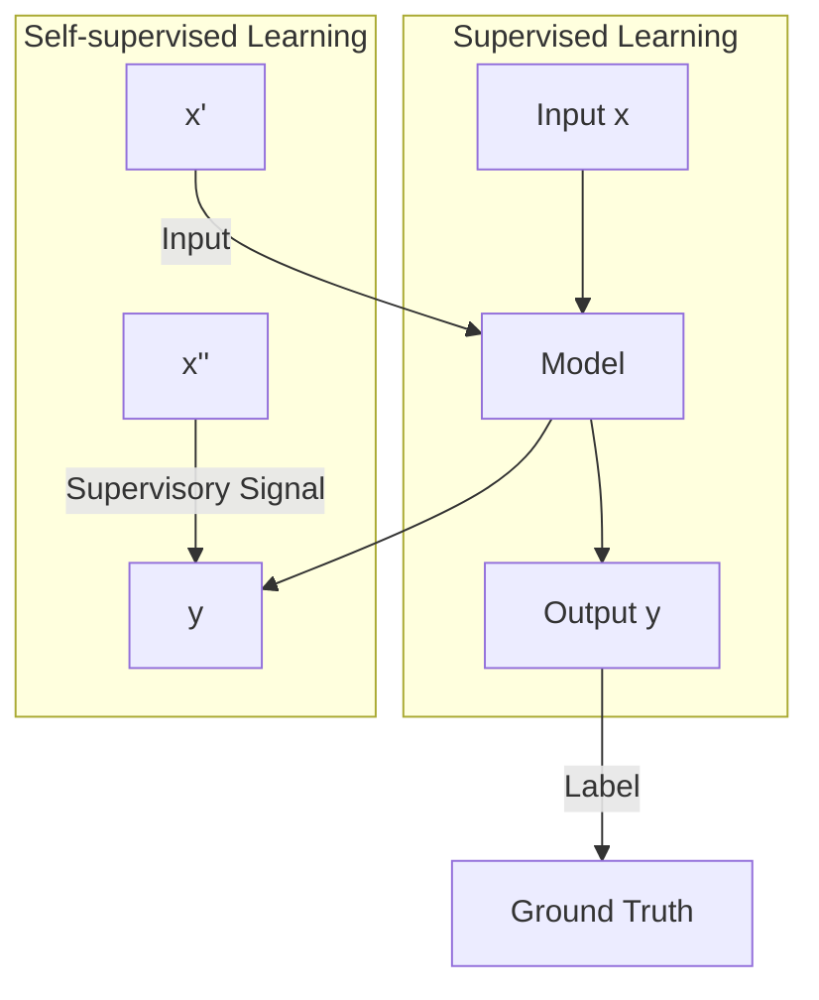

# 第29堂課：Auto-encoder (Part 1 of 2)

本堂課由李宏毅教授講解 **自監督學習 (Self-Supervised Learning)**。自監督學習是現代 NLP 模型（如 BERT, GPT 系列）的核心技術，透過從輸入數據本身挖掘監督訊號，讓模型在大規模無標註資料上進行預訓練，進而遷移至下游任務。

## 1. 什麼是自監督學習？

根據 Yann LeCun 的定義，自監督學習是讓模型學習「從輸入的一部份預測另一部份」。
*   **傳統監督學習 (Supervised Learning)**：模型根據輸入 $x$ 預測標註 $y$。
*   **自監督學習 (Self-Supervised Learning)**：將輸入 $x$ 分割為 $x'$ 與 $x''$（其中 $x''$ 為隱藏部分），利用 $x'$ 去預測 $x''$。

## 2. BERT 系列模型

### 核心概念
BERT (Bidirectional Encoder Representations from Transformers) 是基於 Transformer Encoder 的預訓練模型。
*   **Masking Input**：隨機遮蔽輸入語句中的某些 token（替換為 `[MASK]` 或隨機文字），要求模型根據上下文重建原來的文字。
*   **優化目標**：最小化預測與真實文字之間的交叉熵 (Cross Entropy)。

### 下游任務的微調 (Fine-tuning)
BERT 預訓練後，可應用於多種下游任務：
1.  **序列分類**：如情感分析，利用 `[CLS]` 的輸出經過 Linear 層預測類別。
2.  **序列標註 (Token Labeling)**：如 POS tagging，對每個輸入 token 進行分類。
3.  **自然語言推理 (NLI)**：輸入兩段句子，判斷它們之間的邏輯關係（Entailment, Contradiction, Neutral）。
4.  **抽取式問答 (Extraction-based QA)**：給定文件 $D$ 與問題 $Q$，輸出答案在 $D$ 中的起始位置 $s$ 與結束位置 $e$。

## 3. GPT 系列模型

GPT 系列專注於生成式任務，其核心是 **Predict Next Token**。
*   **運作機制**：模型根據已有的上下文，預測下一個可能出現的 token。
*   **In-context Learning**：GPT-3 展現了強大的「上下文學習」能力，無需進行梯度下降微調，僅透過提示詞 (Prompt) 和範例即可完成新任務。

## 4. 自監督學習在其他領域的應用

除了 NLP，自監督學習也廣泛應用於影像與語音處理：
*   **影像 (Image)**：
    *   **SimCLR**：透過對同一影像的不同增強 (Augmentation)，最大化兩者的表示相似度。
    *   **BYOL**：Bootstrap your own latent，透過線上網路與目標網路的互動學習表示。
*   **語音 (Speech)**：
    *   **SUPERB Benchmark**：提供一個通用平台，評估語音模型在語意、說話者辨識、情緒辨識等 10 種以上的任務表現。

---

### 隨堂測驗

#### Q1：什麼是自監督學習中的「預訓練 (Pre-train)」與「微調 (Fine-tune)」流程？

點擊查看解答

預訓練階段使用大規模無標註資料，透過 Masked token prediction 或 Next sentence prediction 等任務，讓模型學習語言結構；微調階段則在特定下游任務（如情感分析、問答）的少量標註資料上更新模型參數，使其適應特定任務。

#### Q2：在抽取式問答 (Extraction-based QA) 中，模型輸出的是什麼？

點擊查看解答

模型輸出兩個整數 $(s, e)$，分別代表答案在原文中的起始索引 (start) 與結束索引 (end)。

#### Q3：GPT 系列模型主要透過什麼任務進行預訓練？

點擊查看解答

預測下一個 Token (Predict Next Token)。

## 來自課程原聲的重點摘要

## 來自課程原聲的重點摘要

以下為課程內容中關於「Autoencoder」的補充解說：

*   **自動編碼器（Autoencoder）的核心邏輯**：
    *   教授將 Autoencoder 比喻為一個「壓縮與還原」的過程。它將輸入的資料（例如圖片）通過編碼器（Encoder）壓縮成一個低維度的「向量」（Vector），這個過程即所謂的「降維」（Dimension Reduction）。隨後再由解碼器（Decoder）嘗試將此低維向量還原回原始的圖片。
    *   **訓練目標**：目標是讓「解碼器所還原的圖片」與「原始輸入的圖片」越接近越好。這不需要任何人工標記（Labeled Data），完全屬於「非監督式學習」（Unsupervised Learning）。

*   **為何需要 Autoencoder？**
    *   它可以有效去除雜訊（Denoising）。透過 Autoencoder 處理帶有雜訊的輸入，目標卻是恢復乾淨的原始圖片，模型會被強制學會如何「濾掉」那些非本質的雜訊，僅保留資料的特徵。

*   **生動的比喻與例子**：
    *   **《天龍八部》之戰**：教授引用段譽（楊過）與樊一翁（李莫愁的弟子，此處教授口誤為「龔孫止」的弟子）在絕情谷交手的橋段。樊一翁使用「鋼鞭」般的長鬍鬚作為武器，楊過為了擊敗他，選擇砍斷鬍鬚。這個比喻旨在說明「處理複雜問題時，需找出核心關鍵（鬍鬚的根部/特徵的本質）」。
    *   **圖片的壓縮與維度**：以 $3 \times 3$ 的圖片為例，雖然有 9 個像素值，但如果圖片變化有限，我們其實不需要 9 個維度來描述它。只需找出關鍵變數（如 0 和 1 的狀態），就能精確描述該類圖片。

*   **關鍵觀念與常見誤區**：
    *   **誤區：關於層數的迷思**：早期研究者認為深層網路極難訓練，傾向於將每層視為獨立的 Autoencoder 訓練，再串接起來（即 RBM 限制玻爾茲曼機，現已較少使用）。但教授強調，現代觀念中 Autoencoder 本身就是一種深度學習技術，只要架構得當，直接訓練即可。
    *   **關於 Embedding（嵌入）**：教授提到，Embedding、Representation（表示）與 Code（編碼）這三個名詞在機器學習領域中，其實指的都是同一種東西——也就是經過 Encoder 轉換後所得到的低維度向量。
    *   **Decoder 不一定是線性的**：有些學生會懷疑解碼器為何能從低維向量還原回高維圖片，教授明確表示：「解碼器不需要是線性的」。它可以是非常複雜、非線性的深度神經網路，具備強大的資訊恢復能力。
