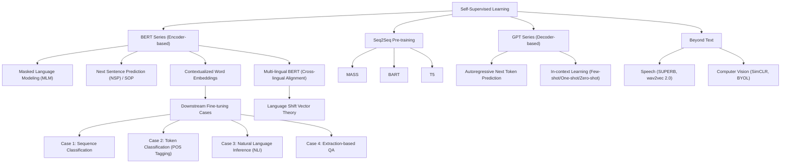

# 第29堂課：Self-Supervised Learning (Video 29)

在本堂課程中，李宏毅教授深入探討了**自監督學習 (Self-Supervised Learning, SSL)** 的核心概念，特別是以自然語言處理 (NLP) 中極具代表性的 **BERT** 與 **GPT** 系列模型為核心進行詳盡剖析。自監督學習在近年來引領了深度學習的革命，本課將從模型架構、預訓練任務、下游任務微調、多語系對齊，一直延伸到語音與電腦視覺領域的自監督技術。

---

## 知識圖譜 (Knowledge Graph)



---

## 一、 自監督學習的核心概念

傳統的監督學習 (Supervised Learning) 依賴大量的人工標記數據 $(x, y)$。然而，人工標記成本極其高昂。**自監督學習 (Self-Supervised Learning)** 的核心思想是：**直接從無標記數據中尋找監督信號。**

深度學習三巨頭之一 Yann LeCun 曾於 2019 年指出：
> 「我現在稱之為『自監督學習』，因為『無監督學習 (Unsupervised Learning)』是一個含混且容易引人誤解的詞。在自監督學習中，系統會學習從輸入的其他部分來預測輸入的某一部分。換言之，輸入的一部分被用作監督信號，來訓練其餘部分的預測器。」

自監督學習通常分為兩個階段：
1. **預訓練 (Pre-train)**：利用海量無標記文本，通過模型自我重構或預測部分輸入，讓模型學習到通用的語義與語法特徵（即基礎模型 Foundation Model）。
2. **微調 (Fine-tune)**：使用少量特定任務的標記數據（下游任務 Downstream Tasks），調整模型參數以獲得極佳的效能。

---

## 二、 BERT 家族與預訓練任務

**BERT (Bidirectional Encoder Representations from Transformers)** 是基於 **Transformer Encoder** 架構的模型。其最關鍵的特點是**雙向性 (Bidirectional)**，即在產生某個 Token 的表徵時，能夠同時參考左側與右側的上下文。

### 1. 預訓練任務一：遮蓋輸入 (Masking Input)
BERT 會隨機將輸入序列中 $15\%$ 的 Token 進行遮蓋。遮蓋策略具體分為以下三種：
* $80\%$ 的機率替換為特殊的 `[MASK]` 標記。
* $10\%$ 的機率隨機替換為另一個任意的 Token。
* $10\%$ 的機率保持原 Token 不變。

#### 訓練機制與損失函數：
假設原始文本為「台灣大學」，我們隨機遮蓋「灣」字，輸入序列變為：`台` `[MASK]` `大` `學`。
1. 模型經過 Transformer Encoder 運算後，在被遮蓋位置輸出一個上下文向量 $h_{\text{mask}}$。
2. 將 $h_{\text{mask}}$ 輸入一個隨機初始化的線性分類器 (Linear Classifier)。
3. 通過 Softmax 函數計算其在整個詞表 (Vocabulary) 上的機率分佈 $\hat{y}$：
   $$\hat{y} = \text{Softmax}(W \cdot h_{\text{mask}} + b)$$
4. 目標是**最小化 $\hat{y}$ 與真實 Token（即「灣」字的一熱編碼 Ground Truth $y$）之間的交叉熵損失 (Cross Entropy Loss)**：
   $$\mathcal{L}_{\text{MLM}} = -\sum_{k \in \text{Vocab}} y_k \log \hat{y}_k$$

透過此任務，BERT 學會了利用上下文來推測缺失詞彙，從而捕捉了豐富的詞彙語境與語法結構。

---

### 2. 預訓練任務二：下一句預測 (Next Sentence Prediction, NSP)
為了讓模型學習篇章級別的語意關係，BERT 引入了 NSP 任務。
* 輸入格式：`[CLS] 句子 A [SEP] 句子 B`
  * `[CLS]` (Classification) 是放置於序列開頭的特殊標記。
  * `[SEP]` (Separator) 用於分隔兩個句子。
* 任務目標：模型讀取 `[CLS]` 的輸出向量，並通過一個線性分類器，預測「句子 B 是否為句子 A 的真實下一句」（輸出為二分類：Yes/No）。

> **備註 (RoBERTa 與 ALBERT 的演進)：**
> 教授指出，後續的研究（如 RoBERTa）發現 NSP 任務對於許多下游任務並沒有顯著幫助。因此，在 ALBERT 中，該任務被替換為**句子順序預測 (Sentence Order Prediction, SOP)**，即句子 A 與句子 B 必定相鄰，但其順序可能是正確的（A 接著 B）或被反轉的（B 接著 A），模型需要判斷其順序是否正確。SOP 迫使模型必須理解語意邏輯，而非單純的上下文主題關聯。

---

## 三、 如何使用 BERT：下游任務微調四大案例

微調 (Fine-tuning) 是指將預訓練好的 BERT 接入一個結構極其簡單的線性層，並在有標註的下游任務數據上對整個模型（包括 BERT 原本的參數）進行梯度下降訓練。相較於隨機初始化 (Random Initialization)，預訓練的 BERT 收斂速度極快，且損失函數能降得更低。

以下是教授詳述的四種主要微調案例：

```
Case 1: [CLS] Sentence ---------> [Linear] ------> Class (Sentiment)
Case 2: Token 1, 2, 3 ----------> [Linear 1, 2, 3] --> POS Tags
Case 3: [CLS] Premise [SEP] Hyp -> [Linear] ------> Contradiction/Entailment
Case 4: [CLS] Q [SEP] D --------> Dot Product with Start/End Vectors ---> s, e
```

---

### Case 1：句子分類任務 (Sequence Classification)
* **範例**：情感分析 (Sentiment Analysis)。
* **輸入**：一言以蔽之的句子。
* **輸出**：句子的類別（如 positive / negative）。
* **微調方式**：
  在開頭放入 `[CLS]` 標記，將句子輸入 BERT。取出 `[CLS]` 對應的輸出向量 $h_{\text{[CLS]}}$，通過一個隨機初始化的線性層進行分類。此時，**BERT 全體參數與線性層參數將共同被優化**。

---

### Case 2：單詞標記任務 (Token Classification / Sequence Labeling)
* **範例**：詞性標記 (POS Tagging)。
* **輸入**：一個句子 $w_1, w_2, w_3$。
* **輸出**：每個單詞對應的詞性（如 N, V, DET）。
* **微調方式**：
  句子直接輸入 BERT，為每一個輸入的 Token 分別取出對應的輸出向量 $h_1, h_2, h_3$。每一個向量都輸入同一個線性層，獨立預測各自的詞性類別。

---

### Case 3：句子對分類任務 (Sentence Pair Classification)
* **範例**：自然語言推理 (Natural Language Inference, NLI)。
* **輸入**：前提 (Premise) 與假設 (Hypothesis)。
* **輸出**：三種類別之一（矛盾 Contradiction、蘊含 Entailment、中立 Neutral）。
* **微調方式**：
  構造輸入序列為：`[CLS] 前提 [SEP] 假設`。經過 BERT 後，利用 `[CLS]` 的輸出向量進行多分類預測。

---

### Case 4：抽取式問答任務 (Extraction-based Question Answering, QA)
這是一個極其經典且巧妙的應用。給定一個段落 (Document) $D = \{d_1, d_2, \dots, d_N\}$ 與一個問題 (Query) $Q = \{q_1, q_2, \dots, q_M\}$，答案必須是段落中的一段連續區間 (Span)，表示為起點 $s$ 與終點 $e$。

#### 實現機制與公式推導：
1. **輸入拼接**：
   $$\text{Input} = \text{[CLS]} \,\, q_1 \,\, \dots \,\, q_M \,\, \text{[SEP]} \,\, d_1 \,\, d_2 \,\, \dots \,\, d_N$$
2. **輸出表徵**：
   BERT 輸出段落中每個單詞 $d_i$ 的上下文向量 $h_i \in \mathbb{R}^d$。
3. **引入參數**：
   我們額外隨機初始化兩個與 $h_i$ 同維度的參數向量：
   * **起點預測向量** $v_s \in \mathbb{R}^d$（上圖中橙色向量）
   * **終點預測向量** $v_e \in \mathbb{R}^d$（上圖中藍色向量）
4. **起點機率計算**：
   計算段落中每個單詞 $d_i$ 與 $v_s$ 的內積 (Inner Product)，並對段落長度進行 Softmax，得到每個位置作為起點的機率 $P_s(i)$：
   $$P_s(i) = \frac{\exp(v_s \cdot h_i)}{\sum_{j=1}^N \exp(v_s \cdot h_j)}$$
   我們選取使機率最大化的位置作為預測起點 $s$：
   $$s = \arg\max_{i} P_s(i)$$
5. **終點機率計算**：
   同理，使用終點向量 $v_e$ 與每個單詞計算內積並 Softmax，得到終點機率 $P_e(i)$：
   $$P_e(i) = \frac{\exp(v_e \cdot h_i)}{\sum_{j=1}^N \exp(v_e \cdot h_j)}$$
   我們選取使機率最大化的位置作為預測終點 $e$：
   $$e = \arg\max_{i} P_e(i)$$
6. **最終答案輸出**：答案即為段落子序列 $\{d_s, \dots, d_e\}$。若 $s > e$，則視為無解。

---

## 四、 為什麼 BERT 能發揮作用？

李宏毅教授用極具洞察力的視角，解答了「為什麼自監督的預訓練模型效果如此驚人」的問題。

### 1. 脈絡化單詞嵌入 (Contextualized Word Embedding)
傳統的單詞嵌入（如 Word2Vec 或 CBOW）中，不論上下文為何，同一個單詞都對應同一個固定向量。這無法解決一詞多義的問題（例如「蘋果手機」與「吃蘋果」中的「蘋果」）。
BERT 是**脈絡化 (Contextualized)** 的。其通過 Self-Attention 機制，會根據上下文動態計算 Token 的 Embedding。
教授展示了計算餘弦相似度 (Cosine Similarity) 的實驗結果：
* 「蘋果手機」與「蘋果股價」中的「蘋果」向量極度接近。
* 「吃蘋果」與「蘋果茶」中的「蘋果」向量極度接近。
* 兩者之間則具有顯著的邊界。

這完美契合了語言學家 John Rupert Firth 的名言：
> 「You shall know a word by the company it keeps.（觀其伴，知其意。）」

### 2. 生物學、化學與音樂的跨界奇蹟
由於 BERT 的本質是「預測序列中被遮蔽的部分」，因此其完全可以被應用於非文本的序列數據。教授帶領實驗室團隊進行了前沿的研究（例如 DNA 序列分類、蛋白質序列預測、音樂作曲家分類）。

最令人驚嘆的實驗是 **DNA 序列分類**：
* 由於 DNA 序列只有 A、T、C、G 四種鹼基，數據量相對較小。
* 團隊嘗試將 DNA 序列**直接映射**到英文單詞上（例如將 A 映射為 "we"、T 映射為 "you" 等），並直接使用**在英文文本上預訓練好的 BERT** 來初始化 DNA 分類模型。
* 實驗結果顯示，相較於隨機初始化 (Random Initialization)，**使用英文預訓練的 BERT 在 DNA、蛋白質與音樂任務上均取得了顯著的性能提升**！這表明 BERT 在預訓練過程中，不僅學會了「英文語法」，更學會了「如何處理與對齊長程序列的一般性規律」。

---

## 五、 多語系 BERT 與跨語言對齊理論

**Multi-lingual BERT (Multi-BERT)** 是使用 104 種語言的無標記語料共同訓練出來的單一 BERT 模型。它展現出了令人難以置信的 **Zero-shot（零樣本）跨語言遷移能力**。

### 1. 零樣本閱讀理解 (Zero-shot Reading Comprehension)
如果在 Multi-BERT 上：
1. 僅使用**英文**的問答數據 (SQuAD) 進行微調。
2. 接著**直接拿中文問答數據** (DRCD) 進行測試（過程中模型從未見過任何中文 QA 訓練範例）。
3. 其 F1-score 竟然能高達 $78.8\%$（僅比用中文微調的模型低了約 $10\%$ 左右），這證明模型自動將英文與中文的語義進行了對齊！

### 2. 跨語言對齊的本質：語言偏移向量 (Language Shift Vector)
如果模型將不同語言的相同概念（如「跳」與 "jump"）對應到完全相同的空間位置，模型要如何重構（或還原）出原本正確語言的單詞呢？
這意味著，**Embedding 空間中必定保留了語言種類的信息**。

教授帶領團隊深入探討「語言信息存放在哪裡」，並提出了 **Language Shift Vector** 理論：
我們將所有中文單詞的 Embedding 向量取平均，得到 $\mu_{\text{zh}}$；將所有英文單詞的 Embedding 向量取平均，得到 $\mu_{\text{en}}$。
研究發現，**中文單詞向量與對應英文單詞向量的差值，幾乎是一個恆定的常數向量（即偏移向量 $V_{\text{shift}}$）**：
$$V_{\text{shift}} = \mu_{\text{zh}} - \mu_{\text{en}}$$
如果我們將一個英文單詞的 Embedding $x_{\text{en}}$ 加上此偏移向量：
$$x_{\text{transformed}} = x_{\text{en}} + \alpha \cdot V_{\text{shift}}$$
當 $\alpha = 1$ 時，將其輸入 Reconstruction 層，模型竟然能**直接輸出其中文翻譯**！這實現了完全無監督的單詞級翻譯 (Unsupervised Token-level Translation)，並強烈證實了：**Multi-lingual BERT 在高維空間中，將不同語言的幾何形狀對齊在了一起，僅僅在平移向量上有所不同**。

---

## 六、 Seq2Seq 模型的自監督預訓練

BERT 擅長理解 (Understanding)，但不擅長生成 (Generation)。為了對 Seq2Seq 架構進行預訓練，我們需要同時訓練 Encoder 與 Decoder。

### 1. 破壞與重建 (Corrupted Reconstruct)
基本架構是將受損的輸入 (Corrupted Input) 餵給 Encoder，並要求 Decoder 重建出完整的原始輸入。

* **BART / MASS**：
  提出多種極具巧思的破壞方法：
  * **Token 刪除**：隨機刪除某些 Token。
  * **亂序 (Permutation)**：將輸入句子的單詞順序隨機打亂。
  * **旋轉 (Rotation)**：將序列循環移動（例如 "A B C D" 變為 "C D A B"）。
  * **文本填充 (Text Infilling)**：將一段連續的 span 替換為單一的 `[MASK]`，要求模型補全。

---

### 2. T5 (Transfer Text-to-Text Transformer)
T5 將所有的 NLP 任務（無論是分類、翻譯還是生成）都統合成 **Text-to-Text（文本到文本）** 的形式。
其預訓練採用的最優策略是：**Replace Spans（替換區間）**。
例如原始文本為：
`Thank you for inviting me to your party last week.`
將 "for inviting" 替換為 `<X>`，將 "to your party" 替換為 `<Y>`。
* **Encoder 輸入**：`Thank you <X> me <Y> last week.`
* **Decoder 目標**：`<X> for inviting <Y> to your party <Z>`

T5 的大規模實驗為後續的超大型預訓練模型奠定了標準基礎。

---

## 七、 GPT 系列模型：下一個 Token 的預測者

**GPT (Generative Pre-trained Transformer)** 是基於 **Transformer Decoder** 架構的模型。其核心任務是**預測下一個 Token (Predict Next Token / Autoregressive)**。

### 1. 自迴歸預訓練 (Autoregressive Pre-training)
給定序列 $w_1, w_2, \dots, w_t$，預訓練的目標是預測 $w_{t+1}$：
$$\mathcal{L}_{\text{GPT}} = -\sum_{t} \log P(w_t \mid w_{<t})$$
為了實現這一點，GPT 採用了**單向 Self-Attention (Masked Self-Attention)**。在計算位置 $t$ 的表徵時，模型只能注意到 $1$ 到 $t$ 的 Token，不能向後看（未來的 Token 會被 Mask 掉）。

---

### 2. 情境內學習 (In-context Learning)
GPT-3（參數高達 1750 億）展示了極其驚人的現象：**不需要對下游任務進行參數微調 (No Fine-tuning)**。取而代之的是，我們僅需要提供適當的**提示詞 (Prompt)**，即可引導模型生成正確答案。

這被稱為 **Few-shot Learning（或稱 In-context Learning）**，其運作方式如下：

```
Translate English to French:  <-- 任務描述 (Task Description)
sea otter => loutre de mer     <-- 範例 1 (Example 1)
peppermint => menthe poivrée   <-- 範例 2 (Example 2)
cheese =>                      <-- 提示 (Prompt)
```

在整個過程中，**沒有任何梯度下降 (No Gradient Descent)，模型參數完全不變**。GPT 僅憑藉其強大的自迴歸語境預測能力，在運算過程中「理解」了上下文所隱含的任務規律，並直接預測出下一個正確的 Token（即法文譯詞）。這種能力隨著模型參數規模的指數級增長而呈現爆發式提升。

---

## 八、 跨越文本：自監督學習在語音與影像的延伸

自監督學習的成功隨後席捲了語音與電腦視覺領域。

* **語音領域 (Speech)**：
  類似於將語音訊號切成多個 Frame，並像 BERT 一樣遮蓋部分訊號要求模型重構（如 Mockingjay、TERA），或採用自迴歸方式（如 APC）。
  為了解決語音任務繁雜、評估標準不一的問題，李宏毅教授團隊與各國際學術頂尖機構共同推出了 **SUPERB (Speech processing Universal PERformance Benchmark)**，這被譽為語音界的 GLUE 基準。
* **電腦視覺領域 (Computer Vision)**：
  自監督學習在 CV 中主要通過**對比學習 (Contrastive Learning)** 大放異彩（例如 SimCLR、BYOL）。通過對同一張圖片進行不同的數據增強（裁剪、旋轉、變色），並最大化它們在高維特徵空間中的相似度，讓模型在無標記情況下學會「什麼是貓、什麼是狗」的語意不變性特徵。

---

## 隨堂測驗

### 測驗 1：基礎概念題
在 BERT 的 MLM（Masked Language Modeling）預訓練任務中，當隨機選中某個 Token 要進行遮蓋時，為什麼不 $100\%$ 都替換為 `[MASK]` 標記，而是保留了一定比例的隨機替換與保持不變？
<details>
<summary>點擊展開答案與解析</summary>

**答案：**  
為了緩解**預訓練階段（Pre-training）與微調階段（Fine-tuning）之間的輸入不一致性（Mismatch）**。

**解析：**  
在預訓練階段，模型會看到大量包含 `[MASK]` 的序列；但在實際微調或推理下游任務時，輸入的真實文本中絕對不會出現 `[MASK]`。如果預訓練時 $100\%$ 替換成 `[MASK]`，BERT 就會過度依賴 `[MASK]` 這個特殊標記來做決策，導致在下游任務上性能受損。保留 $10\%$ 的隨機替換強迫模型必須隨時保持警惕，判斷輸入單詞是否被竄改；而保留 $10\%$ 不變則確保模型對真實單詞的語意表徵能力。
</details>

---

### 測驗 2：數學與架構推導題
在微調 BERT 進行抽取式問答任務 (Extraction-based QA) 時，已知段落長度為 $N$，BERT 輸出的段落單詞向量為 $h_i \in \mathbb{R}^d \,(i=1,\dots,N)$。若此任務只引入了一個起點預測向量 $v_s \in \mathbb{R}^d$，而沒有終點預測向量 $v_e$，且我們直接設定答案的長度恆為 1。請寫出計算該單一答案單詞索引 $s$ 的數學運算步驟。
<details>
<summary>點擊展開答案與解析</summary>

**答案與步驟：**  
1. 計算每個段落單詞向量 $h_i$ 與起點預測向量 $v_s$ 的內積：
   $$a_i = v_s \cdot h_i$$
2. 通過 Softmax 函數對所有內積值進行歸一化，得到各位置成為答案的機率分佈 $P(i)$：
   $$P(i) = \frac{\exp(a_i)}{\sum_{j=1}^N \exp(a_j)} = \frac{\exp(v_s \cdot h_i)}{\sum_{j=1}^N \exp(v_s \cdot h_j)}$$
3. 選取機率值最大的單詞索引作為最終答案 $s$：
   $$s = \arg\max_{i} P(i)$$
</details>

---

### 測驗 3：前沿理論理解題
根據多語系 BERT 跨語言對齊的研究，當我們希望將一個英文單詞表徵 $x_{\text{en}}$ 無監督地轉換為其中文對應詞時，所依賴的「語言偏移向量 (Language Shift Vector)」是如何計算得到的？在 GPT-3 的 In-context Learning 中，是否需要利用這個偏移向量或進行任何模型參數的更新？
<details>
<summary>點擊展開答案與解析</summary>

**答案：**  
1. **語言偏移向量的計算方式**：先計算中文語料中所有單詞 Embedding 的平均向量 $\mu_{\text{zh}}$，再計算英文語料中所有單詞 Embedding 的平均向量 $\mu_{\text{en}}$。兩者的差值即為語言偏移向量：
   $$V_{\text{shift}} = \mu_{\text{zh}} - \mu_{\text{en}}$$
2. **GPT-3 相關判斷**：不需要。GPT-3 的情境內學習 (In-context Learning) **不需要任何語言偏移向量，也完全不進行任何模型參數更新（零梯度更新）**。它是直接在 Prompt 中餵入範例，純粹依賴大模型強大的自迴歸上下文理解與下一個 Token 預測能力來直接生成翻譯結果。
</details>