# 第30堂課：Unknown Title (Video 30)

在本堂課程中，李宏毅教授深入探討了近年來在機器學習（特別是自然語言處理，NLP）領域中掀起革命性浪潮的**自監督學習（Self-Supervised Learning, SSL）**。本課著重於探討兩大最具代表性的自監督學習模型家族：**BERT 系列（BERT series）**與**GPT 系列（GPT series）**，並延伸介紹自監督學習在生物資訊、語音處理以及電腦視覺等非文字領域的最新突破與應用。

---

## 課程知識圖譜

```mermaid
graph TD
    Node1["Self-Supervised Learning"] --> Node2["BERT Family"]
    Node1["Self-Supervised Learning"] --> Node3["GPT Family"]
    Node1["Self-Supervised Learning"] --> Node4["Multi-modal & Other Fields"]

    Node2["BERT Family"] --> Node5["Pre-training Tasks"]
    Node5["Pre-training Tasks"] --> Node6["Masked Language Modeling (MLM)"]
    Node5["Pre-training Tasks"] --> Node7["Next Sentence Prediction (NSP)"]
    Node5["Pre-training Tasks"] --> Node8["Sentence Order Prediction (SOP)"]
    
    Node2["BERT Family"] --> Node9["Downstream Fine-tuning"]
    Node9["Downstream Fine-tuning"] --> Node10["Case 1: Sequence Classification"]
    Node9["Downstream Fine-tuning"] --> Node11["Case 2: Token Tagging"]
    Node9["Downstream Fine-tuning"] --> Node12["Case 3: NLI (Sequence Pairs)"]
    Node9["Downstream Fine-tuning"] --> Node13["Case 4: Extraction-based QA"]

    Node2["BERT Family"] --> Node14["Seq2Seq Models"]
    Node14["Seq2Seq Models"] --> Node15["BART / MASS"]
    Node14["Seq2Seq Models"] --> Node16["T5 (C4 Corpus)"]

    Node3["GPT Family"] --> Node17["Autoregressive Prediction"]
    Node17["Autoregressive Prediction"] --> Node18["Predict Next Token"]
    Node3["GPT Family"] --> Node19["In-context Learning"]
    Node19["In-context Learning"] --> Node20["Few-shot / One-shot / Zero-shot"]

    Node4["Multi-modal & Other Fields"] --> Node21["Cross-lingual BERT"]
    Node4["Multi-modal & Other Fields"] --> Node22["Biology (DNA / Protein)"]
    Node4["Multi-modal & Other Fields"] --> Node23["Speech Processing (SUPERB)"]
    Node4["Multi-modal & Other Fields"] --> Node24["Computer Vision (SimCLR / BYOL)"]
```



---

## 一、 自監督學習（Self-Supervised Learning）概念與模型演進

### 1. 什麼是自監督學習？
在傳統的**監督式學習（Supervised Learning）**中，我們需要大量的標註數據 $(x, y)$，由模型學習從輸入 $x$ 預測標籤 $\hat{y}$。然而，獲取人工標註標籤（Label）的成本極為昂貴。

機器學習巨頭 Yann LeCun 於 2019 年指出：
> 「我現在稱之為『自監督學習』，因為『無監督（Unsupervised）』是一個既含糊又容易令人混淆的詞彙。在自監督學習中，系統透過預測其輸入的一部分來學習，意即將輸入的一部分作為監督信號，去訓練預測剩餘輸入的模型。」

簡單來說，自監督學習就是**「自己產生標籤的監督式學習」**。我們將無標註的資料 $x$ 分割為兩個部分 $x'$ 與 $x''$：
* $x'$ 作為模型的輸入。
* $x''$ 作為模型預期輸出的真實標籤（Ground Truth）。

$$\text{Model}(x') \rightarrow y \quad \longleftrightarrow \quad y \approx x''$$

這使我們能夠利用網路上近乎無限的無標註文字、語音或影像進行超大規模的模型訓練。

---

### 2. 模型參數量的「巨神兵」演進史
近年來，自監督學習模型的進步與**模型參數量（Parameter Scale）**的指數級增長密不可分：

* **ELMo** (2018): 約有 $94\text{M}$（九千四百萬）參數。
* **BERT** (2018): 約有 $340\text{M}$（三億四千萬）參數。
* **GPT-2** (2019): 參數狂飆至 $1542\text{M}$（約十五億，1.5B）。
* **Megatron** (2019): $8\text{B}$（八十億）參數。
* **T5** (2019): $11\text{B}$（一百一十億）參數。
* **Turing NLG**: $17\text{B}$（一百七十億）參數。
* **GPT-3** (2020): 高達 $175\text{B}$（一千七百五十億）參數，體積是 Turing NLG 的 10 倍以上。
* **Switch Transformer** (2021): 突破至 $1.6\text{T}$（一兆六千億）參數。

這種參數量驚人的成長，被李教授戲稱為「進擊的巨人（Rumbling）」般的巨神兵壓境，小模型在這些巨獸面前顯得極為渺小。

---

## 二、 BERT 系列模型詳解

**BERT**（Bidirectional Encoder Representations from Transformers）本質上是一個 **Transformer Encoder**。它的主要目標是透過自監督學習預訓練出一個能夠深度理解上下文語意（Contextualized）的通用特徵提取器。

### 1. 預訓練任務一：遮罩輸入（Masking Input）
在預訓練階段，BERT 隨機遮蔽（Mask）輸入句子中 $15\%$ 的 Token，並要求模型預測這些被遮蔽的字。

遮蔽的方法有兩種：
1. **替換為特殊 Token `[MASK]`**（佔大部分）。
2. **隨機替換為另一個中文字**（隨機雜訊，如將「大」替換為「天」、「一」等）。

#### 數學優化目標：
假設輸入為 $X = [x_1, \text{[MASK]}, x_3, x_4]$，對應的 Transformer 輸出向量為 $H = [h_1, h_2, h_3, h_4]$。
我們將被遮蔽位置的特徵向量 $h_2$ 通過一個線性變換矩陣 $W$，再經過 $\text{Softmax}$ 得到所有候選字元（Vocabulary）的機率分佈 $\hat{y}$：

$$\hat{y} = \text{Softmax}(W h_2)$$

其優化目標為最小化預測機率分佈 $\hat{y}$ 與真實字元（例如「灣」的 One-hot 向量 $y$）之間的**交叉熵（Cross-Entropy）**：

$$\mathcal{L}_{\text{MLM}} = -\sum_{c \in \mathcal{V}} y_c \log \hat{y}_c$$

```
   [灣] (Ground Truth)
     ^
     | (minimize cross entropy)
  Softmax
     ^
  Linear Layer
     ^
    h_2
     ^
+---------+
|  BERT   |  <-- Transformer Encoder
+---------+
  ^   ^   ^
  台 [MASK] 大 ...
```

---

### 2. 預訓練任務二：下一句預測（Next Sentence Prediction, NSP）與 SOP
除了字詞級別的 MLM，BERT 還引入了句子級別的預訓練任務。

* **下一句預測（NSP）**：
  輸入兩個句子，格式為：`[CLS] Sentence 1 [SEP] Sentence 2`。模型透過首個特殊 Token `[CLS]` 對應的輸出向量，經由一個隨機初始化的線性分類器，預測 Sentence 2 是否為 Sentence 1 的下一句（輸出 Yes/No）。
  * *註：後續研究如 RoBERTa 發現 NSP 任務對下游任務幫助有限，甚至可能帶來負面影響。*

* **句子順序預測（Sentence Order Prediction, SOP）**：
  由 **ALBERT** 模型提出。其不使用隨機拼湊的無關句子，而是全部使用連續句子，但隨機將 Sentence 1 與 Sentence 2 的順序反轉，要求模型預測其順序是否正確。這是一個更具挑戰性且對理解句間邏輯更有效的任務。

---

## 三、 BERT 的下游任務微調（Fine-tuning）

預訓練完成後，我們便擁有了一個極具威力的 BERT 模型。針對不同的下游任務（Downstream Tasks），我們只需要在其上方添加極為輕量（通常只有一層線性層）的解碼器，並使用少量的標註數據進行端到端（End-to-End）的**微調（Fine-tuning）**。

### Case 1: 序列分類任務（Sequence Classification）
* **應用範例**：情緒分析（Sentiment Analysis）、文法正確性判斷。
* **輸入**：單一序列字串。在開頭加上 `[CLS]` Token。
* **操作方式**：取出 `[CLS]` 對應的 BERT 輸出向量，送入一個隨機初始化的線性層（Linear Layer），預測其類別（例如正評/負評）。
* **參數優化**：BERT 與線性層的參數共同微調。實驗顯示，使用預訓練初始化的 BERT 相比從頭隨機初始化（Scratch），其訓練損失收斂速度更快、最終表現顯著更優。

```
       Class (e.g., Positive)
         ^
         |
    Linear Layer (Random Init)
         ^
      h_[CLS]
         ^
   +-----------+
   |   BERT    | (Pre-trained Init)
   +-----------+
     ^   ^   ^
   [CLS] 這 堂 課 真 棒
```

---

### Case 2: 序列標註任務（Token Tagging）
* **應用範例**：詞性標記（Part-of-Speech Tagging, POS Tagging）、命名實體識別（NER）。
* **操作方式**：對於輸入序列中的每一個 Token $w_i$，取出其經過 BERT 後輸出的向量 $h_i$，分別送入同一個隨機初始化的線性分類器中，預測該字词對應的標記類別（如名詞、動詞、代名詞等）。

```
     Noun   Verb   Noun
      ^      ^      ^
     [L]    [L]    [L]  (Linear layers)
      ^      ^      ^
     h_1    h_2    h_3
      ^      ^      ^
   +------------------+
   |       BERT       |
   +------------------+
     ^      ^      ^
   [CLS]    我     看     書
```

---

### Case 3: 雙序列關係預測任務（Sequence Pair Classification）
* **應用範例**：自然語言推理（Natural Language Inference, NLI）。
  * 給定前提（Premise）：「一個騎馬的人跳過一架壞掉的飛機。」
  * 給定假設（Hypothesis）：「一個人在小吃店裡。」
  * 預測三者關係：矛盾（Contradiction）、蘊含（Entailment）或中立（Neutral）。
* **操作方式**：將前提與假設拼接為 `[CLS] Premise [SEP] Hypothesis` 輸入 BERT，取出 `[CLS]` 對應的輸出向量，經由線性分類器預測關係類別。

---

### Case 4: 抽取式問答任務（Extraction-based QA）
* **應用範例**：閱讀理解（Reading Comprehension）。給定文章 $D = \{d_1, d_2, \dots, d_N\}$ 與問題 $Q = \{q_1, q_2, \dots, q_M\}$，模型必須輸出答案在文章中的起點索引 $s$ 與終點索引 $e$，使得答案為 $A = \{d_s, \dots, d_e\}$。
* **操作方式**：
  1. 輸入格式：`[CLS] Question [SEP] Document`。
  2. 隨機初始化兩個與 BERT 輸出維度相同的向量 $\vec{s}$（起點向量）與 $\vec{e}$（終點向量）。
  3. 對於文章中每個單字 $d_i$ 對應的 BERT 輸出向量 $h_i$，與起點向量 $\vec{s}$ 進行內積（Inner Product），再經由 $\text{Softmax}$ 得到起點機率分佈：

     $$P_s(i) = \frac{\exp(\vec{s} \cdot h_i)}{\sum_j \exp(\vec{s} \cdot h_j)}$$

     取機率最大之位置為預測起點 $s$（例如 $s=2$）。
  4. 同理，將 $h_i$ 與終點向量 $\vec{e}$ 進行內積與 $\text{Softmax}$ 運算，得到預測終點 $e$（例如 $e=3$）。
  5. 最終抽取的答案片段即為 $\{d_2, d_3\}$。

```
               [0.1]  [0.7]  [0.2] <-- Softmax
                 ^      ^      ^
                 dot    dot    dot
                 / \    / \    / \
    Vector s -->O  h_1 O  h_2 O  h_3
                |  |   |  |   |  |
              +--------------------+
              |        BERT        |
              +--------------------+
                ^  ^  ^  ^  ^  ^  ^
              [CLS] Q_1 Q_2 [SEP] d_1 d_2 d_3
```

---

## 四、 為什麼 BERT 能發揮作用？上下文相關字嵌入（Contextualized Word Embeddings）

傳統的字向量（如 Word2Vec）是**靜態的**：無論「蘋果」指的是水果還是手機公司，其字向量皆完全相同。

BERT 則實現了**上下文相關的動態字向量（Contextualized Word Embeddings）**。其輸出的向量能根據當前句子的語境調整。

### 1. 實驗實證
若計算 BERT 輸出向量的餘弦相似度（Cosine Similarity），我們會發現：
* 在「今天買了蘋果來吃」與「進口蘋果（富士）平均每公斤下跌」這兩句話中，**「蘋果」**一詞的向量高度相似。
* 在「蘋果即將於下月發表新款 iPhone」與「蘋果的股價又跌了」這兩句話中，**「蘋果」**一詞的向量亦高度相似。
* 但當我們跨越不同語境（水果 vs 公司）時，兩者之間的餘弦相似度便會顯著降低。

這完美契合了語言學家 John Rupert Firth 的名言：
> 「You shall know a word by the company it keeps.（欲知一字，且看其伴。）」

---

### 2. 驚人的跨領域抽象學習能力
一項發表於 2021 年的研究展示了 BERT 令人難以置信的抽象特徵學習能力。
研究人員將 **DNA 序列**（由 A, T, C, G 組成）或蛋白質、音樂序列，進行任意的對稱替換，將其對應至英文單字（例如：將 A 映射為 we，G 映射為 she，C 映射為 he）。

接著，他們直接將這些偽裝過的 DNA 序列送入**完全使用英文預訓練的 BERT** 中進行微調：

$$\text{DNA sequence} \xrightarrow{\text{mapping}} \text{Pseudo-English sequence} \xrightarrow{\text{fine-tune}} \text{English-pre-trained BERT}$$

實驗結果極為驚人：**直接使用英文預訓練 BERT 微調的效果，遠優於隨機初始化的模型**。這證明了 BERT 預訓練時所學習到的並非僅是特定的「英文語彙」，而是更深層、更抽象且通用的「序列語法與結構規則」。

---

## 五、 進階自監督模型與 Seq2Seq 預訓練

### 1. 胚胎學研究（BERT Embryology）
我們是否知道 BERT 在預訓練的哪一個階段學會了詞性標記（POS tagging）、語法解析（Syntactic parsing）或語意理解（Semantics）？
台達電學術合作計畫的研究（姜成翰同學）表明，BERT 學習知識的順序並非線性，而是呈現一種波動與階段性，其規律常常是違反直覺的。

---

### 2. Seq2Seq 模型的自監督預訓練
對於 Encoder-Decoder 架構（Seq2Seq）的模型，我們該如何進行預訓練？
最直觀的方法是：將受損的輸入送入 Encoder，並要求 Decoder 重構（Reconstruct）出完整的原始序列。

```
 Corrupted Input --> [ Encoder ] -- Cross Attention --> [ Decoder ] --> Reconstructed Output
```

#### 代表性模型：
* **BART** / **MASS**：
  引入了多元的輸入毀損策略，包括：
  * **Text Infilling**：隨機將多個連續 Token 替換為單一個 `[MASK]`。
  * **Sentence Permutation**：將句子順序任意打亂，要求模型重新排列。
  * **Document Rotation**：隨機選擇一個 Token 作為開頭，將之前的文字移到句子尾端。

* **T5 (Text-to-Text Transfer Transformer)**：
  Google 提出的大一統架構。其將所有 NLP 任務（包括翻譯、分類、問答等）都轉化為「文字到文字」的生成任務。T5 在包含 30 億字、規模是《哈利波特》全集 3000 倍的 **C4 Corpus** 上進行了極其詳盡的預訓練消融實驗，為自監督架構設計樹立了新的基準。

---

## 六、 跨語言 BERT (Multi-lingual BERT)

我們可以使用 104 種語言的無標註文本（包括英文、中文、德文等）共同訓練一個 BERT，這被稱為 **Multi-BERT**。

### 1. 零樣本跨語言閱讀理解（Zero-shot Cross-lingual QA）
Multi-BERT 展現出了極其驚人的跨語言遷移能力：
1. 我們使用 Multi-BERT 作為基礎模型。
2. **僅使用英文**的問答數據（如 SQuAD）對模型進行微調。
3. **不提供任何中文問答數據**，直接將中文閱讀理解問題（如 DRCD）送入模型進行測試。

#### 實驗結果：
即使模型「從未學過如何用中文回答問題」，其在中文問答測試上的 F1 分數仍能高達 **78.8%**（僅比使用中文數據微調的 88.7% 略低）。這意味著 Multi-BERT 在預訓練過程中，已自動將不同語言的語意空間對齊了！

```
 English QA Training ---> [ Multi-BERT ] ---> Test directly on Chinese QA (Zero-shot)
```

---

### 2. 跨語言對齊的祕密：語言特徵向量（Language Bias Vector）
Multi-BERT 是如何在沒有平行語料庫（Translation pairs）的情況下，將「jump」與「跳」、「rabbit」與「兔」在空間中對齊的？

研究（劉記良、許宗嫄、莊永松同學）發現：
如果 Multi-BERT 實現了完美的跨語言對齊，我們應該無法從其表徵中重構出原始輸入是用何種語言寫成的。然而事實上，我們卻能夠重構出來。這說明**表徵中必定仍保留了某種「語言特徵資訊」**。

進一步分析顯示，在 Multi-BERT 的向量空間中：
* 中文所有 Token 向量的平均值為 $\vec{v}_{\text{Chinese\_avg}}$。
* 英文所有 Token 向量的平均值為 $\vec{v}_{\text{English\_avg}}$。
* 我們可以定義一個**語言位移向量**：

  $$\vec{v}_{\text{shift}} = \vec{v}_{\text{Chinese\_avg}} - \vec{v}_{\text{English\_avg}}$$

如果我們將英文單字「rabbit」的向量加上這個位移向量 $\alpha \vec{v}_{\text{shift}}$，其在空間中的位置就會精確地落在中文「兔」的向量附近！
這使得我們能夠在**完全不進行任何模型訓練**的情況下，單純透過向量平移，實現高質量的**無監督單字/句子級翻譯（Unsupervised Token-level Translation）**。

---

## 七、 GPT 系列與 In-context Learning

相較於 BERT 遮蔽中間字元的作法，**GPT** 採用的是**自迴歸（Autoregressive）**的預訓練方式：**預測下一個 Token**。

### 1. 預測下一個 Token
給定輸入開頭符號 `<BOS>`，GPT 預測下一個中文字「台」；接著輸入 `<BOS> 台`，預測下一個字「灣」，以此類推：

$$P(W) = \prod_{t=1}^T P(w_t \mid w_{<t})$$

為了避免模型在預訓練時「偷看」後方的文字，GPT 在自注意力機制中使用了**因果遮罩（Causal Mask）**，限制模型只能關注當前及歷史位置的 Token。

---

### 2. GPT-3 的 In-context Learning：神奇的「不進行梯度下降」學習
到了 GPT-3（175B 參數），模型展現出了一種極為特殊的現象：**情境內學習（In-context Learning）**。
我們不需要為了下游任務更新 GPT-3 的任何模型參數（梯度下降 $\nabla \theta = 0$），而只需在輸入中提供「任務描述、幾個範例（Examples）以及當前輸入（Prompt）」，模型就能奇蹟般地輸出正確解答。

#### 範例格式：
```
Translate English to French:  <-- 任務描述 (Task Description)
sea otter => loutre de mer   <-- 範例 1 (Few-shot Examples)
peppermint => menthe poivrée <-- 範例 2
cheese =>                    <-- 提示詞 (Prompt) 
```
此時 GPT-3 就會自動順著概率生成出法文的起司 `fromage`。

研究顯示，這種 Few-shot / One-shot 性能會隨著**模型參數量的增大而出現劇烈的「湧現（Emergence）」現象**。當參數量達到百億級以上時，Few-shot 的準確度將會呈現爆發式的成長。

---

## 八、 自監督學習在其他領域的拓展

自監督學習的成功早已超越了純文字領域，在多模態（Multi-modal）以及非文字領域皆取得了豐碩的成果。

### 1. 電腦視覺（Computer Vision）中的對比學習
在影像處理中，我們無法像文字一樣直接進行 MLM，因為遮蔽影像中的一個像素點毫無意義。因此，CV 領域主要採用**對比學習（Contrastive Learning）**：

* **SimCLR**：
  對同一張影像 $x$ 進行兩種不同的隨機增強（如旋轉、裁剪、色彩對比度調整），得到 $\tilde{x}_i$ 與 $\tilde{x}_j$。模型（如 ResNet）提取特徵後，拉近這兩個「正樣本對（Positive pairs）」在空間中的距離，並推遠與其他不同影像（負樣本，Negative pairs）的距離。

* **BYOL (Bootstrap Your Own Latent)**：
  更進一步，BYOL 甚至不需要任何負樣本，僅透過「Online」與「Target」兩個不對稱架構互相預測，即可訓練出極其強大的影像特徵提取器。

---

### 2. 語音處理（Speech Processing）與 SUPERB 基準
語音同樣可以視為一種一維序列。我們可以直接對聲音訊號（如梅爾濾波器特徵，MFCC）隨機進行遮蔽（Masking），並利用自監督學習訓練語音版 BERT（如 Mockingjay, TERA, wav2vec 2.0）。

為了推動語音 SSL 的發展，李宏毅教授團隊與各界學者共同發起並推出了 **SUPERB**（Speech processing Universal PERformance Benchmark）基準。這是一個語音領域的「GLUE」，涵蓋了：
* **偵測類（Detection）**：關鍵字偵測（Keyword Spotting）。
* **識別類（Recognition）**：自動語音識別（ASR）、音素識別。
* **語意類（Semantic）**：意圖分類、槽位填充。
* **說話者類（Speaker）**：說話者識別、說話者驗證。

這為全球的語音科學家提供了一個標準且模組化的開源評估工具包（`s3prl`）。

---

## 隨堂測驗

### 測驗 1：關於下述 BERT 微調（Fine-tuning）與預訓練的敘述，哪一項是正確的？
A. 在下游任務微調時，我們必須將 BERT 的所有參數凍結（Freeze），只訓練上方隨機初始化的線性層。
B. ALBERT 中提出的 SOP 任務，是將無關的兩個句子隨機拼湊，並要求模型預測其是否為下一句。
C. 實驗顯示，相較於從頭隨機初始化訓練一個模型，使用預訓練初始化的 BERT 微調，不僅收斂速度顯著加快，且最終任務損失更低。
D. 在問答任務（Case 4）中，起點向量 $\vec{s}$ 和終點向量 $\vec{e}$ 的參數是由預訓練好的 BERT 提供的，不需要隨機初始化。

<details>
<summary>點擊查看答案與解析</summary>

**正確答案：C**

* **解析**：
  * **A 錯誤**：微調時通常會更新 BERT 的所有參數以及上方線性層的參數。
  * **B 錯誤**：隨機拼湊無關句子是 BERT 的 NSP 任務；ALBERT 的 SOP 任務使用的是連續句子，但會隨機反轉其順序。
  * **C 正確**：這正是課程中投影片「Pre-train v.s. Random Initialization」所展示的明確結論。
  * **D 錯誤**：起點向量 $\vec{s}$ 和終點向量 $\vec{e}$ 在微調開始前是隨機初始化的。
</details>

---

### 測驗 2：根據 Multi-lingual BERT（跨語言對齊）的研究，若我們想在不重新訓練模型的前提下，將英文單字 $w_{\text{en}}$ 的特徵向量對齊到中文對應詞，應該如何進行向量運算？（設 $\vec{v}_{\text{Chinese\_avg}}$ 為中文平均向量，$\vec{v}_{\text{English\_avg}}$ 為英文平均向量）
A. $w_{\text{aligned}} = w_{\text{en}} \cdot (\vec{v}_{\text{Chinese\_avg}} \cdot \vec{v}_{\text{English\_avg}})$
B. $w_{\text{aligned}} = w_{\text{en}} + \alpha (\vec{v}_{\text{Chinese\_avg}} - \vec{v}_{\text{English\_avg}})$
C. $w_{\text{aligned}} = w_{\text{en}} - \alpha (\vec{v}_{\text{Chinese\_avg}} + \vec{v}_{\text{English\_avg}})$
D. $w_{\text{aligned}} = \vec{v}_{\text{Chinese\_avg}} - w_{\text{en}}$

<details>
<summary>點擊查看答案與解析</summary>

**正確答案：B**

* **解析**：
  跨語言 BERT 向量空間存在著由語言偏差引起的空間位移。透過將英文單字向量加上適當權重 $\alpha$ 的「中英語言平均差值向量」（即 $\vec{v}_{\text{Chinese\_avg}} - \vec{v}_{\text{English\_avg}}$），即可在沒有平行語料的情況下，精確將英文特徵位移至中文同義詞的特徵區域。
</details>

---

### 測驗 3：在 GPT-3 的 In-context Learning 中，當我們給定少量的翻譯範例來讓模型完成新的翻譯任務時，模型內部發生了什麼樣的計算變化？
A. 模型會根據輸入的範例，透過反向傳播（Backpropagation）計算梯度，並更新 Transformer 的注意力權重。
B. 模型會自動鎖定 Encoder 的參數，只針對 Decoder 的線性輸出層進行梯度下降。
C. 模型不需要進行任何梯度更新與參數修改，僅依賴於 Self-attention 機制在情境內（In-context）捕捉範例規律並生成文字。
D. 模型會暫時將 GPT 的因果遮罩（Causal Mask）關閉，以便進行雙向語境的重構。

<details>
<summary>點幕查看答案與解析</summary>

**正確答案：C**

* **解析**：
  GPT-3 的 In-context Learning（不論是 Few-shot、One-shot 還是 Zero-shot）最具革命性的特點在於：**完全不更新模型參數（No gradient descent）**。模型純粹依靠預訓練階段獲得的強大通用概率估算能力，直接在輸入的 Prompt 中動態理解與模仿範例的規律並生成答案。
</details>