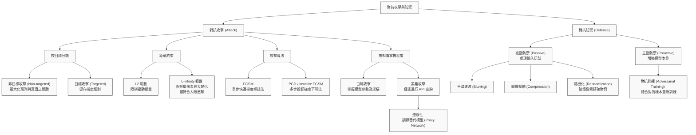

# 第31堂課：Adversarial Attack

在本堂課程中，李宏毅教授深入探討了**對抗生成攻擊（Adversarial Attack）**的原理、方法與防禦機制。隨著深度學習技術被廣泛部署於現實世界的安全敏感領域（如人臉識別、自動駕駛、惡意軟體檢測等），研究神經網路的魯棒性（Robustness）與其面臨惡意干擾時的脆弱性，已成為機器學習領域至關重要的課題。

---

## 一、 對抗攻擊的基本概念與動機

### 1. 為什麼要研究對抗攻擊？
神經網路在許多圖像、語音任務上的表現已經超越人類。然而，這並不代表神經網路的判斷邏輯與人類完全一致。對抗攻擊的核心目的，在於研究**如何透過極其微小的、人類無法察覺的擾動（Perturbation），來徹底欺騙一個已經訓練好的高性能模型**。

*   **安全防禦應用**：
    *   垃圾郵件分類器（Spam Classification）
    *   惡意軟體檢測（Malware Detection）
    *   網路入侵檢測系統（Network Intrusion Detection）
*   **學術意義**：幫助我們理解神經網路的內部決策邊界（Decision Boundaries），進而開發更安全的機器學習演算法。

---

## 二、 對抗攻擊的數學原理與分類

對抗攻擊的核心公式在於：**固定模型的參數，只更新輸入的圖像（或訊號），使其在滿足「與原圖極為相似」的約束下，最大化（或最小化）特定的損失函數。**

```
原圖 x0 ───> 加上微小擾動 Δx ───> 對抗樣本 x (與 x0 極為相似) ───> 騙過神經網路 f(x)
```

### 1. 攻擊的目標分類

設定原始輸入為 $x^0$，模型輸出為 $y^0 = f(x^0)$，真實標籤（Ground Truth）為 $\hat{y}$。攻擊者希望尋找一個新的輸入 $x = x^0 + \Delta x$：

#### A. 非目標攻擊（Non-targeted Attack）
攻擊者的目標僅是讓模型的預測結果**錯誤**，不介意預測成什麼類別。
*   **優化目標**：
    $$x^* = \arg\min_{x} L(x)$$
*   **損失函數 $L(x)$**：
    $$L(x) = -e(f(x), \hat{y})$$
    *其中 $e(y, \hat{y})$ 代表預測輸出與真實標籤之間的交叉熵（Cross Entropy）。加上負號代表我們要「最大化」兩者的距離。*

#### B. 目標攻擊（Targeted Attack）
攻擊者不僅要模型認錯，還要指定模型將其誤判為某個**特定的錯誤類別** $y^{\text{target}}$（例如將「貓」認成「海星」）。
*   **優化目標**：
    $$x^* = \arg\min_{x} L(x)$$
*   **損失函數 $L(x)$**：
    $$L(x) = -e(f(x), \hat{y}) + e(f(x), y^{\text{target}})$$
    *此公式同時推進兩個目標：遠離正確類別 $\hat{y}$，並且靠近目標錯誤類別 $y^{\text{target}}$。*

---

### 2. 「無法察覺」的約束限制（Non-perceivable Constraint）

為了使對抗樣本具有欺騙性，擾動 $\Delta x = x - x^0$ 必須非常小，小到人類視覺系統無法察覺：
$$d(x^0, x) \le \epsilon$$

常用的距離度量函數 $d(x^0, x)$ 有兩種：

#### A. $L_2$-norm（歐式距離）
$$d(x^0, x) = \|\Delta x\|_2 = \sqrt{(\Delta x_1)^2 + (\Delta x_2)^2 + (\Delta x_3)^2 + \dots}$$
*   **特點**：限制了所有像素改變的總量。
*   **缺點**：如果集中把很大的擾動加在某一個特定的像素上，雖然 $L_2$-norm 仍然很小，但該像素的劇烈變化很容易被人类一眼看穿。

#### B. $L_{\infty}$-norm（最大絕對差值）
$$d(x^0, x) = \|\Delta x\|_{\infty} = \max_i \{|\Delta x_i|\}$$
*   **特點**：限制了「任何一個像素」能被修改的最大幅值。
*   **優勢**：在對抗攻擊的研究中，**$L_{\infty}$-norm 比 $L_2$-norm 更符合人類的視覺感知特徵**。因為它確保了沒有任何一個像素會被突兀地修改，從而保證了整體的隱蔽性。

---

## 三、 對抗攻擊的算法與實現

在常規的模型訓練中，我們是利用梯度下降來更新參數 $\theta$：
$$\theta^* = \arg\min_{\theta} L(\theta)$$

而在對抗攻擊中，**參數 $\theta$ 是固定的，我們對輸入 $x$ 進行梯度下降**：
$$x^* = \arg\min_{x} L(x)$$

### 1. 梯度下降攻擊（Gradient Descent Attack）
從原始圖像 $x^0$ 出發，迭代更新 $t = 1 \dots T$ 步：
$$x^t \leftarrow x^{t-1} - \eta g$$
其中梯度 $g$ 定義為：
$$g = \nabla_x L(x^{t-1}) = \begin{bmatrix} \frac{\partial L}{\partial x_1} \\ \frac{\partial L}{\partial x_2} \\ \vdots \end{bmatrix}_{x=x^{t-1}}$$

若更新後的 $x^t$ 超出了約束範圍（即 $d(x^0, x^t) > \epsilon$），則必須將其投影回可行域：
$$x^t \leftarrow \text{fix}(x^t)$$

---

### 2. 快速梯度標誌法（Fast Gradient Sign Method, FGSM）

由 Ian Goodfellow 等人提出的 FGSM 是一種**單步攻擊**演算法，旨在以極高的速度產生對抗樣本。其核心理念是不進行繁瑣的多次迭代，而是直接沿著梯度的方向前進最大允許步長 $\epsilon$。

由於受到 $L_{\infty} \le \epsilon$ 的約束，我們在各維度上能移動的最大距離就是 $\epsilon$。

*   **更新公式**：
    $$x^* = x^0 - \epsilon \cdot \text{sign}(g)$$
*   **其中符號函數 $\text{sign}(g)$** 定義為：
    $$\text{sign}(g_i) = \begin{cases} +1, & \text{if } g_i > 0 \\ -1, & \text{otherwise} \end{cases}$$

> **一拳超人比喻**：FGSM 就像是一拳超人，只出一拳（單步更新）就能發揮最強大的攻擊威力。

---

### 3. 迭代快速梯度標誌法（Iterative FGSM / PGD）

相較於 FGSM 的一擊斃命，**Iterative FGSM（通常被視為 Projected Gradient Descent, PGD）** 採取多步微調策略：
$$x^t \leftarrow x^{t-1} - \eta \cdot \text{sign}(g)$$
並在每一步更新後，利用 $\text{fix}(x^t)$ 將結果限制在以 $x^0$ 為中心、半徑為 $\epsilon$ 的 $L_{\infty}$ 超立方體內。實務上，PGD 被公認為是最強大的基於一階梯度的對抗攻擊算法。

---

## 四、 白箱攻擊 vs. 黑箱攻擊 (White Box v.s. Black Box)

根據攻擊者對目標模型的了解程度，攻擊可分為兩大類：

| 攻擊類型 | 攻擊者掌握的資訊 | 實現方式 |
| :--- | :--- | :--- |
| **白箱攻擊 (White Box)** | 知道模型架構、所有權重參數 $\theta$。 | 直接對目標模型計算梯度 $g = \nabla_x L(x)$。 |
| **黑箱攻擊 (Black Box)** | 無法獲取內部參數，僅能透過 API 進行輸入並獲得輸出類別機率。 | 利用**對抗樣本的遷移性（Transferability）**進行攻擊。 |

### 黑箱攻擊的實現：替代模型（Proxy Network）
當我們無法直接對黑箱模型計算梯度時：
1.  利用與黑箱模型相同的訓練數據（或透過主動查詢收集的數據），自己訓練一個**替代模型（Proxy Network）**。
2.  對該替代模型進行白箱攻擊，生成對抗樣本。
3.  由於不同神經網路在相同任務上學習到的特徵空間具有相似性，這些在替代模型上成功的對抗樣本，有**極高機率**能直接騙過黑箱模型！

### 整合攻擊（Ensemble Attack）
為了提高黑箱攻擊的成功率，攻擊者可以同時對多個不同的替代模型（例如同時對 ResNet-152, ResNet-101, VGG-16）進行聯合白箱攻擊，找出能同時欺騙這些模型的對抗樣本。這樣的樣本在未知黑箱模型上的遷移成功率幾乎可達 $100\%$。

---

## 五、 其他有趣的攻擊變體

*   **單像素攻擊（One Pixel Attack）**：
    僅修改圖像中**一個像素**的顏色，就能讓神經網路分類錯誤。此方法不依賴梯度下降，而是使用「差分進化演算法（Differential Evolution）」在離散空間中搜索。
*   **通用對抗擾動（Universal Adversarial Attack）**：
    尋找一幅看似噪聲的固定圖案，只要將其疊加在**任何一張**不同的輸入圖像上，都能引導模型輸出錯誤。
*   **對抗重編程（Adversarial Reprogramming）**：
    在 ImageNet 分類器的輸入周圍貼上特定的對抗貼紙，將該分類器「重新編程」為執行完全不同任務的模型（例如：讓一個原本辨識動物的網路去數方塊的數量）。
*   **後門攻擊（Backdoor / Trojaning）**：
    攻擊發生在**訓練階段**。攻擊者在訓練集中偷偷混入帶有特定「觸發器（Trigger，如圖角的一個小黃方塊）」的毒化數據。模型訓練完成後，平時辨識完全正常，但只要圖像中出現觸發器，模型就會立刻將其判定為指定的錯誤類別。

---

## 六、 對抗攻擊的防禦策略

防禦策略主要分為兩大陣營：**被動防禦（Passive Defense）**與**主動防禦（Proactive Defense）**。

### 1. 被動防禦：輸入清理與轉換
被動防禦不修改神經網路模型本身，而是在輸入圖像進入模型之前，先進行「清洗」以破壞對抗攻擊者精心設計的微小高頻干擾。

*   **圖像平滑濾波（Image Smoothing / Blurring）**：
    使用高斯濾波器或中值濾波器。
    *   *原理*：對抗干擾訊號多為高頻噪聲，濾波能有效抹平這些噪聲。
    *   *缺點*：會造成原圖模糊，導致對良性圖像的預測準確度輕微下降。
*   **圖像壓縮（Image Compression）**：
    將圖像壓縮成 JPEG 格式再解壓。有損壓縮過程會自然丟棄對人眼不重要、但對攻擊至關重要的像素細節。
*   **生成式還原（Generative Reconstruction）**：
    將輸入圖像輸入 Autoencoder 或 GAN 的 Generator，重建一張乾淨的圖像。
*   **隨機化機制（Randomization）**：
    在模型推理前，對輸入圖像進行隨機縮放（Resizing）與隨機裁剪填充（Padding）。
    *   *原理*：對抗樣本的像素擾動必須極其精確地對齊卷積核才能起作用，隨機縮放會徹底打亂這種「像素對齊」，使攻擊失效。

---

### 2. 主動防禦：對抗訓練（Adversarial Training）

主動防禦的核心是**提升模型本身的魯棒性**，最經典的方法就是對抗訓練（Adversarial Training）。這是一種特殊的數據增強（Data Augmentation）技術。

#### 演算法流程：
設原始訓練集為 $\mathcal{X} = \{(x^1, \hat{y}^1), (x^2, \hat{y}^2), \dots, (x^N, \hat{y}^N)\}$：
1.  對於每一個訓練樣本 $x^n$，使用特定的攻擊算法（如 PGD）找出對應的對抗樣本 $\tilde{x}^n$。
2.  將這些對抗樣本加入訓練集，並標註為**正確的標籤**：
    $$\mathcal{X}' = \{(\tilde{x}^1, \hat{y}^1), (\tilde{x}^2, \hat{y}^2), \dots, (\tilde{x}^N, \hat{y}^N)\}$$
3.  混合原數據集 $\mathcal{X}$ 與對抗數據集 $\mathcal{X}'$ 重新訓練模型。

> **局限性**：
> *   **計算代價極高**：訓練過程需要不斷生成對抗樣本，特別是使用多步 PGD 攻擊時，訓練時間會成倍增長。
> *   **過擬合於特定攻擊**：用 FGSM 訓練出來的防禦模型，可能在面對 PGD 攻擊時依然會輕易瓦解。

---

## 七、 為什麼神經網路如此脆弱？

許多研究指出，神經網路之所以容易受到攻擊，並非因為訓練不足，而是因為**模型學習到了高維空間中的不安全特徵**。

如圖所示，如果我們將輸入向隨機方向（Random Direction）移動，模型預測真實類別的概率曲線非常平緩；但如果我們沿著**特定的對抗方向（Specific Direction）**移動，會發現決策邊界上存在極其陡峭的「深谷」，導致僅需極小的位移就會落入其他類別的預測區域中。

```
[隨機方向移動]                  [對抗方向移動]
  P(y_true)                      P(y_true)
    ┌───*───┐                      │   /\
    │       │                      │  /  \  <-- 極窄的正確區域
────┴───────┴──── ────          ───┴─/────\─┴─── ───
      x0                             x0 (稍微偏離即落入其他類別)
```

---

## Mermaid 知識圖譜



---

## 隨堂測驗

### Q1：在限制對抗干擾程度時，為什麼學術界通常認為 $L_{\infty}$-norm 比 $L_2$-norm 更符合「人類無法察覺」的定義？
<details>
<summary>點擊展開解答</summary>

**正確答案**：
因為 $L_2$-norm 限制的是整體擾動的累積總和。如果將所有擾動能量集中在圖像中的一個或少數幾個像素上，雖然 $L_2$-norm 算出來的數值仍然很小，但那幾個被劇烈修改的像素在人眼看來會非常突兀。而 $L_{\infty}$-norm 嚴格限制了「任何一個像素」所能改變的最大上限，能確保圖像的每一個部分都只有微小到無法察覺的變化，因此更符合人類視覺感知的特徵。
</details>

---

### Q2：黑箱攻擊（Black Box Attack）能夠成功的底層科學原理是什麼？
<details>
<summary>點擊展開解答</summary>

**正確答案**：
其核心原理是**對抗樣本的遷移性（Transferability）**。不同架構的神經網路（如 ResNet、VGG、GoogleNet）在相同的訓練數據上進行訓練時，它們學習到的決策邊界與高維特徵流形非常相似。因此，針對「替代模型（Proxy Network）」精心設計的對抗樣本，有非常高的機率也能成功欺騙未知的「黑箱模型」。
</details>

---

### Q3：為什麼在被動防禦中，對輸入圖像進行「隨機縮放與隨機裁剪填充（Random Resizing & Padding）」能有效防禦對抗攻擊？
<details>
<summary>點擊展開解答</summary>

**正確答案**：
因為對抗樣本的擾動訊號通常是極其精細且高頻的，其每一個像素的干擾位置必須精確地與神經網路的卷積核對齊，才能在多層前向傳播中把干擾信號放大。隨機縮放與裁剪會打亂這些精心計算的微小擾動在空間中的位置，破壞這種「像素級別的精確對齊」，從而使對抗干擾失去作用。
</details>