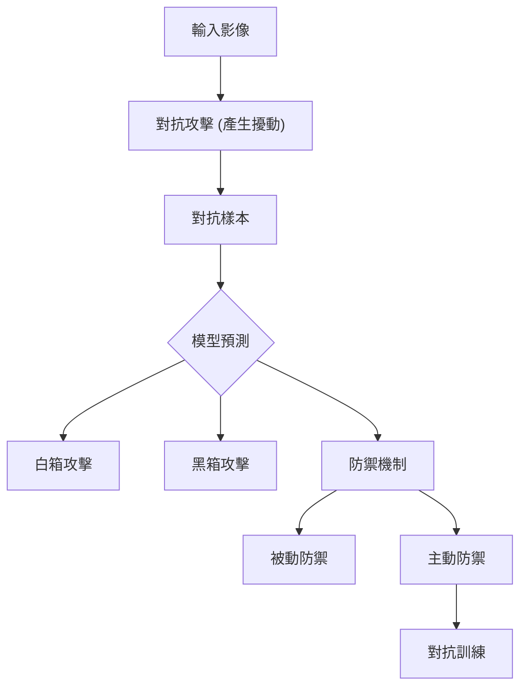

# 第31堂課：[ML 2021 (English version)] Lecture 23:  Adversarial Attack (1/2)

本堂課介紹機器學習模型面臨的安全威脅——對抗式攻擊 (Adversarial Attack)。我們將探討如何透過對輸入資料加入微小的擾動 (Perturbation)，使得深度學習模型產生錯誤的預測，並討論相關的防禦機制。

## 1. 什麼是對抗式攻擊？

### 動機
當我們將訓練好的神經網路部署到現實世界中（如垃圾郵件過濾、惡意軟體偵測、網路入侵偵測等），攻擊者可能會刻意設計特殊的輸入，旨在讓網路產生錯誤判斷。我們需要評估網路對這類攻擊的穩健性 (Robustness)。

### 攻擊類型
*   **非目標攻擊 (Non-targeted Attack)**：攻擊者只希望模型判斷錯誤，結果為任何非正確類別的標籤即可。
*   **目標攻擊 (Targeted Attack)**：攻擊者希望模型判斷成某個特定類別（例如：將貓誤判為海星）。

### 範例：視覺分類
將一張正常的圖片 $x^0$ 加上極微小的雜訊（擾動）$\Delta x$，產生對抗樣本 $x$。雖然人類視覺看起來仍是「貓」，但神經網路可能會錯誤地將其分類為「海星」或「鍵盤」。
$$x = x^0 + \Delta x$$

## 2. 如何進行攻擊

核心邏輯：我們固定模型的參數，轉而調整輸入 $x$ 以最大化損失函數。

### 優化目標
*   **非目標攻擊**：
    $$\hat{x} = \arg \min_{x} L(x), \quad \text{其中 } L(x) = -e(y, \hat{y})$$
*   **目標攻擊**：
    $$\hat{x} = \arg \min_{x} L(x), \quad \text{其中 } L(x) = -e(y, \hat{y}) + e(y, y^{\text{target}})$$

### 限制條件 (Constraint)
為了確保擾動不被人類察覺，我們通常會限制擾動的範圍：
$$d(x^0, x) \le \epsilon$$
*   **$L_2$-norm**：限制整體的變化量。
*   **$L_{\infty}$-norm**：限制每個像素的最大變化量，即 $d(x^0, x) = \max_i |\Delta x_i|$。

### 常用演算法
1.  **梯度下降法 (Gradient Descent)**：對輸入 $x$ 進行梯度更新。
2.  **FGSM (Fast Gradient Sign Method)**：利用梯度的符號進行快速更新。
3.  **迭代式 FGSM (Iterative FGSM)**：透過多次迭代來提升攻擊成功率。

## 3. 白箱攻擊與黑箱攻擊

*   **白箱攻擊 (White Box Attack)**：攻擊者已知模型的權重 $\theta$，可直接計算梯度。
*   **黑箱攻擊 (Black Box Attack)**：攻擊者不知道模型參數。
    *   **方法**：利用與目標模型相似的訓練資料，訓練一個「代理模型 (Proxy Network)」。對代理模型生成對抗樣本，這些樣本通常也能夠成功攻擊目標模型。
    *   **整合攻擊 (Ensemble Attack)**：透過結合多個模型的資訊來提升攻擊成功率。

## 4. 防禦機制

### 被動防禦 (Passive Defense)
在模型接收輸入前，對輸入進行預處理，使其對抗性雜訊失效，但不影響分類結果。
*   **平滑化 (Smoothing)**：去除高頻雜訊。
*   **影像壓縮**。
*   **隨機化 (Randomization)**：例如對圖片進行隨機縮放或填充。

### 主動防禦 (Proactive Defense)
**對抗訓練 (Adversarial Training)**：將對抗樣本加入訓練資料集中。
1.  針對當前模型，生成對抗樣本 $x'$。
2.  將 $(x', y^{\text{target}})$ 加入訓練資料集 $X'$。
3.  使用 $X \cup X'$ 重新訓練模型，提高模型對於擾動的穩健性。

## 5. 隨堂測驗

1. **問：在對抗式攻擊中，為什麼要限制擾動範圍 $d(x^0, x) \le \epsilon$？**
   

   
點擊查看解答

   答：為了確保對抗樣本在人類眼中看起來與原始影像沒有明顯差異，即擾動對人類而言是「不可感知的 (Non-perceivable)」。
   

2. **問：在黑箱攻擊中，即使不知道目標模型的參數，為什麼攻擊依然可能成功？**
   

   
點擊查看解答

   答：攻擊者可以訓練一個代理模型 (Proxy Network)，並利用代理模型的梯度來生成對抗樣本，這些樣本往往具有「遷移性 (Transferability)」，能同樣有效地攻擊目標模型。
   

3. **問：簡述什麼是「對抗訓練 (Adversarial Training)」。**
   

   
點擊查看解答

   答：這是一種主動防禦方法。透過在訓練階段產生對抗樣本，並將這些樣本與正確標籤加入訓練資料集共同進行訓練，使模型學會如何辨識並抵抗這些特殊的擾動。
   

## 來自課程原聲的重點摘要

## 來自課程原聲的重點摘要

*   **對抗性攻擊的定義與目的**
    *   對抗性攻擊（Adversarial Attack）不僅僅是追求模型的高準確率，真正的目標是**讓模型能防禦人類的惡意攻擊**。
    *   教授比喻：「就算一個模型在正常情況下表現很好，如果有人試圖誤導它，模型必須具備能偵測並抗拒這種『欺騙』的能力。」
    *   以電子郵件的垃圾信過濾器為例：詐騙者會刻意修改郵件內容，試圖避過偵測，因此模型必須對這類人為的微小干擾具有「強健性」（Robustness）。

*   **攻擊的分類：無目標攻擊 vs. 有目標攻擊**
    *   **無目標攻擊（Targetless Attack）**：攻擊者的唯一目的是讓模型的預測結果「不正確」（例如：把貓誤認成其他東西即可，不在乎變成什麼）。
    *   **有目標攻擊（Targeted Attack）**：這是更具挑戰性的攻擊，攻擊者要求模型不僅預測錯誤，還要精準地誤判成指定的類別（例如：將「貓」誤判成「海星」）。

*   **對抗性攻擊的生動範例**
    *   教授用一個 50 層的 ResNet 模型做實驗，當輸入一張貓的影像時，若攻擊者加入一層極微小的雜訊（擾動），人眼完全看不出差異，但模型卻會以 100% 的信心將其判斷為「海星」。這顯示了模型對於攻擊是非常脆弱的。

*   **對抗性攻擊的推導邏輯**
    *   攻擊的數學基礎其實就是「優化問題」：我們希望找到一個擾動（$\Delta x$），讓輸入影像加上這個擾動後，模型輸出的結果與原始結果的差距最大化（非目標攻擊）或是與目標類別的差距最小化（目標攻擊）。
    *   這過程類似訓練模型的「反向過程」：模型訓練是為了減小 Loss，攻擊則是為了透過梯度更新來「增加」Loss，迫使模型輸出錯誤答案。

*   **關於「邊界條件」與「限制」**
    *   教授特別強調，擾動不能無限制地隨便加，必須滿足一定的限制條件，例如 $\Delta x$ 與原始影像的距離要小於某個門檻值（$\epsilon$），這確保了人類無法察覺這些雜訊的存在。
    *   教授提醒學生，在做攻擊實驗時，若更新後的影像跑出了允許的區間，必須使用「截斷法」（Pull it back）將其強行拉回邊界內，才能保持攻擊的隱蔽性。

*   **學習重點提示**
    *   教授指出，這些攻擊方法在技術的核心邏輯上與我們學習的「梯度下降法」（Gradient Descent）非常相似，只是目標相反。
    *   最後，教授提到這類攻擊有許多變體（如 FGSM），它們的核心精神都是利用梯度資訊來進行精確攻擊，重點不在於複雜的數學公式，而在於理解「梯度是如何影響模型輸出」。
