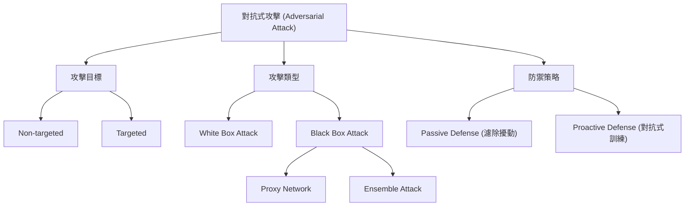

# 第34堂課：Explainable ML (Part 2 of 2)

## 1. 什麼是 Adversarial Attack (對抗式攻擊)？

在部署神經網路時，我們需要考慮模型在真實世界中的安全性。**Adversarial Attack** 的核心概念是：即便模型在測試集上表現良好，攻擊者仍可以透過對輸入數據加入肉眼難以察覺的微小擾動，誘導模型做出錯誤的判斷。

### 攻擊分類
*   **Non-targeted (非目標攻擊)**：攻擊者的目標僅是讓模型輸出錯誤結果（例如只要不是「貓」都可以）。
*   **Targeted (目標攻擊)**：攻擊者的目標是將輸入強制分類為指定的類別（例如將「貓」誤判為「海星」）。

## 2. 攻擊方法與數學推導

攻擊的核心在於保持原始輸入 $x^0$ 與受攻擊輸入 $x$ 之間的差異極小，同時最大化模型的分類錯誤。

### 損失函數定義
我們希望找到一個 $x^*$，使得 $x$ 與 $x^0$ 非常接近：
$$x^* = \arg \min L(x)$$
其中，限制條件為 $d(x^0, x) \le \epsilon$。

*   **Non-targeted**: $L(x) = -e(y, \hat{y})$，其中 $e$ 為衡量相似度的函數（如 Cross Entropy），$\hat{y}$ 為原始標籤。
*   **Targeted**: $L(x) = -e(y, \hat{y}) + e(y, y^{target})$。

### 優化策略：梯度下降
與訓練模型不同，攻擊時我們**固定模型參數**，僅更新**輸入數據**：
$$x^t \leftarrow x^{t-1} - \eta g$$
其中 $g$ 為損失函數關於輸入的梯度。

### 常見演算法
1.  **FGSM (Fast Gradient Sign Method)**：
    *   計算損失函數對輸入的梯度符號：$g = \text{sign}\left(\left. \frac{\partial L}{\partial x} \right|_{x=x^{t-1}} \right)$。
    *   僅透過一步梯度運算更新輸入。
2.  **Iterative FGSM**：重複執行多次 FGSM 並進行截斷處理以滿足 $d(x^0, x) \le \epsilon$。

## 3. 攻擊情境：White Box vs. Black Box

*   **White Box Attack**：攻擊者完全知曉模型的參數 $\theta$。
*   **Black Box Attack**：攻擊者無法取得模型參數，但可以透過訓練一個「代理網路 (Proxy Network)」來模擬目標網路的行為，並在代理網路上生成對抗樣本，這些樣本通常也能成功攻擊目標網路。

## 4. Mermaid 知識圖譜

## 5. 防禦策略

*   **Passive Defense (被動防禦)**：在輸入進入網路前進行處理，例如使用濾波器 (Smoothing)、影像壓縮，或是加入隨機化層 (Randomization) 來削減擾動的影響。但這類方法往往會帶來一定的副作用 (Side Effect)，降低準確率。
*   **Proactive Defense (主動防禦)**：**對抗式訓練 (Adversarial Training)**。將產生的對抗樣本加入訓練資料集中，讓模型在訓練過程中學習如何識別這些擾動，從而增強模型的魯棒性 (Robustness)。

---

### 隨堂測驗

1. **在對抗式攻擊中，進行梯度下降時我們更新的是什麼？**
   

   
點擊查看解答

   更新的是「輸入數據 (Input)」，而非模型的參數 (Parameters)。
   

2. **什麼是 Black Box Attack 的主要達成手段？**
   

   
點擊查看解答

   訓練一個「代理網路 (Proxy Network)」，透過該代理網路產生對抗樣本，這些樣本通常具有轉移性 (Transferability)，能攻擊目標網路。
   

3. **對抗式訓練 (Adversarial Training) 屬於哪一種防禦類型？**
   

   
點擊查看解答

   屬於「主動防禦 (Proactive Defense)」，透過在訓練過程中加入對抗樣本作為資料增強，來提升模型的魯棒性。
   

## 來自課程原聲的重點摘要

## 來自課程原聲的重點摘要

* **關於全局解釋（Global Explanation）的生動比喻**：
    * 李教授將「局部解釋」與「全局解釋」做出對比。局部解釋就像是給機器看一張特定的照片，問它「為什麼你覺得這是貓」；而全局解釋則不針對單張照片，而是想知道模型「心中」的貓到底長什麼樣子。
    * 他運用了「尋找 X* 」的比喻，將 X* 想像成一個未知的變數，目標是透過優化過程，找到一張能讓模型「極大化」其特定類別分數的照片，藉此洞察模型學到的視覺特徵。

* **對於難點的詳細解釋與推導邏輯**：
    * **濾波器 (Filter) 與特徵圖 (Feature Map)**：教授解釋卷積神經網路中，濾波器負責提取特徵。當模型看到符合其訓練目標的圖像模式時，特定濾波器的特徵圖輸出值會變大。
    * **優化過程**：為了找出濾波器關注的模式，我們不是分析現有的圖，而是「創造」一張圖（X* ）。透過類似梯度上升 (Gradient Ascent) 的方法，讓圖像不斷調整，直到該濾波器的輸出值最大化，這時圖像呈現的內容就是該濾波器在尋找的特徵。
    * **雜訊與對抗性攻擊的關聯**：教授提到，如果直接進行優化，產出的圖像可能看起來充滿雜訊。他巧妙連結了「對抗性攻擊 (Adversarial Attack)」的概念——就像攻擊者透過添加人類肉眼看不見的微小擾動來混淆模型，這裡的「雜訊」其實就是模型在識別特定特徵時的參考依據。

* **學生容易誤解或需特別強調的觀念**：
    * **優化方法的選擇**：教授特別強調，這裡是「梯度上升 (Gradient Ascent)」而非下降，因為我們的目標是「最大化」特定類別或特徵的分數，使其達到理想的偵測效果。
    * **過度擬合的限制**：對於學生提出的「若增加無意義的類別選項」問題，教授提醒，機器學習本質上是在尋找能讓分數最高的解。若只給予過少的限制，模型往往會「偷懶」，產出充滿雜訊而非具體物件特徵的圖像。因此，在實務操作中，引入適當的「約束 (Constraints)」來限制搜尋空間至關重要。
    * **可解釋性 (Explainability) 的界線**：教授最後點出，這些視覺化方法（如 LIME）並非宣稱能完美還原模型運作的全部細節，而是透過簡單模型來局部模擬複雜模型，協助人類理解 AI 決策的「小局部」。
