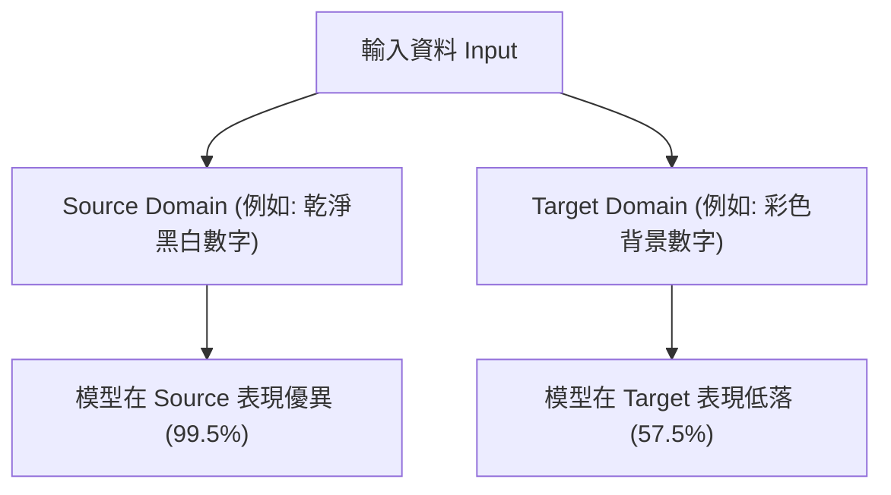
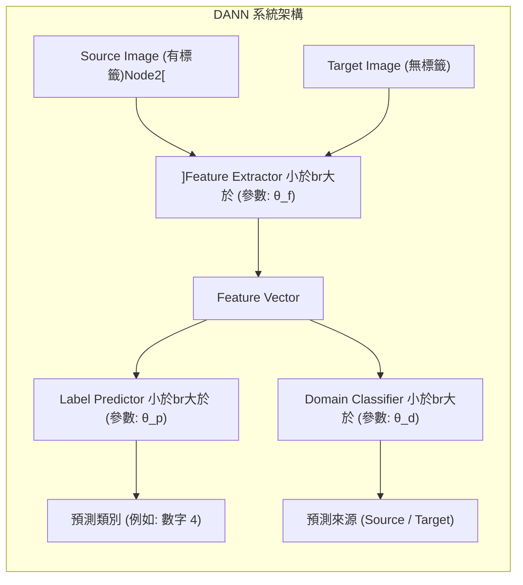
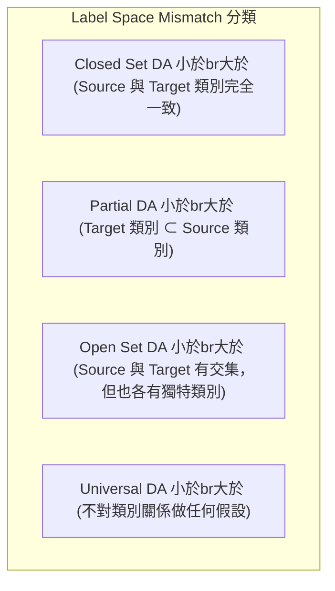
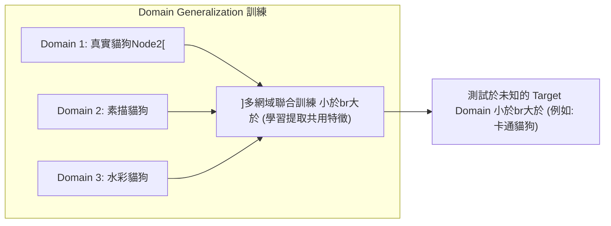

# 第35堂課：Domain Adaptation

在機器學習中，我們通常假設訓練資料（Training Data）與測試資料（Testing Data）來自於相同的分佈（Distribution）。然而在實際應用中，這個假設往往不成立，這種訓練與測試資料分佈不一致的現象稱為 **網域轉移（Domain Shift）**。為了讓在特定網域（Source Domain）訓練的模型能夠成功應用於另一個不同的網域（Target Domain），我們需要使用 **網域調適（Domain Adaptation）** 技術。

---

## 1. 網域轉移 (Domain Shift) 與網域調適的基本概念

### 1.1 什麼是 Domain Shift？
當我們在一個特定的資料集（例如乾淨的黑底白字數字圖形 MNIST）上訓練一個分類器，並在相同分佈的測試集上測試，準確率通常可以達到 $99.5\%$。

但是，若我們將同一個分類器直接套用到背景彩色、有雜訊的數字圖形（例如 MNIST-M）上，準確率可能會暴跌至 $57.5\%$。這種因為**訓練與測試資料分佈不同**而導致模型效能急劇下降的現象，就是 **Domain Shift**。

*   **來源網域 (Source Domain)**：我們用來訓練模型的網域，通常擁有大量且有標記（Labeled）的資料。例如：MNIST。
*   **目標網域 (Target Domain)**：我們希望模型最終能應用、測試的網域，通常資料缺乏標記。例如：MNIST-M、真實世界場景。



### 1.2 網域調適 (Domain Adaptation) 的光譜
根據我們對**目標網域（Target Domain）**所掌握的知識與資料量，Domain Adaptation 的解決策略可以分為以下幾種：

1.  **Target Domain 有少量且有標記資料**：
    *   **策略**：**微調（Fine-tuning）**。
    *   **挑戰**：因為 Target Domain 資料極少，模型非常容易產生過擬合（Overfitting）。
2.  **Target Domain 有大量但無標記（Unlabeled）資料**（最常見的場景）：
    *   **策略**：透過對齊特徵分佈，讓模型學習到「跨網域共通」的特徵。
3.  **Target Domain 僅有極少量且無標記資料**：
    *   **策略**：**測試時訓練（Testing Time Training, TTT）**，在測試階段一邊讀入資料一邊動態調整模型。
4.  **對 Target Domain 完全一無所知（窩不知道）**：
    *   **策略**：**網域泛化（Domain Generalization）**，訓練時利用多個不同的 Source Domains 讓模型學會極強的魯棒性（Robustness）。

---

## 2. 網域對抗訓練 (Domain Adversarial Training, DANN)

當目標網域（Target Domain）擁有**大量無標記資料**時，最經典且主流的方法是 **Domain Adversarial Training of Neural Networks (DANN)**。

### 2.1 核心思想：學習忽略網域特異性特徵
DANN 的基本想法是引導模型中的**特徵提取器（Feature Extractor）**去忽略那些「僅屬於特定網域」的特徵（例如 MNIST-M 的彩色背景），而只提取「對任務有用且跨網域共用」的本質特徵（例如數字的筆畫形狀）。

如果特徵提取器成功了，那麼不論輸入是 Source Domain 還是 Target Domain，提取出來的特徵向量（Feature Vector）在潛在空間（Latent Space）中的分佈應該要完全重合（The same distribution）。



### 2.2 DANN 的對抗賽局架構
DANN 將神經網路分為三個部分，進行一種類似 GAN（生成對抗網路）的對抗訓練：

1.  **特徵提取器 (Feature Extractor, $G_f$)**：
    *   輸入：圖片 $x$。
    *   輸出：特徵向量 $f = G_f(x; \theta_f)$。
    *   **目標**：既要讓 Label Predictor 能精準分類，又要「騙過」Domain Classifier。因此它扮演了 **Generator** 的角色。
2.  **標籤預測器 (Label Predictor, $G_y$)**：
    *   輸入：特徵向量 $f$。
    *   輸出：類別預測 $\hat{y} = G_y(f; \theta_p)$。
    *   **目標**：最小化分類任務的損失值 $L$。
3.  **網域分類器 (Domain Classifier, $G_d$)**：
    *   輸入：特徵向量 $f$。
    *   輸出：二元分類 $\hat{d} = G_d(f; \theta_d)$（判斷特徵來自 Source 還是 Target）。
    *   **目標**：精準分辨特徵的來源，最小化網域分類損失值 $L_d$。它扮演了 **Discriminator** 的角色。

### 2.3 數學目標函數與最佳化
我們定義任務分類損失為 $L$，網域分類損失為 $L_d$：

*   對於**標籤預測器**，我們希望最小化任務損失：
    $$\theta_p^* = \arg\min_{\theta_p} L$$
*   對於**網域分類器**，我們希望最大化其分辨能力（即最小化其損失）：
    $$\theta_d^* = \arg\min_{\theta_d} L_d$$
*   對於**特徵提取器**，它的目標是矛盾的。一方面它要幫助 $G_y$ 分類，另一方面要阻礙 $G_d$ 分辨網域。因此它的最佳化目標為：
    $$\theta_f^* = \arg\min_{\theta_f} \left( L - \lambda L_d \right)$$
    其中 $\lambda$ 是調和兩者力量的超參數（Hyperparameter）。

> **實作細節（Gradient Reversal Layer, GRL）**：
> 為了能夠用單一的反向傳播（Backpropagation）演算法完成對抗訓練，作者設計了 **GRL（梯度逆轉層）**。在正向傳播時，GRL 做 Identity mapping（不做任何改變）；但在反向傳播時，GRL 會將傳過來的梯度乘以一個負常數 $-\lambda$，直接實現了對 $L_d$ 梯度的逆轉。

---

## 3. DANN 的局限性與決策邊界（Decision Boundary）

雖然 DANN 可以成功將 Source 和 Target 的特徵分佈「對齊（Align）」，但在某些情況下，僅僅對齊特徵是不夠的。

### 3.1 為什麼單純對齊特徵會失敗？
如下圖所示，藍色圓形與藍色三角形代表 Source Domain 中的兩個類別，黑色虛線是模型根據 Source Domain 學出來的決策邊界（Decision Boundary）。橘色正方形代表無標記的 Target Domain 資料。

*   **左圖（僅特徵對齊）**：儘管 Source 和 Target 的整體分佈重合了，但因為我們沒有 Target Domain 的標籤，有些 Target Domain 的資料點可能會剛好落在決策邊界上，或者被錯誤地劃分到另一邊。
*   **右圖（理想狀態）**：我們不僅希望特徵對齊，還希望 Target Domain 的資料點能夠**遠離決策邊界**，分佈在邊界的兩側。

```
[僅對齊特徵 (左圖)]                    [考慮邊界/遠離邊界 (右圖)]
      Class 1                               Class 1
   ●  ■  ●  ■                                ●  ●  ● 
 ●  ■  ●  ■  ●                             ●  ●  ●  ●
------------- [決策邊界]                  ------------- [決策邊界]
 ▲  ■  ▲  ■  ▲                             ■  ■  ■  ■
   ▲  ■  ▲  ■                                ▲  ▲  ▲
      Class 2                               Class 2
(Target 資料 ■ 混雜在邊界上)              (Target 資料 ■ 遠離邊界)
```

### 3.2 解決方案：最小化目標網域熵（Entropy）
為了強迫目標網域的預測結果遠離決策邊界，我們可以利用 **熵（Entropy）** 作為正則化項。

對於無標籤的目標網域資料 $x_t$，模型輸出的類別機率分佈為 $P(y|x_t)$。
*   **若 $x_t$ 靠近決策邊界**：模型會感到猶豫，輸出的機率分佈會趨於均勻（例如：$P(class_1) = 0.5, P(class_2) = 0.5$），此時它的**熵（Entropy）會非常大**。
*   **若 $x_t$ 遠離決策邊界**：模型預測會非常自信（例如：$P(class_1) = 0.99, P(class_2) = 0.01$），此時它的**熵（Entropy）會非常小**。

因此，在訓練時加入**最小化 Target Domain 預測熵（Small Entropy）**的限制，可以逼迫模型將決策邊界推開，避開 Target Domain 的資料密集區。
代表性的衍生演算法包括：
*   **DIRT-T** (Decision-boundary Iterative Refinement Training with a Teacher)
*   **MCD** (Maximum Classifier Discrepancy)

---

## 4. 網域調適的進階挑戰與展望 (Outlook)

在標準的 Domain Adaptation 中，我們預設 Source 與 Target 的類別集合（Label Space）是完全相同的（這稱為 **Closed Set DA**）。然而在現實中，這兩個網域的類別可能存在不一致：



*   **Partial DA**：Target Domain 的類別只是 Source Domain 的一個子集。如果強行對齊所有特徵，會將 Target 沒有的類別特徵強行揉合進來，導致效能下降。
*   **Open Set DA**：Target Domain 包含了一些 Source Domain 從未見過的「未知類別（Unknown class）」。此時模型必須具備拒絕（Reject）未知類別的能力。
*   **Universal DA**：最符合現實的場景，我們完全不知道 Source 和 Target 類別的交集關係。

---

## 5. 網域泛化 (Domain Generalization)

當我們**完全沒有 Target Domain 的任何資料**時，我們該怎麼辦？這時候我們的任務就轉變為 **Domain Generalization（網域泛化）**。

### 5.1 核心思想
如果我們只有單一網域的資料（例如：真實貓狗照片），模型很難學會泛化。但如果我們在訓練時提供**多個不同的網域**（例如：真實照片、素描圖、水彩畫、卡通圖）：



模型在多種風格的 Source Domains 交互洗禮下，會自動學會剔除所有與「風格、背景」相關的特徵，進而提取出最本質的「貓/狗幾何拓撲結構」。如此一來，即使遇到完全沒看過的「卡通風格」測試集，也能有極佳的預測效果。

---

## 6. 隨堂測驗

### 測驗 1：觀念理解
**問題**：在 Domain Adversarial Training (DANN) 中，特徵提取器（Feature Extractor）與網域分類器（Domain Classifier）之間的關係最類似於下列哪一種經典的深度學習架構？
*   (A) Transformer 中的 Self-Attention 機制
*   (B) GAN (Generative Adversarial Network) 中的 Generator 與 Discriminator
*   (C) Autoencoder 中的 Encoder 與 Decoder
*   (D) ResNet 中的 殘差連接 (Residual Connection)

<details>
<summary>點擊展開答案與解析</summary>
答案：**(B)**

**解析**：
在 DANN 中，特徵提取器（Feature Extractor）希望提取出讓網域分類器（Domain Classifier）無法分辨來源的特徵（即「欺騙」Domain Classifier）；而 Domain Classifier 的目標是盡可能精準辨識特徵來自 Source 還 Target。這種博弈與對抗關係與 GAN 中 Generator 和 Discriminator 的對抗訓練完全一致。
</details>

---

### 測驗 2：公式推導
**問題**：若我們希望未標記的 Target Domain 資料點在經過模型預測後，能夠盡可能「遠離」決策邊界（Decision Boundary），我們應該在損失函數中加入什麼樣的限制？
*   (A) 最大化 Target Domain 預測機率分佈的 熵 (Entropy)
*   (B) 最小化 Target Domain 預測機率分佈的 熵 (Entropy)
*   (C) 最小化 Source Domain 的分類損失 (Label Loss)
*   (D) 最大化 Domain Classifier 的 Loss $L_d$

<details>
<summary>點擊展開答案與解析</summary>
答案：**(B)**

**解析**：
當預測點極度接近決策邊界時，模型會感到猶豫，各類別機率分佈會很均勻，導致熵（Entropy）很大。反之，當資料點遠離決策邊界時，模型對其類別預測會非常有信心（某一類別機率接近 1，其餘接近 0），此時熵會非常小。因此，「最小化 Target Domain 的預測熵」可以有效迫使資料點遠離決策邊界。
</details>

---

### 測驗 3：情境應用
**問題**：小明手上有一個醫療影像辨識任務。他擁有「台大醫院」採集並標記好的 10 萬張 X 光片（Source Domain），現在他要把模型佈署到「榮總醫院」（Target Domain），但榮總只提供了 5 萬張「沒有任何標記」的 X 光片。請問小明**不應該**採用以下哪一種技術來解決這個 Domain Shift 問題？
*   (A) Domain Adversarial Training of Neural Networks (DANN)
*   (B) Maximum Classifier Discrepancy (MCD)
*   (C) 標準的微調技術 (Supervised Fine-tuning)
*   (D) 加入 Target 預測熵最小化（Entropy Minimization）的對抗訓練

<details>
<summary>點擊展開答案與解析</summary>
答案：**(C)**

**解析**：
微調（Fine-tuning）是監督式學習技術，必須依賴 Target Domain **有標籤（Labeled）** 的資料。由於榮總（Target Domain）提供的 5 萬張照片「沒有任何標記」，因此無法直接套用標準的微調技術。此情境屬於典型「Target Domain 有大量無標籤資料」的 Domain Adaptation 場景，最適合使用 DANN、MCD 等無監督網域調適方法。
</details>