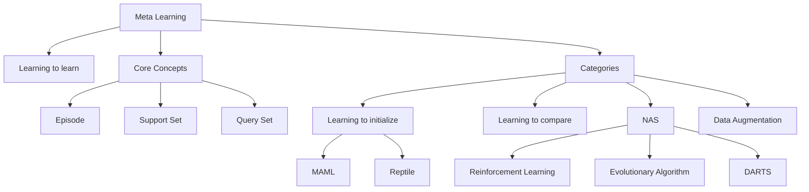

# 第37堂課：元學習 Meta Learning (二) - 萬物皆可 Meta

在機器學習中，所謂的 "Meta" 意指「關於...的...」，因此 Meta Learning 即為 **"Learning to learn"（學習如何學習）**。

## 1. 機器學習 101：回顧機器學習的本質

機器學習本質上是在尋找一個函數 $f$。我們可以將其標準化為三個步驟：
1. **Step 1: Function with unknown**：定義一個帶有未知參數 $\theta$ 的函數 $f_\theta$。
2. **Step 2: Define loss function**：定義損失函數 $L(\theta)$，衡量模型在訓練資料上的表現。
3. **Step 3: Optimization**：透過演算法（如梯度下降）找到最佳參數 $\theta^* = \arg \min_\theta L(\theta)$，使得 $f_{\theta^*}$ 在資料上有好的表現。

## 2. 什麼是 Meta Learning？

Meta Learning 的核心思想是**學習一個「學習演算法」**。
*   一般的機器學習是手刻學習演算法（如梯度下降），再讓模型從資料中學到參數 $\theta$。
*   Meta Learning 則是將整個「學習演算法」視為一個函數 $F$，我們想要透過大量任務（Tasks）的訓練，讓模型學到一個最佳的學習演算法 $F_{\phi^*}$。

### Meta Learning 的三個步驟
1. **Step 1: Learnable components**：定義學習演算法 $F_\phi$ 中可學習的部分 $\phi$（例如：網路架構、初始參數、學習率等）。
2. **Step 2: Define loss function**：定義 Meta Learning 的損失函數 $L(\phi)$。不同於傳統 ML 在訓練集上計算 loss，Meta Learning 在 **Testing set (Query set)** 上計算 Loss。
3. **Step 3: Optimization**：找出 $\phi^* = \arg \min_\phi L(\phi)$，使學習演算法 $F_{\phi^*}$ 能快速適應新任務。

## 3. Meta Learning 與傳統機器學習的差異

| 特徵 | 機器學習 (ML) | 元學習 (Meta Learning) |
| :--- | :--- | :--- |
| **目標** | 找一個函數 $f$ | 找一個能找到 $f$ 的函數 $F$ |
| **資料** | 單一任務 (One task) | 多個訓練任務 (Training tasks) |
| **計算 Loss** | 訓練資料 (Training examples) | 測試資料 (Testing examples) |

### 關鍵概念：Episode
Meta Learning 採用 "Episode" 訓練機制，每個 episode 包含一個訓練任務（Support set）與一個測試任務（Query set）。
*   **Across-task training**：透過眾多任務進行 Meta-training，學習如何適應。
*   **Within-task training**：在單一任務內，模型使用 Support set 進行訓練，並在 Query set 上進行測試（適應）。

## 4. Meta Learning 的常見分類

1. **Learning to initialize**：學習最佳的初始參數 $\phi$，讓模型在少量步驟內快速收斂。代表作：**MAML** (Model-Agnostic Meta-Learning)。
2. **Learning to compare**：學習特徵空間，使得類別之間更容易區分。
3. **Other**：
    *   **Network Architecture Search (NAS)**：學習最佳的網路架構。
    *   **Data Augmentation**：學習最佳的資料擴增策略。
    *   **Sample Reweighting**：學習給不同樣本分配權重。

## 5. 知識圖譜

---

## 隨堂測驗

**Q1：在 Meta Learning 中，為什麼我們在訓練期間需要用到「測試資料 (Testing examples)」？**

點擊查看解答

因為 Meta Learning 的目的是學習一個學習演算法，我們需要衡量這個演算法在面對「未見過的測試資料」時，適應速度與準確度如何。因此，將測試資料的表現作為 loss 的一部分，才能迫使模型學會如何適應新任務。

**Q2：MAML (Model-Agnostic Meta-Learning) 的主要目標是什麼？**

點擊查看解答

MAML 的目標是「學習如何初始化 (Learning to initialize)」。它試圖找到一組最佳的初始參數 $\phi$，使得當模型拿到新任務時，只需經過少量的梯度更新，就能快速適應並達到良好的表現。

**Q3：什麼是 "N-ways K-shot" 分類任務？**

點擊查看解答

這是一種小樣本學習 (Few-shot learning) 的設定：
- N-ways：任務中包含 N 個不同的類別。
- K-shot：每個類別中僅有 K 個標記過的範例 (examples) 可供學習。

## 來自課程原聲的重點摘要

## 來自課程原聲的重點摘要

* **教授的口頭比喻與教學細節**
    * **Memo (Model-Agnostic Meta-Learning)：** 李教授提到，Memo 的縮寫聽起來很像哺乳類動物（Mammal），因此可以由此連結記憶。他還提到這系列方法的變形還有叫「爬蟲類（Reptile）」的，推測可能是研究人員在取名上的趣味巧思。
    * **學習初始化 (Learning to Initialize)：** 在談論如何找到好的初始參數時，教授強調這不僅僅是選一個數字，而是一個「Learning to learn」的過程。
    * **研究參考來源：** 教授特別提到了論文《How to train your MAML》，他幽默地說這跟電影《How to train your dragon》（馴龍高手）有異曲同工之妙。

* **關於難點的詳細推導邏輯與觀念強調**
    * **Meta-Learning 的核心：** Meta-learning 不僅僅是在做參數訓練，更是「學習如何去學習 (learning to learn)」。教授特別強調了 `initialize` 的參數是可以被訓練的。
    * **Hyperparameter 的挑戰：** 在 Meta-learning 中，依然存在需要人工調整的 Hyperparameter（如學習率）。雖然目標是透過 Meta-learning 自動化，但過程本身依然伴隨不少需要決策的細節。
    * **Self-supervised learning 與 Meta-learning 的關聯：** 教授引導思考，如何利用無標記數據（Unlabeled data）進行預訓練。這是一個「以任務為導向」的學習，透過不斷執行 Proxy task 來尋找更優化的初始化參數，這其實與 Self-supervised learning 在處理數據稀缺問題時的邏輯相輔相成。

* **學生容易忽略的重點**
    * **Memo 與初始化：** 很多人以為初始化參數是隨機即可，但教授明確指出，好的初始化對收斂速度與效果有顯著的「天差地遠」影響。
    * **實驗設計的嚴謹性：** 在討論不同方法（如 MAML vs. Reptile）時，教授提醒學生不能單看實驗結果，還要了解各方法對隨機初始值的敏感度。
    * **數據分佈的影響：** 教授提醒，如果訓練任務與測試任務的「Domain」差異過大，Meta-learning 的效果會受到考驗，這引出了「Domain Adaptation」的重要性。
