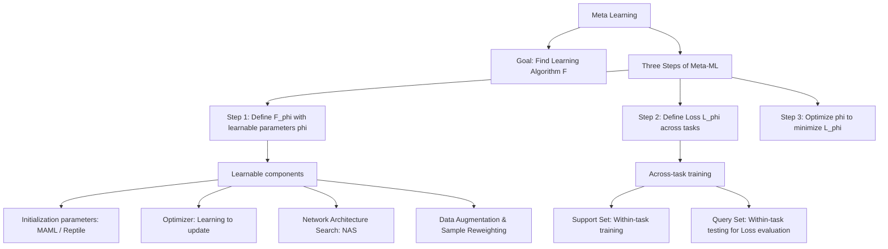

# 第37堂課：Meta Learning (Learn to Learn)

在本堂課程中，李宏毅教授深入探討了**元學習 (Meta Learning)**，亦即「**學會如何學習 (Learn to learn)**」。傳統的機器學習是讓機器在給定任務中尋找一個最優的函數 $f$，而元學習則是進一步讓機器**自動學習出「如何尋找該函數的演算法 $F$」**。

---

## 一、 知識圖譜 (Knowledge Graph)

---

## 二、 什麼是元學習 (Meta Learning)？

「Meta」意指「X about X」（關於 X 的 X）。因此，**Meta Learning 便是「關於學習的學習」**。

### 1. 機器學習 101 的核心三步驟
在一般機器學習中，我們的目標是尋找一個函數 $f$：
*   **步驟 1：定義一個帶有未知參數 $\theta$ 的函數 $f_\theta$**（例如：神經網路架構）。
*   **步驟 2：定義損失函數 $L(\theta)$**：
    $$L(\theta) = \sum_{k=1}^K e_k$$
    其中 $e_k$ 為第 $k$ 個訓練樣本上的誤差（如 Cross-entropy）。
*   **步驟 3：最佳化 (Optimization)**：
    $$\theta^* = \arg\min_{\theta} L(\theta)$$
    通常使用梯度下降法 (Gradient Descent) 來尋找最優參數 $\theta^*$。

### 2. 機器學習與元學習的架構對比

*   **機器學習 (ML)**：
    輸入「訓練資料」，通過一個**人工設計 (Hand-crafted)** 的學習演算法 $F$，得到一個分類器 $f^*$。我們再用測試資料驗證這個 $f^*$ 的好壞。
*   **元學習 (Meta Learning)**：
    我們不再人工設計演算法 $F$，而是**讓機器自己學出演算法 $F_\phi$**。元學習同樣遵循機器學習的三步驟，只是對象提升到了「學習演算法」的層次。

---

## 三、 元學習的三步驟

為了讓機器自動學出一個學習演算法 $F_\phi$（其中 $\phi$ 為該演算法中可學習的參數），我們同樣需要定義其三步驟：

### 步驟 1：定義帶有參數 $\phi$ 的學習演算法 $F_\phi$
在演算法 $F_\phi$ 中，哪些部分是可以被參數化並讓機器學習的？
*   **初始化參數 (Initial Parameters)**：如 MAML。
*   **神經網路架構 (Network Architecture)**：如神經架構搜索 (NAS)。
*   **優化器 (Optimizer)**：學習如何更新參數，取代手寫的 Adam 或 SGD。
*   **數據預處理 (Data Processing)**：如自動學習資料增強 (Data Augmentation) 策略。

### 步驟 2：定義學習演算法的損失函數 $L(\phi)$
如何衡量一個學習演算法 $F_\phi$ 的好壞？
我們必須引入**多個不同的任務 (Tasks)** 進行評估。假設我們有 $N$ 個訓練任務（如「任務 1：蘋果與橘子分類」、「任務 2：自行車與汽車分類」）：

1.  對於**任務 $n$**，我們將演算法 $F_\phi$ 應用於其**訓練資料 (Support Set)**，學習出一個專屬於該任務的分類器 $f_{\theta^{n*}}$。
2.  接著，我們在該任務的**測試資料 (Query Set)** 上測試分類器 $f_{\theta^{n*}}$ 的表現，並計算其損失值 $l^n$。
3.  **元損失函數 (Meta Loss)** $L(\phi)$ 即為所有訓練任務在測試資料上損失的總和：
    $$L(\phi) = \sum_{n=1}^N l^n$$

> **💡 重要概念辨析：**
> 在傳統機器學習中，我們在訓練時只看訓練集的 Loss。
> 在元學習中，我們計算元損失 $L(\phi)$ 時，**使用的是各個任務的測試集 (Testing Examples/Query Set) 上的誤差**！這常使初學者感到困惑，但請記住：元學習的「訓練」是在「學習如何泛化」，所以必須以任務在測試集上的表現作為回饋。

### 步驟 3：最佳化 (Optimization)
我們的目標是尋找一組 $\phi^*$，使得總體任務損失最小化：
$$\phi^* = \arg\min_{\phi} L(\phi)$$

*   如果 $L(\phi)$ 對於 $\phi$ 是可微的（如 MAML），我們可以直接使用**梯度下降法**。
*   如果不可微（如 NAS 中的網路架構選擇），則需藉助**強化學習 (Reinforcement Learning)** 或**演化演算法 (Evolutionary Algorithm)**。

---

## 四、 機器學習 (ML) 概念與元學習 (Meta) 術語對比

為了避免閱讀文獻時混淆，下表整理了兩者的術語與對應關係：

| 比較維度 | 機器學習 (Machine Learning) | 元學習 (Meta Learning) |
| :--- | :--- | :--- |
| **最終目標** | 尋找一個好函數 $f$ | 尋找一個能產出好函數的演算法 $F$ |
| **訓練資料** | 單一任務的訓練集 | 多個訓練任務 (Training Tasks) |
| **任務內訓練資料** | 訓練集 (Training Set) | **支持集 (Support Set)** |
| **任務內測試資料** | 測試集 (Testing Set) | **查詢集 (Query Set)** |
| **訓練方式** | 任務內訓練 (Within-task Training) | **跨任務訓練 (Across-task Training)** |
| **測試方式** | 任務內測試 (Within-task Testing) | **跨任務測試 (Across-task Testing / Episode)** |
| **損失函數** | $L(\theta) = \sum_{k=1}^K e_k$ (單一任務樣本誤差和) | $L(\phi) = \sum_{n=1}^N l^n$ (所有任務查詢集誤差和) |
| **優化循環** | 單一 Gradient Descent 循環 | **內迴圈 (Inner Loop)** 訓練任務內模型 **外迴圈 (Outer Loop)** 更新元參數 $\phi$ |

---

## 五、 元學習中「什麼是可以被學習的」？

### 1. 學習如何初始化 (Learning to Initialize)
這是目前元學習最主流的研究方向之一，其代表性演算法為 **MAML (Model-Agnostic Meta-Learning)** 與 **Reptile**。

*   **核心思想**：我們想找到一組最完美的「初始參數」 $\phi$。當我們遇到一個全新的任務時，神經網路只需要基於 $\phi$ 進行 **1 步或極少步數** 的梯度下降更新，就能在該任務上達到極佳的效果。
*   **MAML 與預訓練 (Pre-training) 的差別**：
    *   **預訓練 (Pre-training / Multi-task Learning)**：尋找的是一個在所有任務上「目前表現平均最好」的參數。
    *   **MAML**：尋找的是一個「潛力最大、最容易被微調 (Easy to fine-tune)」的初始點。即使該初始點在當前各任務上的直接表現普通，但只要走一步梯度更新，就能瞬間適應新任務。

### 2. 學習優化器 (Learning the Optimizer)
在傳統的梯度下降中，參數更新規則為：
$$\theta^{t+1} \leftarrow \theta^t - \lambda g^t$$
我們是否能將更新規則、學習率等（甚至整個優化演算法）參數化，並用一個 LSTM 來代替手寫的 Adam 或 RMSprop？
*   **代表研究**：*Learning to learn by gradient descent by gradient descent* (NIPS 2016)。研究表明，由 LSTM 學出來的優化器在特定任務（如 MNIST）上的收斂速度能顯著超越傳統優化器。

### 3. 神經架構搜索 (Network Architecture Search, NAS)
*   **核心思想**：將神經網路的結構（如卷積核大小、通道數、層數連接等）作為 $\phi$。
*   **方法**：使用一個 RNN（作為 Agent）來產生網路結構的配置。接著在訓練集上訓練這個生成的網路，並將其在驗證集上的準確率（$-L(\phi)$）作為 Reward，透過強化學習來更新 RNN 的參數 $\phi$。

### 4. 數據處理 (Data Processing & Sample Reweighting)
*   **自動資料增強**：例如 *AutoAugment*，讓機器自己學習在什麼時候該對圖像進行旋轉、剪切或變色。
*   **樣本重加權 (Sample Reweighting)**：讓機器學會辨識哪些訓練樣本是「噪聲（給予低權重）」，哪些是「困難且關鍵的樣本（給予高權重）」。

### 5. 跨越梯度下降 (Beyond Gradient Descent)：學習去比較
*   **Metric-based Approach (幾何度量法)**：
    不使用梯度下降來更新任務內的引導模型。
    例如 **Relation Network**、**Matching Network** 或 **Prototypical Network**。這類模型本質上是在學習一個「比較器」：輸入 Support Set 與 Query 樣本，直接計算它們之間的相似度來輸出分類結果。

---

## 六、 應用場景：少樣本學習 (Few-shot Learning)

元學習最著名的應用場景便是 **Few-shot Image Classification (少樣本圖像分類)**：

*   **N-ways K-shot 分類**：
    每個任務中包含 $N$ 個類別，每個類別只有 $K$ 個標註樣本（通常 $K$ 非常小，如 1 或 5）。
*   **常用基準數據集**：
    *   **Omniglot**：被稱為「轉置版 MNIST」，包含 1623 種不同語言的字符，每個字符僅有 20 個手寫樣本。非常適合用來進行「20-ways 1-shot」或「5-ways 5-shot」的 Few-shot 元學習測試。

---

## 七、 隨堂測驗

### 測驗 1：觀念理解
在 Meta Learning 的元損失函數 (Meta Loss) $L(\phi) = \sum_{n=1}^N l^n$ 中，子損失 $l^n$ 是在任務 $n$ 的哪一個數據集上計算得到的？
(A) Support Set
(B) Query Set
(C) Across-task Testing Set
(D) Pre-training Dataset

點擊展開解答

**答案：(B)**
解析：在元學習的 Across-task Training 中，對於每個任務 $n$，我們使用 Support Set（支持集）來更新模型參數 $\theta^n$，隨後在 Query Set（查詢集，即任務內的測試集）上計算 Loss $l^n$，以此作為元學習更新參數 $\phi$ 的依據。

---

### 測驗 2：演算法對比
關於 MAML (Model-Agnostic Meta-Learning) 與一般 Multi-task Pre-training（多任務預訓練）的比較，以下敘述何者正確？
(A) MAML 旨在尋找一個目前在所有任務上表現最平均、最完美的參數。
(B) Pre-training 旨在尋找一個最具潛力、最容易被 Fine-tune 的初始參數。
(C) MAML 關注的是「走一步梯度下降後」在新任務上的表現；Pre-training 則關注「目前參數」在各任務上的綜合表現。
(D) 兩者在數學目標函數的定義上完全相同。

點擊展開解答

**答案：(C)**
解析：MAML 的優化目標是尋找一個能快速適應（Fast Adaptation）的 initialization，因此它關注的是在更新一或數步梯度後的 Loss；而 Pre-training（或 Multi-task learning）關注的是當前參數在所有任務上的平均 Loss。

---

### 測驗 3：應用場景
若一個 Few-shot 任務被稱為「5-ways 2-shot」，這代表什麼意思？
(A) 該任務有 2 個類別，每個類別有 5 張圖片。
(B) 該任務有 5 個類別，每個類別有 2 張圖片。
(C) 該任務共需要重複進行 5 次，每次使用 2 張圖片進行測試。
(D) 該任務的模型共有 5 層，每層使用 2 個通道。

點擊展開解答

**答案：(B)**
解析：在少樣本學習（Few-shot Learning）的術語中，「$N$-ways $K$-shot」代表任務中包含 $N$ 個分類類別，且每個類別在 Support Set 中只有 $K$ 個有標註的訓練樣本。

