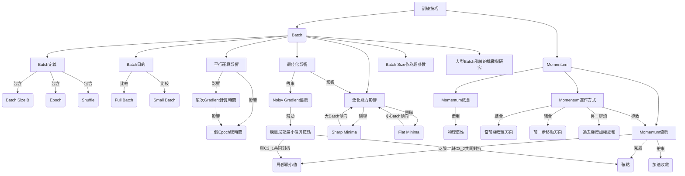

好的，我已將李宏毅教授的機器學習課程逐字稿整理成排版精美的 Markdown 筆記。

---
title: 第5堂課：Unknown Title (Video 5)
tags:
  - MachineLearning
  - ML2021
---

# 【機器學習 2021】第5堂課：Unknown Title (Video 5)

## 前言

本次課程將深入探討機器學習訓練中的兩個關鍵技巧：**Batch** (或稱 Mini-Batch) 和 **Momentum**。這兩種技術對於模型的訓練效率和最終性能有著顯著的影響。

---

## 批次訓練 (Batch / Mini-Batch)

### 什麼是 Batch？

在機器學習訓練中，我們通常不會一次性將所有訓練資料載入記憶體並計算 Loss 和 Gradient。取而代之的是，我們將所有資料分割成一個個小的資料批次 (Batch)，也稱為 **Mini-Batch**。

*   **Batch Size (B)**：每個批次包含的資料筆數。助教的程式中常使用 Mini-Batch。
*   **參數更新**：每次更新參數時，我們只取一個 Batch 的資料計算 Loss 和 Gradient，然後更新一次參數。
*   **Epoch**：當所有 Batch 都被看過一遍時，稱為一個 Epoch。
*   **Shuffle**：在每個 Epoch 開始前，會重新打亂資料的順序，使每個 Epoch 中的 Batch 組合都不同。這有助於避免模型記住特定 Batch 的順序或特性。

### 為什麼要使用 Batch？直覺比較

教授透過比較兩種極端情況來解釋 Batch 的目的：

1.  **Full Batch (Batch Size = 所有資料)**
    *   **優點**：每次參數更新的方向穩定，因為基於所有資料計算，梯度更精確。
    *   **缺點**：每次更新需要看完所有資料，蓄力時間長，技能冷卻時間長。
    *   **更新次數**：一個 Epoch 只有一次參數更新。

2.  **Small Batch (Batch Size = 1)**
    *   **優點**：每次更新只需看一筆資料，蓄力時間短，技能冷卻時間短。
    *   **缺點**：每次參數更新的方向較為不穩定 (Noisy)，因為只基於單筆資料計算，梯度較不準確。
    *   **更新次數**：一個 Epoch 中會進行多次參數更新 (資料筆數次)。

**直覺結論**：Full Batch 更新穩定但慢，Small Batch 更新快但不穩。看起來各有優缺點。

### 平行運算與時間效率的影響

在實際應用中，現代深度學習訓練通常會利用 GPU 進行**平行運算**。這使得 Batch Size 對訓練時間的影響產生了反直覺的結果。

*   **單次 Gradient 計算時間**：
    *   當 Batch Size 從 1 增加到 1000 時，計算 Loss 並進而計算 Gradient 所需的時間**幾乎一樣**。
    *   這是因為 GPU 可以同時處理多筆資料，資料是平行處理的，1000 筆資料不需花費單筆資料 1000 倍的時間。
    *   但 GPU 的平行運算能力有極限，當 Batch Size 變得非常巨大 (例如 10000、60000) 時，單次 Gradient 計算時間還是會隨著 Batch Size 增加。
*   **完成一個 Epoch 所需時間**：
    *   由於單次 Gradient 計算時間在一定範圍內幾乎相同，Batch Size 越小，完成一個 Epoch 需要的更新次數就越多。
    *   因此，**大的 Batch Size 反而能讓模型更快地看完所有資料，完成一個 Epoch**。
    *   例如：60000 筆資料，Batch Size=1 需要 60000 次更新；Batch Size=1000 只需要 60 次更新。
    *   **結論**：從完成一個 Epoch 的角度來看，大的 Batch Size 在訓練效率上佔據優勢。這與未考慮平行運算時的直覺想法不同。

### Noisy Gradient (小 Batch) 的神奇助益

儘管大 Batch Size 在訓練效率上看似佔優，但實驗結果卻顯示，**Noisy 的 Gradient (由小 Batch Size 產生) 反而對訓練 (Optimization) 和測試 (Generalization) 都有幫助**，這與直覺相反。

#### 1. 優化 (Optimization) 上的幫助

*   **現象**：在 MNIST 和 CIFAR-10 等影像辨識任務上，Batch Size 越大，Validation Accuracy 和 Training Accuracy 反而越差。這不是模型偏差 (Model Bias) 問題，而是優化 (Optimization) 問題。
*   **解釋**：
    *   **Full Batch (穩定)**：沿著單一 Loss Function 梯度更新。一旦遇到 Local Minima (局部最小值) 或 Saddle Point (鞍點) (梯度為零)，參數更新就會停止。
    *   **Small Batch (不穩定/Noisy)**：每次選擇不同 Batch，會使用略微不同的 Loss Function (例如 L1, L2, ...)。即使某個 Batch 導致梯度為零，下一個 Batch 的 Loss Function 可能不同，仍然可以計算出非零梯度，使訓練繼續進行，幫助模型跳出局部極值或鞍點。

#### 2. 泛化能力 (Generalization) 上的幫助

*   **現象**：即使我們設法讓大 Batch 和小 Batch 在 Training Accuracy 上達到相同水平，小 Batch 在 Testing Accuracy 上往往表現更好 (代表大 Batch 可能會 Overfitting)。
*   **解釋**：
    *   論文《On Large-Batch Training For Deep Learning: Generalization Gap And Sharp Minima》指出：
        *   **Sharp Minima (峽谷型局部最小值)**：位於 Loss Surface 狹窄的「峽谷」中。雖然訓練 Loss 很低，但由於訓練和測試資料分佈可能存在微小差異 (Mismatch)，導致測試時 Loss 可能急劇升高。
        *   **Flat Minima (盆地型局部最小值)**：位於 Loss Surface 寬廣的「盆地」中。即使訓練和測試存在差異，測試 Loss 也不會大幅度變化，具有更好的泛化能力。
    *   **直覺想法**：
        *   **Small Batch**：由於更新方向具有隨機性 (Noisy)，它不容易被狹窄的「峽谷」困住，而是傾向於跳出小峽谷，最終停留在更寬廣的「盆地」中。
        *   **Large Batch**：順著穩定的梯度更新，更容易落入並被困在狹窄的「峽谷」中。

### Batch Size 大小差異總結

| 特性               | Small Batch (小 Batch Size)       | Large Batch (大 Batch Size)       |
| :----------------- | :-------------------------------- | :-------------------------------- |
| **無平行運算時效率** | 較有效率 (每次更新快)             | 較慢 (單次更新時間長)             |
| **有平行運算時 (單次 Gradient 計算時間)** | 與大 Batch 接近 (直到 Batch Size 極大) | 與小 Batch 接近 (直到 Batch Size 極大) |
| **完成一個 Epoch 時間** | 較長 (更新次數多)                 | 較短 (更新次數少，效率高)         |
| **更新方向**       | Noisy (不穩定，隨機性高)          | 穩定 (基於大量資料)               |
| **優化 (Optimization)** | 較好 (易脫離局部極值/鞍點)        | 較差 (易卡在局部極值/鞍點)        |
| **泛化能力 (Generalization)** | 較好 (傾向找到 Flat Minima)        | 較差 (傾向找到 Sharp Minima)      |

**結論**：Batch Size 是重要的超參數 (Hyperparameter)，需要仔細調整。

### 大型 Batch 訓練的挑戰與研究

儘管小 Batch 在泛化能力上有優勢，但大 Batch 在單個 Epoch 內的訓練效率極高。許多研究試圖在保持大 Batch 效率的同時，解決其在優化和泛化上的劣勢，以實現更快的深度學習訓練（例如，快速訓練 BERT, ResNet, Imagenet 等）。這些研究通常會探索特殊的 Learning Rate 調整策略或其他優化技巧來克服大 Batch 可能帶來的問題。

---

## 動量 (Momentum)

Momentum 是另一種優化技巧，旨在幫助模型克服 Saddle Point 和 Local Minima，加速訓練過程。

### Momentum 概念：物理世界中的球

想像 Error Surface 是一個真實的斜坡，而我們的參數是一個球。
*   **Gradient Descent**：球在斜坡上滾動，走到局部最小值或鞍點時就會停下。
*   **物理世界中的球**：球從高處滾下時，即使遇到鞍點或局部最小值，也會因為**慣性 (Momentum)** 繼續往前滾動，甚至翻過小坡，繼續探索更低點。
Momentum 技巧就是將這種慣性概念引入 Gradient Descent。

### Momentum 的運作方式

回顧一般的 **Vanilla Gradient Descent**：
$$ \theta_{t+1} = \theta_t - \eta \cdot g_t $$
其中 $\theta_t$ 是當前參數，$\eta$ 是學習率 (Learning Rate)，$g_t$ 是當前梯度。參數更新方向完全由當前梯度決定。

**加入 Momentum 後的 Gradient Descent**：
在 Momentum 中，參數的移動方向不僅考慮**當前梯度的反方向**，還會考慮**前一步的移動方向**。

具體更新公式如下：
1.  **初始化**：設定初始參數 $\theta_0$，並令前一步的變化量 $m_0 = 0$。
2.  **計算梯度**：在 $\theta_t$ 處計算梯度 $g_t$。
3.  **計算移動向量**：新的移動向量 $m_t$ 由兩部分組成：
    *   前一步移動向量 $m_{t-1}$ 乘以一個衰減係數 $\lambda$ (慣性強度)。
    *   當前梯度的反方向 $g_t$ 乘以學習率 $\eta$。
    $$ m_t = \lambda \cdot m_{t-1} - \eta \cdot g_t $$
    其中 $\lambda$ 和 $\eta$ 都是需要調整的超參數。
4.  **更新參數**：將計算出的移動向量加到當前參數上。
    $$ \theta_{t+1} = \theta_t + m_t $$

**另一個解讀**：加入 Momentum 後，參數的更新方向不只考慮當前梯度，而是**過去所有梯度方向的加權總和**。移動向量 $m_t$ 可以被看作是之前所有梯度的一個指數加權移動平均 (Exponentially Weighted Moving Average)。

### Momentum 帶來的優勢

*   **克服局部極值與鞍點**：
    *   即使當前梯度很小或為零 (在 Local Minima 或 Saddle Point)，由於過去累積的動量，模型仍然可以繼續「滾動」，跳出這些困境。
    *   在梯度方向與動量方向相反時，若動量夠大，也能翻越小坡，找到更好的極值點。
*   **加速收斂**：在 Loss Surface 較為平坦的區域，Momentum 可以幫助模型更快地朝目標方向移動，加速收斂。

---

## 知識圖譜 (Knowledge Graph)

---

## 隨堂測驗

### 測驗一

在機器學習訓練中，若考慮 GPU 的平行運算能力，以下關於 Batch Size 對訓練效率的描述何者正確？

A. Batch Size 越大，單次計算梯度所需的時間越長，因此一個 Epoch 的訓練時間也越長。
B. Batch Size 越大，單次計算梯度所需的時間越短，因此一個 Epoch 的訓練時間也越短。
C. 在一定範圍內，Batch Size 大小對單次計算梯度時間影響不大，但 Batch Size 越大會減少一個 Epoch 的總更新次數，因此一個 Epoch 的訓練時間越短。
D. 在一定範圍內，Batch Size 大小對單次計算梯度時間影響不大，但 Batch Size 越小會減少一個 Epoch 的總更新次數，因此一個 Epoch 的訓練時間越短。

點擊查看解答

**正確答案：C**

**解釋**：
*   A 和 B 錯誤：由於 GPU 平行運算，Batch Size 在一定範圍內對單次梯度計算時間影響不大，而非直接變長或變短。
*   D 錯誤：Batch Size 越小，一個 Epoch 的更新次數越多，導致總時間更長。
*   C 正確：GPU 平行運算使得單次梯度計算時間相對穩定。Batch Size 越大，完成一個 Epoch 所需的更新次數越少，從而縮短了整個 Epoch 的訓練時間。

### 測驗二

根據課程內容，小 Batch Size 在訓練過程中會產生 Noisy Gradient，這對模型訓練有何幫助？

A. 導致模型更容易陷入局部最小值或鞍點，降低訓練效果。
B. 由於更新方向具有隨機性，有助於模型跳出局部最小值或鞍點，找到更好的解。
C. 使得模型在訓練集上的準確率更高，但在測試集上容易過擬合 (Overfitting)。
D. 減緩模型收斂速度，因為每次更新的方向都不穩定。

點擊查看解答

**正確答案：B**

**解釋**：
*   A 錯誤：Noisy Gradient 的隨機性正是幫助模型脫離局部極值的關鍵。
*   B 正確：每次 Batch 的 Loss Function 略有不同，即使當前 Batch 梯度為零，下一個 Batch 仍可能產生梯度，促使模型繼續探索並跳出困境。
*   C 錯誤：小 Batch Size 傾向於找到 Flat Minima，這有助於提高泛化能力，降低過擬合的風險，甚至在測試集上表現更好。
*   D 錯誤：雖然更新方向不穩定，但這種不穩定性在脫離局部極值方面是有益的，不一定會減緩整體收斂。

### 測驗三

Momentum (動量) 技巧的核心思想是什麼？

A. 只考慮當前梯度方向，並以固定的學習率進行參數更新。
B. 結合當前梯度的反方向與前一步參數的移動方向，來決定新的參數更新方向。
C. 每次更新參數時，隨機選擇一個 Batch 的資料來計算梯度。
D. 根據模型在驗證集上的表現，動態調整學習率。

點擊查看解答

**正確答案：B**

**解釋**：
*   A 描述的是 Vanilla Gradient Descent 的部分特徵。
*   B 正確：Momentum 的核心是引入「慣性」，將前一步的移動方向（帶有衰減係數）與當前梯度的反方向結合，來計算新的更新向量。
*   C 描述的是 Batch 的概念，與 Momentum 無關。
*   D 描述的是學習率排程 (Learning Rate Scheduling) 或自適應學習率 (Adaptive Learning Rate) 算法，與 Momentum 是不同的優化技巧。

